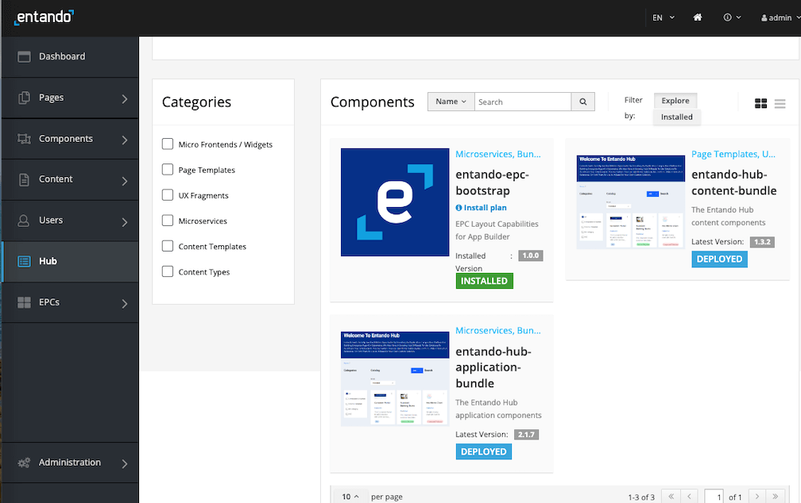

# Entando Hub
## Overview

An Entando Hub enables teams to share components across their organization and between Entando Applications. It can be installed in Entando 6.3.2 or higher and includes API-level integration with the Entando 7 App Builder.

Hub use cases:

- Centralize components and business capabilities for use across teams, groups, or clients.
- Publish, manage and communicate component features, versions and metadata.
- Perform business-level assessment of component readiness. 

An Entando Application can make use of an Entando Hub in several ways:
* The **Local Hub**, included in the Entando App Builder, displays a collection of components ready to use. They can be used to compose an application or as a starting point to create new components.	

* **Entando Cloud Hub** is the public catalog containing packaged business capabilities and components provided by Entando and its partners throughout the world.

* An **enterprise Entando Hub**, developed and curated by Entando clients and partners, can be used to share components within their respective organizations or made available for public use.


This tutorial covers:

1. [Installation](#installation)
2. [Configuration](#configuration)
3. [Using an Entando Hub](#using-an-entando-hub)
4. [Application Details](#application-details)
5. [Resources](#resources)

## Installation

An Entando Hub is installed using the Local Hub and two Entando Bundles. One bundle contains the micro frontends and microservices while the other sets up the initial content and pages for the hub UI.

### Prerequisites

- An Entando Application on any Kubernetes provider. Follow the [tutorials](../#operations) appropriate to your environment to install the Entando Platform.
- The [ent command line tool](../../docs/getting-started/entando-cli.md), installed and connected to your Kubernetes instance.

### Automatically Access the Entando Hub from the App Builder
1. Log in to your App Builder
2. Go to `Hub` → `Select Registry`  
3. Choose `New Registry`
4. In the pop-up window, enter `Entando Hub` and `https://entando.com/entando-hub-api/appbuilder/api` for the URL, then click `Save` 
5. Click on Entando Hub in the Registry and continue with the tutorial at Step 4 below

### Manual Installation Steps

1. Apply the custom resource definitions for the hub component bundles:

```
ent ecr deploy --repo=docker://registry.hub.docker.com/entando/entando-hub-application
```
```
ent ecr deploy --repo=docker://registry.hub.docker.com/entando/entando-hub-content
```

2. Log into your App Builder instance.

3. Select `Hub` from the menu on the left. Your bundles will be visible in the Local Hub as shown in the screenshot below.



4. Click each bundle icon and `Install` each bundle, where order of installation is important. The `entando-hub-application-bundle` must be installed first because it provides the `entando-hub-content-bundle` with MFEs. It may take several minutes to download the Docker images for the microservices and install related assets.

5. Set up permissions to configure the service:
   - [Log in to your Keycloak instance](../../docs/consume/identity-management.md#logging-into-your-keycloak-instance) as an admin.
   - Give at least one user the ability to manage the hub by granting the `eh-admin` role. Assign the `eh-admin` role for the `pn-152edaba-0a2ba8fb-entando-entando-hub-catalog-ms-server` client. See [Role Assignment in ID Management](../../docs/consume/identity-management.md#authorization) for more details.
   - Give the generated plugin client permission to manage users. 
       1. From the left sidebar, go to `Clients` and select client ID `pn-152edaba-0a2ba8fb-entando-entando-hub-catalog-ms-server`. 
       2. Click the `Service Account` tab at the top of the page and select `realm-management` from the `Client Roles` field. 
       3. Choose `realm-admin` from `Available Roles` and click `Add selected`. It should now appear as an `Assigned Role`.
    
6. Access the hub from the App Builder by navigating to `Pages → Management`, finding `Entando Hub` in the page tree, and clicking `View Published Page` from its actions.

## Configuration

::: tip
(Entando 7.0+) Any hub instance can be accessed from the Entando App Builder of another Entando Application. Configure the App Builder to access the desired hub instance via the endpoint `BASEURL/entando-hub-api/appbuilder/api`, where the BASEURL is the URL for the Entando Application.
:::

## Using an Entando Hub

### Concepts

The key entities in an Entando Hub are:

- `Bundle Group`: A bundle group is a group of one or more Entando Bundles. 
- `Bundle Group Version`: A bundle group can have one or more versions, each with a particular status.
- `Bundle`: An Entando Bundle is the deployment unit within an Entando Application. A bundle can contain one or more components such as micro frontends, microservices, or any of the [component types](../../docs/curate/bundle-details.md) available in Entando. 
- `Category`: Each bundle group belongs to a specific category. The initial possible categories are solution template, packaged business capability (PBC), and component collection. An admin of an Entando Hub can refine the available categories as desired.
- `Organization`: Bundle groups belong to a single organization. Authors and managers can only update bundle groups for their own organization.  
- `User`: User identity is managed within Keycloak, where users are granted roles within a hub instance. Users must be assigned to a specific organization.

Notes:
- A private repository can be used for a bundle, but this requires [an additional Kubernetes Secret](../curate/private-git-repo.md#overview) before deployment via the App Builder.

### Roles

Three roles are used to provide access to hub features:

- `eh-author`: An author can create and edit bundle groups for their organization and submit them for publication.
- `eh-manager`: A manager has the permissions of an author, but can also approve a publication request for their organization.
- `eh-admin`: An admin has full access to create, update, and delete bundle groups for the entire hub instance. An admin can also create categories and organizations, and assign users to an organization.
- `guest`: Any user without one of the preceding roles is considered a guest in the Entando Hub and is given a read-only view of the public catalog. This is also true for unauthenticated users.

### Bundle Group Version Status

The possible statuses for the versions of a bundle group are:

- `Draft`: This is the default status for the first version of a bundle group. 
- `Publication Request`: An `eh-author` sets a version to this status to request an `eh-manager` or `eh-admin` to review the version and mark it for publication. An `eh-manager` or `eh-admin` may edit versions with this status.
- `Published`: Versions with this status are visible in the home page list of available bundle groups and also available in the App Builder-facing API. An `eh-manager` or `eh-admin` may edit published versions.
- `Archived`: Previously published versions are assigned this status. No edits can be made on an archived version.
- `Deletion Request`: An `eh-manager` or `eh-admin` can delete versions once this status has been set.

Notes:
- An eh-author can change any field except organization while a version is in draft.
- There is no automated notification process when a publication request is made for a bundle group version.

### Bundle Group Creation
Clicking the `Add +` button at the top of the page displays the form for creating a new bundle group:


There are two ways to provide access to a bundle group:
- Add one (or more) bundles using `Add URL Bundle`.
- Check `Display Contact Us button?` and enter the URL for requesting the bundle group under `Contact URL`. This option allows the owner to gather more information from the user and control access to the bundle URLs. Typically, the contact URL points to a web form on the owner's web site.
### Bundle Group Versions
The list of bundle group versions can be seen by clicking `View Versions` on any entry in the catalog:


The following rules apply to bundle group versions:
- Once the first version of a group is published, the organization, name, and category can no longer be changed.
- A new version of a bundle group can be created (via the `New Version` option) after the first version has been published. 
- There can be at most two active versions: one draft or publication requested version and one published version. 
- When a new version is published, the previous version is set to archived. 
- Archived versions are only visible in the versions view and are not shown elsewhere in the user interface.


## Application Details

An Entando Hub includes the following key components:

### Micro Frontends / Widgets
- `Entando Hub App`: This is the main micro frontend which contains the management UI for the hub entities noted above.
- `Entando Hub Login`: This is an optional login component which can be used in a page’s top navigation.

### Microservices
A single Spring Boot microservice provides two REST endpoints:
- The first is a backend-for-a-frontend (BFF) service for the hub UI and contains the various entity APIs.
- The second provides methods that support the Entando App Builder integration (7.0+).

### Content
The content bundle (`entando-hub`) includes a custom template and a page preconfigured with the main hub micro frontends.

### Integration
The Entando App Builder should be configured using the endpoint `BASEURL/entando-hub-api/appbuilder/api`, where the BASEURL is the URL for the Entando Application.

## Resources
### Source Code

Entando open source examples and tutorials are available on GitHub. Reference the hub sample project for instructions to build the project from source code:

- <https://github.com/entando-samples/entando-hub>