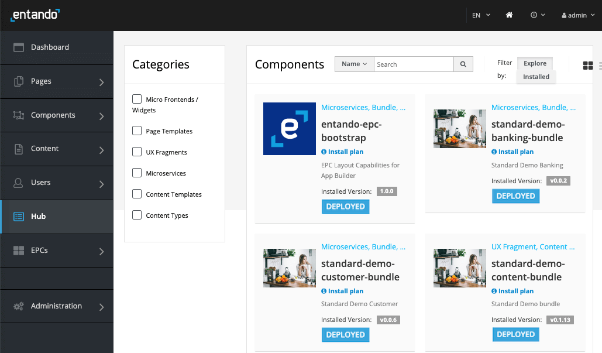
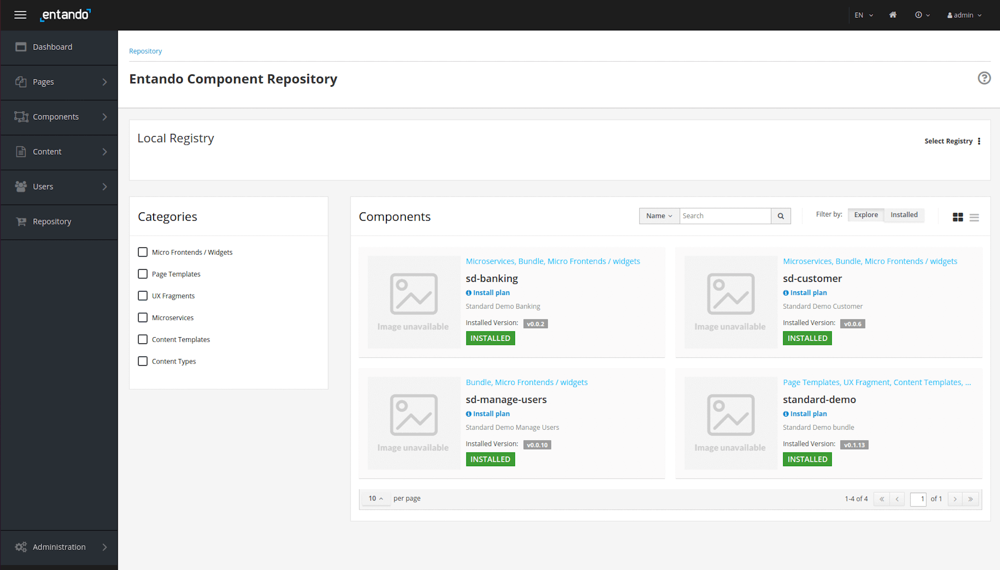
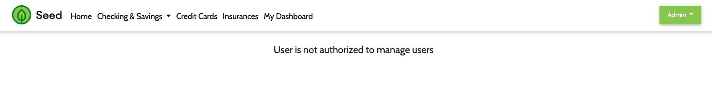

# Entando Standard Banking Demo

This tutorial will guide you through installing a demo application using the Local Hub and a set of Entando
bundles. This solution template includes: 

- microservices
- micro frontends
- multiple pages
- CMS content

The goal of this exercise is to demonstrate how Entando bundles can be used to: 

- quickly install and create functionality in an Entando Application
- enable packaged business capabilities
- allow developers to reuse full stack operations via bundles

Some of the key elements of the template are reviewed in the [Application Details section](#application-details) below.

## Installation

There are numerous assets installed as part of the Standard Banking Demo. Entando Bundles can include more or less components, depending on objectives. It is recommended that organizations develop guidelines for bundle sizing that fit the goals of their applications and teams.

### Prerequisites

- A working instance of Entando running on Kubernetes. [Install Entando on any Kubernetes provider](../#operations) or see [Getting Started](../../docs/getting-started/) for more information. 
- The ent command line tool, installed and connected to your Kubernetes instance.

### Automatic Install via the Entando Hub
Install the Standard Banking Demo by integrating the Entando Hub into your App Builder. 
1. Log into your `App Builder` → `Hub` → `Select Registry` → choose `Entando Hub` if it has been configured.
     1. If not, choose `New Registry`
     2. In the pop-up window, enter `Entando Hub` and https://entando.com/entando-hub-api/appbuilder/api for the URL, then `Save` 
     3. Click on the Hub in the Registry 

2. From the Hub Catalog, `Deploy` and `Install` the four Standard Banking Demo bundles, where order of installation is important. The `standard-demo-content-bundle` will need to be installed last, as it relies on MFEs from the other bundles to set up each of the pages. 
     1. `standard-demo-banking-bundle`
     2. `standard-demo-customer-bundle`
     3. `standard-demo-manage-users-bundle`
     4. `standard-demo-content-bundle`

3. To navigate to the Standard Demo: 
   * From the sidebar →  `Page` → `Management` 
   * Find `Home SD` in the page tree
   * From the `Actions` pull-down menu →  `View Published Page`

### Manual Install
1. Apply the definitions for the four bundles that comprise the Standard Banking Demo. 
```
ent ecr deploy --repo="https://github.com/entando-samples/standard-demo-banking-bundle.git"
```
```
ent ecr deploy --repo="https://github.com/entando-samples/standard-demo-customer-bundle.git"
```
```
ent ecr deploy --repo="https://github.com/entando-samples/standard-demo-manage-users-bundle.git"
```
```
ent ecr deploy --repo="https://github.com/entando-samples/standard-demo-content-bundle.git"
```

2. Log into your App Builder instance.

3. Select `Hub` from the menu on the left. Your bundles will be visible in the repository as shown in the screenshot below.
   

4. Select `Install` for each bundle, where order of installation is important. The `standard-demo-content-bundle` will need to be installed last, as it relies on MFEs from the other bundles to set up each of the pages. 
   

Each installation can take several minutes while the application downloads the Linux images for the microservices and installs the related assets. The `standard-demo-banking-bundle` and `standard-demo-customer-bundle` include microservices that require the initialization of containers and will take longer to install.

In the unlikely event you encounter conflicts during an initial installation, you will be presented with an Installation Plan like the one shown below. Select `Update All` in the upper right after making your selections.
   


5. Access the Standard Banking Demo via one of the following options:

**Option 1** If you'd like to make the Standard Banking Demo your default home page, go to `App Builder → Pages → Settings`. In
   the dropdown for Home Page, select `Home / Home SD` and click `Save`.
   

You can now navigate to your application's home page using the home icon in the upper right of the App Builder.


**Option 2** Alternatively, you can view the Standard Banking Demo home page by going to `Pages → Management`, finding `Home SD` in the page tree, and clicking `View Published Page` from its actions.


## Application Details

The Entando Standard Banking Demo application demonstrates a number of the major features of the Entando platform, including:

* Keycloak integration for role based access controls
* Micro frontends implemented using React and Angular and co-existing on the same dashboard page
* Micro frontend communication techniques
* Microservices via Spring Boot
* Entando Content Management

### Micro Frontends (MFE)

The application includes six MFEs in which the above features complement one another to achieve custom functionality. These are described below.

#### 1. Card


- The Card MFE is a React micro frontend that is visible on the My Dashboard page. The MFE makes an API call to the banking microservice to fetch a numeric result depending on the configured card type. The displayed value will change as the configuration is changed.
- The MFE is authorization-aware and will pass the bearer token to the microservice for authorization and authentication. If you render the dashboard page and you aren't authenticated, the widget displays an error message.
- This MFE emits events that are consumed by the Transaction Table widget.

#### 2. Card NG


- The Card NG MFE is an Angular widget that is similar to the Card widget above, except for the choice of frontend technology.
- This MFE communicates with the Transaction Table widget, which is implemented in React.

#### 3. Manage Users


- The Manage Users MFE makes an API call to Keycloak to fetch user information. When the user is logged into the app, the MFE is visible from the dropdown under the username.
- By default, application users are not granted Keycloak authorization to manage users. This demonstrates role based access control for an MFE using Keycloak. To enable the Manage Users widget, login to Keycloak and assign the realm-management client's `view-users` and `manage-users` roles to the desired user.

Authorized View


Not Authorized View


#### 4. Transaction Table


- This MFE is a React micro frontend that consumes events from the Card MFEs detailed above.
- The Transaction Table widget makes an API call to the banking microservice to fetch transaction data for the user.


#### 5. Sign Up


- The Sign Up MFE is a form widget that makes an API call to the customer microservice to create a new user. The Sign Up MFE is visible on the sign up page, and can be accessed from any page when a user is not authenticated.

  

#### 6. Alert Icon


- The Alert Icon MFE displays an icon on the dashboard page. It includes a configuration MFE to allow the user to select the appropriate icon and datatype to display.
- In the default deployment, the Alert Icon MFE makes an API call to the banking microservice to fetch data.


### Configuration Micro Frontends

When placed on a page, many of the MFEs detailed above include configuration screens visible in the App Builder at `Components → Micro frontends & Widgets`. To see the rendered config screen, place the MFE on a new page.

### Microservices

The application includes two microservices (service paths: `/banking` and `/customer`) to support the data visible in the MFEs detailed above. Both microservices demonstrate the automated deployment and linking of a microservice to an Entando Application via the Entando Operator.

The data for the microservices are created with Liquibase, demonstrating the use of the Operator and Liquibase + Spring Boot to automatically provision data into an environment. The demo data is available in the source code for the microservices on GitHub.

### Static Widgets

The application uses static HTML, FreeMarker, and JavaScript widgets to display content, e.g. headers, footers, images, etc. To view the static widgets, log into the App builder and select `Components → Micro frontends & Widgets`.

### Static CMS Content

The application makes extensive use of the Entando CMS. This includes the creation of content templates, content types, and content. If you want to learn more about the Entando CMS in the application, log into the App Builder and select `Content →  Templates`, `Content → Management`, or `Content → Types`.


## Source Code

The source code for the Entando Standard Banking Demo can be found on GitHub [here](https://github.com/entando-samples/standard-demo), along with our other open source examples and tutorials.
