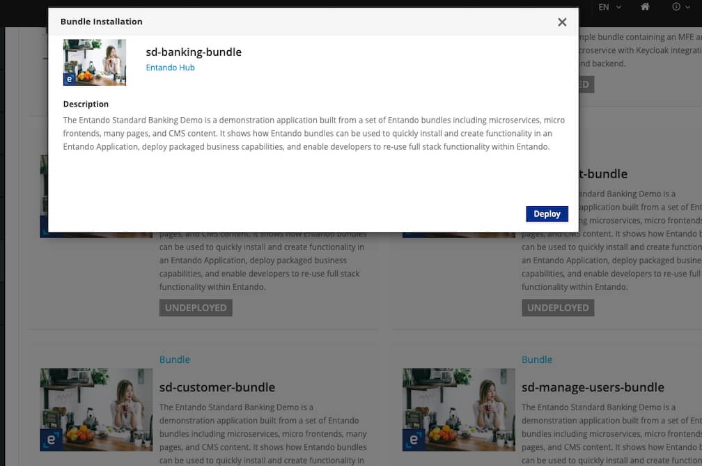
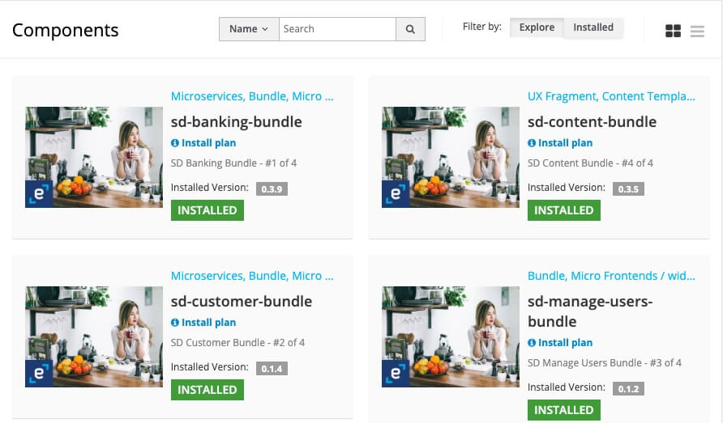
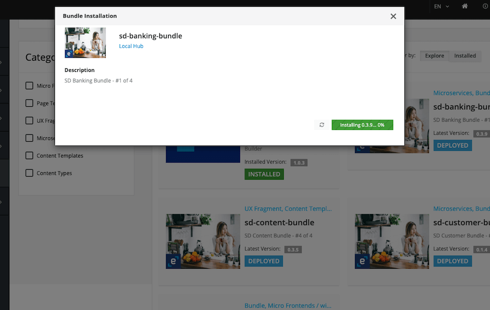
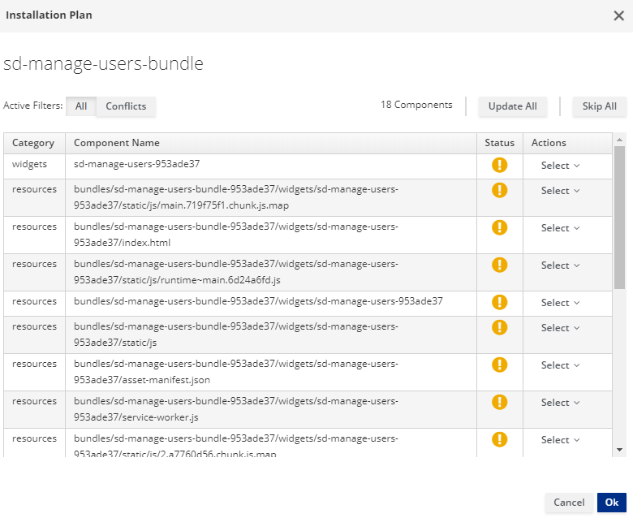

# Entando Standard Banking Demo

This tutorial guides you through installing a demonstration application using a set of Entando
Bundles and the Entando Hub. The solution template includes: 

- Microservices
- Micro frontends
- Multiple pages
- CMS content

This exercise showcases how Entando Bundles can be used to: 

- Quickly install and create functionality in an Entando Application
- Enable packaged business capabilities (PBCs)
- Allow developers to reuse full-stack operations via bundles

Several key elements of this solution package are reviewed in the [Application Details section](#application-details) below.

## Installation

The Standard Banking Demo installs bundles containing multiple assets. Entando Bundles should contain the number and types of components necessary to satisfy business and developer objectives, making it easier to reuse.

### Prerequisites

- A running instance of Entando. [Install Entando on any Kubernetes provider](../#operations) or see [Getting Started](../../docs/getting-started/) for more information. 
- The [Entando CLI](../../docs/getting-started/entando-cli.md), installed and connected to your Kubernetes cluster.

### Automatic Installation
Install the Standard Banking Demo by accessing the Entando Cloud Hub from your App Builder:

1. **Log in to your App Builder**

2. **Go to `Hub` → `Select Registry`**

3. **Choose `Entando Hub` if it has been configured. If not:**
     1. Select `New Registry`
     2. In the pop-up window, enter: \
         Name: Entando Cloud Hub \
         URL: https://auth.entando.com/entando-hub-api/appbuilder/api
     3. Click `Save` 
     4. In `Select Registry`, choose `Entando Cloud Hub` 

4. **From the catalog, deploy and install each of the four Standard Banking Demo Bundles in this order:**

     `sd-banking-bundle` \
     `sd-customer-bundle` \
     `sd-manage-users-bundle` \
     `sd-content-bundle` 

   ::: warning
   **The order of installation is important.** `sd-content-bundle` must be installed last, as it relies on micro frontends (MFEs) from the other bundles to set up each page. To uninstall the Banking demo, `sd-content-bundle` must be uninstalled first to resolve dependencies before other bundles can be be removed.
   :::

     1. Click on the `sd-banking-bundle` thumbnail
     1. In the pop-up window, click `Deploy` and `Install`. \
     It may take several minutes to download the Linux images for the microservices, and install and initialize the assets. 
     1. Close the pop-up window
     1. Repeat for the remaining three bundles

      

The four bundles should now be listed in your Local Hub for use in any application. 




### Manual Installation
1. **Apply the definitions for the four bundles that comprise the Standard Banking Demo, in the order listed:**
   ```
   ent ecr deploy --repo="docker://registry.hub.docker.com/entandodemo/sd-banking-bundle"
   ent ecr deploy --repo="docker://registry.hub.docker.com/entandodemo/sd-customer-bundle"
   ent ecr deploy --repo="docker://registry.hub.docker.com/entandodemo/sd-manage-users-bundle"
   ent ecr deploy --repo="docker://registry.hub.docker.com/entandodemo/sd-content-bundle"
   ```

2. **Log in to your App Builder instance**

3. **Select `Hub` in the left menu to view the bundles deployed to your Local Hub**

4. **`Install` each bundle:**

   ::: warning
   **The order of installation is important.** `sd-content-bundle` must be installed last, as it relies on micro frontends (MFEs) from the other bundles to set up each page. To uninstall the Banking demo, `sd-content-bundle` must be uninstalled first to resolve dependencies before other bundles can be be removed.
   :::

     1. Click on the `sd-banking-bundle` entry
     2. In the pop-up window, click "Install" \
     It may take several minutes to download the Linux images for the microservices, and install and initialize the assets.
     3. Close the pop-up window
     4. Repeat steps 1-3 for the remaining three bundles

      

     ::: tip
     Conflicts during the initial installation will generate an Installation Plan like the one shown below. After making your selections, click `Ok` in the lower right corner. You can also choose `Update All` or `Skip All` as needed.
     
     :::

## Access the Standard Banking Demo

Access the Standard Banking Demo through one of the following options:

**Option 1: Make the Standard Banking Demo your default homepage**
   1. Go to `App Builder` → `Pages` → `Settings` 
   2. In the drop-down menu for Home Page, select `Home/Home SD`
   3. Click `Save`
   
   4. Click the home icon in the upper right corner of the App Builder to see your new homepage


**Option 2: Navigate to the Demo homepage from the App Builder page tree**
   1. Go to `App Builder` → `Pages` → `Management` 
   2. Find `Home SD` in the page tree
   3. From the `Actions` drop-down menu, go to `View Published Page`
   
   ::: tip Congratulations! 

   You have just installed a reusable Entando Bundle. 
   :::
    
   

## Application Details

The Entando Standard Banking application demonstrates a number of major features of the Entando Platform:

* Modular and Composable components architecture
* Keycloak integration for role based access controls
* React and Angular micro frontends that coexist in the same application
* Micro frontend communication techniques
* Spring Boot Microservices
* Entando Content Management

### Micro Frontends

The application includes six micro frontends (MFEs) showcasing complementary features and custom functionality. The key features of each are listed below.

#### 1. Card MFE


- This is a React MFE found on the My Dashboard page.
- It makes an API call to the banking microservice to fetch a numeric result dependent on the current card selection. The displayed value updates with changes to the card configuration.
- It is authorization-aware and passes the bearer token to the microservice. If an unauthenticated user renders the dashboard page, the widget displays an error message.
- This MFE emits events that are consumed by the Transaction Table widget.

#### 2. Card NG MFE


- This is an Angular widget that is similar to the Card widget above, except for the choice of frontend technology.
- It communicates with the Transaction Table widget, which is built with React.

#### 3. Manage Users MFE

- This MFE makes an API call to Keycloak to fetch user information. 
- It is visible from the username drop-down menu when the user is logged in to the app.
- By default, application users are not granted Keycloak user management privileges. 
   - To use Keycloak to apply role based access controls for an MFE:
      1. Enable the Manage Users widget.
      2. Log in to Keycloak and assign the realm-management `view-users` and `manage-users` client roles to the desired user. 
   - See the [Entando Identity Management System](../../docs/consume/identity-management.md) page for details.

Authorized View


Unauthorized View


#### 4. Transaction Table MFE

- This is a React micro frontend that consumes events from the Card MFEs.
- It makes an API call to the banking microservice to fetch transaction data.


#### 5. Sign Up MFE

- This is a form widget located on the sign up page.
- It makes an API call to the customer microservice to create a new user.
- Unauthenticated users can access this widget from any page.


#### 6. Alert Icon MFE

- This MFE displays an icon on the dashboard page. 
- It includes a configuration MFE for the user to select the icon's appearance and datatype.
- By default, it makes an API call to the banking microservice to fetch data.


### Configuration Micro Frontends

Many of the Standard Banking Demo MFEs include configuration screens. These are visible in the App Builder at `Components` → `Micro frontends & Widgets`. To view a rendered configuration screen, place the MFE on a new page.

### Microservices

Two microservices generate the data displayed by the Standard Banking Demo MFEs. Both are managed by the Entando Operator to automate their deployment and link them to the Application.

The microservices demonstrate how the Entando Operator, Liquibase, and Spring Boot can be used to automatically provision data. The sample data is available in the microservice [source code](https://github.com/entando-samples/standard-demo).

### Static Widgets

The Standard Banking Demo uses static HTML, FreeMarker, and JavaScript widgets to display content, e.g. headers, footers, and images. To view the static widgets, log in to the App Builder and select `Components` → `Micro frontends & Widgets`.

### Static CMS Content

The Standard Banking Demo relies on the Entando CMS to create content templates, content types, content, etc. To learn more about the Entando CMS, log in to the App Builder and go to `Content` and select `Templates`, `Management`, and `Types`.

## Source Code

The source code for the Entando Standard Banking Demo can be found on GitHub [here](https://github.com/entando-samples/standard-demo) along with our other open source examples and tutorials.
