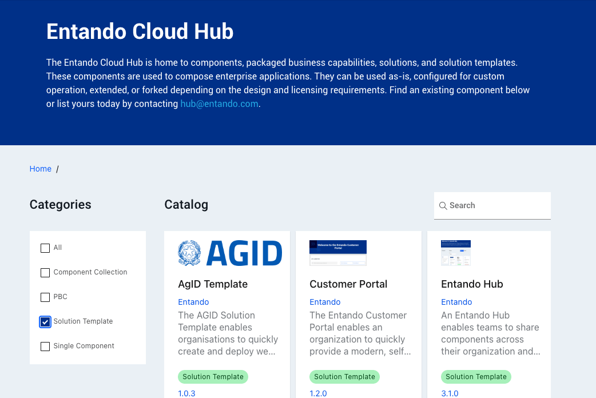
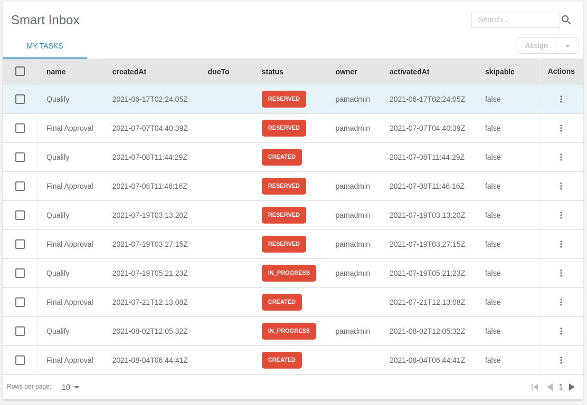

# Entando Solution Templates 

The Entando Application Composition Platform offers several Solution Templates to demonstrate various business capabilities and integrations:

- [**Entando Customer Portal**](customer-portal.md)
- [**Entando Hub**](entando-hub.md)
- [**Entando Process Driven Applications Plugin**](pda-tutorial.md)
- [**Entando Standard Banking Demo**](install-standard-demo.md)

Each open source Solution Template was built with Entando and can be used as-is, reviewed for common development practices, or leveraged as a starting point for similar applications. 

These and other components are available in the [Entando Cloud Hub](https://entando.com/composable-platform/packaged-business-capabilities/) for installation in any environment, with turnkey functionality that can be customized or extended.

## Entando Customer Portal

The [Entando Customer Portal](customer-portal.md) is a customer-facing, self-service subscription management application. The Portal integrates Keycloak for role based access control and Jira Project Management for the service ticket tracking system.

## Entando Hub

The [Entando Hub](entando-hub.md) is a catalog management package that empowers teams to share and collaborate on the building blocks that make up a composable application. These modular components can be organised, developed and published on the Hub. This solution template extends the Entando Application Composition Platform (ACP) with direct connectivity between the component catalog and the App Builder, to accelerate innovation and rapidly pivot the business capabilities of your online applications.  

[Entando Hub Details](../../docs/curate/hub-details.md)  
[Entando Hub Installation and User Guide](./entando-hub.md)

## Entando Process Driven Applications Plugin

The [Entando Process Driven Applications Plugin](pda-tutorial.md) provides a comprehensive and versatile automation scheme for Business Process Management. It comprises a custom UX layer, a Spring Boot Backend for Frontend microservice interface, and integration with the [Red Hat Process Automation Manager](https://www.redhat.com/en/technologies/jboss-middleware/process-automation-manager).

## Entando Standard Banking Demo

The [Entando Standard Banking Demo](install-standard-demo.md) showcases the benefits and possibilities of a composable application built from modular components. The example banking environment integrates a transaction table, sign up form, alert icon, and summary cards to demonstrate the variable components that can be built on Entando ACP. Prominent features include Keycloak role based access control, coexistence of React and Angular MFEs, and pluggable Spring Boot microservices.

::: tip
Check out our [Concepts](../../docs/getting-started/concepts-overview) page to explore Entando's approach to composability, or visit [Getting Started](../../docs/getting-started/) to put these capabilities into action!
:::

