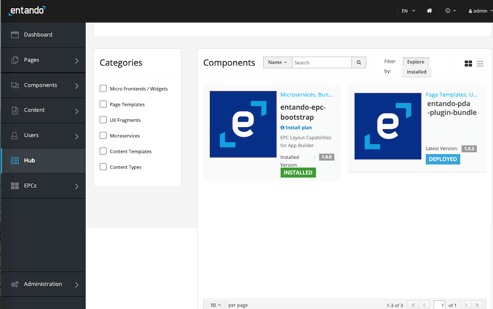
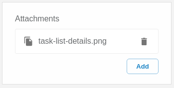
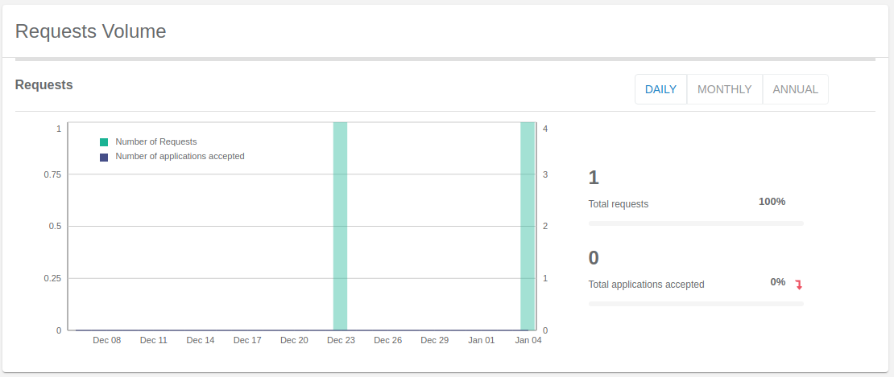

# Entando Process Driven Applications Plugin

## Introduction

The Entando Process Driven Applications (PDA) plugin provides a rich and full-featured user experience for the management and implementation of business process automation. This solution template includes: 

- A general purpose UX layer created from micro frontends that can be implemented for any business process or task engine. It serves data through the included Entando integration adapter or via a set of interfaces on the server side.
- A Spring Boot microservice backend providing a pluggable interface for the injection of underlying processes or automation toolkits. The interfaces and steps for creating a new PDA backend implementation are described in further detail [here](./pda-technical-guide.md).

The following tutorial installs the PDA plugin via the Local Hub and an Entando Bundle. It demonstrates the process automation enabled by integrating: 

- Custom Micro Frontends (MFEs)
- Backend for Frontend (BFF) microservice
- [Red Hat Process Automation Manager](https://www.redhat.com/en/technologies/jboss-middleware/process-automation-manager) (PAM)

Key elements of the template are reviewed in the [Application Details section](#application-details) below.

## Installation

There are many assets installed as part of the Entando PDA bundle. Entando Bundles can include more or less components, depending on objectives. It is recommended that organizations develop guidelines for bundle sizing that fit their goals.

### Prerequisites

- An Entando Application on any Kubernetes provider. Follow one of the [tutorials](../#operations) appropriate to your environment to install the Entando Platform.
- The ent command line tool, installed and connected to your Kubernetes instance.
- Red Hat PAM


### Automatic Install via the Entando Hub
1. Log in to your `App Builder`. Go to `Hub` → `Select Registry` → choose `Entando Hub` if it has been configured.
     1. If not, choose `New Registry`
     2. In the pop-up window, enter `Entando Hub` and `https://auth.entando.com/entando-hub-api/appbuilder/api` for the URL, then `Save` 
     3. Select Entando Hub in the Registry 

2. Click the PDA bundle icon and `Deploy` and `Install` it in the pop-up window. The installation may take several minutes while the application downloads the Linux image for the microservice and installs the related assets.

3. To finish the tutorial, skip to the [Configuration Steps](#configuration) below.

### Manual Install
1. Apply the Custom Resource Definition for the PDA Bundle.
```
ent ecr deploy --repo="https://github.com/entando-samples/entando-process-driven-plugin-bundle.git"
```

2. Log in to your App Builder instance.

3. Select `Hub` from the left sidebar. Your bundles will be visible in the repository as shown here.



4. Click the PDA bundle icon and `Install` it in the pop-up window. The installation may take several minutes while the application downloads the Linux image for the microservice and installs the related assets.

## Configuration

::: warning
---

<details><summary>Configuration error on OpenShift 4.8+</summary>

An incomplete role definition prevents Entando from configuring the PDA Plugin connections on RedHat OpenShift 4.8+. As a workaround, update the entando-plugin Role by adding the missing rules below.

``` yaml
apiVersion: rbac.authorization.k8s.io/v1
kind: Role
metadata:
  name: entando-plugin
rules:
  - apiGroups:
      - entando.org
    resources:
      - entandoplugins
    verbs:
      - get
      - update
  - apiGroups:
      - ""
    resources:
      - secrets
    verbs:
      - create
      - get
      - delete
      - update
```

</details>

---
:::

Follow the steps below to configure service permissions and connections.

1. Set up permissions to configure the services for the PDA plugin:
   - [Log in to your Keycloak instance](../../docs/consume/identity-management.md#logging-into-your-keycloak-instance) as an admin.
   - Give at least one user the ability to configure and manage the PDA plugin by assigning all roles for the `pn-efbd66b6-b0ceabd7-entando-pda-plugin-server` client. See [Role Assignment in ID Management](../../docs/consume/identity-management.md#authorization) for more details.

2. Log in to the App Builder and configure the PDA connection:
- Go to `Pages` → `Management`, find `PDA Connections` in the page tree, and select `View Published Page` from `Actions`. 
- Click `Create new connection` in the upper right corner. The `Name*`, `Engine*` and `Timeout*` fields are prepopulated with default values. The default name `pam-demo` may be edited, but the datasource names of other widgets must match your settings.
  
    - PDA Dashboard
    - PDA Process Definition
    - PDA Smart Inbox
    - PDA Task Details
    > To change the datasource, go to `Pages` → `Management` and select `Design` from the Actions menu for a page. Each component in the frames has a kebab drop-down menu to make changes. For the relevant widget, you can update the `Knowledge Source` field by selecting the `Settings` option.
  - Leave `pam` as the engine name. This value is appropriate for jBPM or PAM.
  - Leave the timeout as `60000`msec.
  - Provide your connection URL to the KIE Server rest services, e.g. 'http://my.server.net:8080/kie-server/services/rest/server'.
  - Username/password should be for a jBPM or PAM service account user, e.g. 'krisv'.

3. Go to the Smart Inbox to begin working with the PDA plugin: 
- Go to `Pages → Management`, find `PDA Smart Inbox` in the page tree and click `View Published Page` from its `Actions`.

## Application Details
 
The Entando PDA plugin demonstrates several important features of the Entando Platform summarized below. For a discussion of these components in deployment, see [PDA Deployment Architecture](./pda-architecture.md).

### Micro Frontends (MFEs)

This section provides a brief description of every MFE in the PDA plugin. Details specific to the PAM implementation of an MFE are included where applicable. MFE behavior and datasources must be defined if the integration layer is extended to other engines or customizations.

#### A. Task List
 
The Task List MFE provides the user a list of visible tasks that are
either assigned to or could be claimed by them. 
In the default implementation, the visible tasks are limited to a single process instance. 
At configuration time, the application designer is given the option to select a set of columns that are visible in the task list for that page.
 
![Task List in Table Format with create date, status, owner, etc.]](./pda-images/task-list.png)

The default PAM implementation exposes the top level task fields in the list for selection. It is possible to fetch task and process variables from the list for rendering, but this is disabled by default to optimize performance.
 
#### B. Task Details
 
The Task Details MFE renders detailed information about a task in a read only grid. It gives the end user the information necessary to process the task. See the [Styling](#styling) section below to customize the layout.


 
The PAM implementation renders task variables in the details widget.
 
#### C. Task Comments
 
The Task Comments MFE enables the user to view and add notes attached
to a task.
 


The PAM implementation reads and publishes notes to the comments endpoint.
 
#### D. Task Form
 
The Task Form can be accessed by clicking on the Task Overview link found in the Task Details MFE. It is a form specific to a task completed by the user to define the way it is displayed.

A wrapper for the JSON Schema blueprint, it describes the layout, style and content of the form. 
The backend implementation provides the mapping to the schema and default UX layout needed to render the form. See the
[technical documentation](./pda-technical-guide.md) for more on the JSON Schema implementation.
 
The PAM implementation of forms relies on the presence of a form definition for the PAM task. The Entando PAM engine implementation transforms the format to JSON Schema to render the form. It also transforms the API format back to the PAM format. There are some limitations on form customization due to the format required to return the data to PAM. See the [Task Forms](pda-technical-guide.md#task-forms) section in the technical documentation for more information.
 
#### E. Attachments 

The Attachments MFE enables the user to view and add documents attached to a task, case or process. To add this capability to a page, go to `Pages` → `Management` in the App Builder, select `Design` from the desired page's Actions drop-down, and drag the "PDA - Task Attachments" widget into an empty frame.


 
The PAM implementation posts the documents to the PAM endpoints for storage.
 
#### F. New Process Form
 
The New Process Form MFE renders a form enabling the end user to instantiate a new business process instance. The same technology is used to generate a New Process Form and the JSON Schema definition for a Task Form.


 
The PAM implementation relies on a form definition attached to the process definition. Entando transforms the PAM representation into a JSON Schema form that can be rendered to the end user.
 
#### G. Summary Cards
 
The Summary Cards MFE provides a view into the aggregate data for the process
implementation. The rendered information includes a total value, a trend
value, and a time frame selector. The MFE provides the option to request rendering information. This request maps to a call in the underlying engine and provides the summarized data.


 
The PAM implementation of the widget relies on the PAM custom query functionality. The PAM PDA engine exposes a configuration file where the custom query can be defined. This allows the user to customize the data rendered on the summary cards. The application contains a "properties" file where the user can submit a custom query for each of the cards.
 
#### H. Totals Over Time
 
The Totals Over Time MFE provides a dual axis line/bar graph displaying
trend information about the process environment. Three summary values can be compared over a single time period.


 
The PAM implementation of this MFE utilizes custom queries to fetch the summary data rendered for the chart. The queries used in the implementation are defined in configuration files in the MFE and can be updated to render specific data.
 
### Process Automation Manager (PAM)
 
The Entando PDA is built on Red Hat Process Automation Manager, a business process automation engine with the following special features.
 
### Backend for Frontend (BFF)
 
A microservice architecture allows teams to rapidly iterate and
develop technology to scale. Backend for Frontend
is an architecture pattern built with microservices. The BFF is the key
of this pattern, connecting the frontend of an application with the backend.
 
## Customization and Extension
 
This section describes how the PDA plugin can be customized and extended via:

- Styling
- Implementing a new engine
- Integrating a new task source

For an in-depth discussion of the PDA architecture, refer to the [PDA Technical Guide](./pda-technical-guide.md).
 
### Styling
 
The MFEs of the Entando PDA are styled with a Material UI theme. That theme can
be downloaded and updated [here](https://github.com/entando/frontend-libraries/tree/master/packages/entando-ui).
 
### Implementing a New Engine or Integrating a New Task Source

Emloying a new engine for Process Driven Applications means
creating a new Java project and implementing the interfaces defined in the
`pda-core-engine` project. The new project should therefore include the
`pda-core-engine` as a dependency.
 
To see an example in action, consider the `pda-redhatpam-engine` project, which applies the Red Hat PAM engine as an integrated dependency. The resultant JAR file should be available in the classpath for the `entando-process-driven-plugin`, which is the project that is ultimately executed, exposing the REST APIs for the frontend components.
 
One way to achieve this is by publishing the engine implementation to a Maven repository and adding it as a dependency to the `entando-process-driven-plugin` project. Below are the descriptions of
the engine class and key interfaces in the `pda-core-engine` project that must be inherited or applied when a new engine is created.
 
#### Classes
 
`Engine`: represents a Business Process Management (BPM) engine and exposes the services that are available for that specific implementation. It is intended to be inherited, and the subclass should be provided for each service by calling the superclass constructor with its implementation as an argument. If any service is not supported, a null value should be passed to the corresponding constructor argument. The engine can also establish functionality for service interfaces.
 
#### Interfaces
 
`TaskService`: defines service methods for task retrieval from the BPM engine.
 
`TaskDefinitionService`: defines service methods related to task definition. A task definition specifies which fields or columns are available for all task instances.
 
`TaskCommentService`: defines service methods related to task comment manipulation. It should be implemented if the task comment is supported by the engine.
 
`TaskAttachmentService`: defines service methods to operate on task attachments. It should be used if the engine supports file attachments on the task.
 
`TaskFormService`: defines service methods for task form operations, like retrieving the form definitions and submitting a form. The Form object can be used to render a form dynamically.
 
`TaskLifecycleService`: defines service methods related to the task lifecycle. The lifecycle operations move the task from one state to another.
 
`TaskLifecycleBulkService`: defines methods for bulk lifecycle operations. Like the TaskLifecycleService, these methods move the task from one state to another, but this interface works with multiple tasks at a time.
 
`ProcessService`: defines service methods for process definitions operations.
 
`ProcessFormService`: defines service methods for process form operations, like retrieving the form definitions and submitting a form. The Form object can be used to render a form dynamically.
 
`GroupService`: defines service methods related to groups in the BPM engine.

## Troubleshooting
1. Reinstallation after an uninstall that will not progress   
If the PDA plugin is uninstalled and then reinstalled, an issue may stop the process due to the secret containing the connection configuration names does not get updated upon reinstallation. To prevent this issue, an upgrade of the plugin is recommended instead of uninstalling, following best practices.

If removing the plugin bundle is required, create a backup of the EntandoPlugin custom resource, `metadata.name: pn-efbd66b6-b0ceabd7-entando-pda-plugin` before removing it, and copy the list of `connectionConfigNames` to the new installation's plugin custom resource.

## Resources
### Source Code

The source code for the Entando PDA plugin can be found on GitHub, along with our other open source examples and tutorials. Reference the component projects for instructions on how to build from source code:

- <https://github.com/entando/entando-process-driven-plugin>
- <https://github.com/entando/entando-process-driven-plugin/tree/master/widgets>
- <https://github.com/entando/pda-redhatpam-engine>
- <https://github.com/entando/pda-core-engine>
