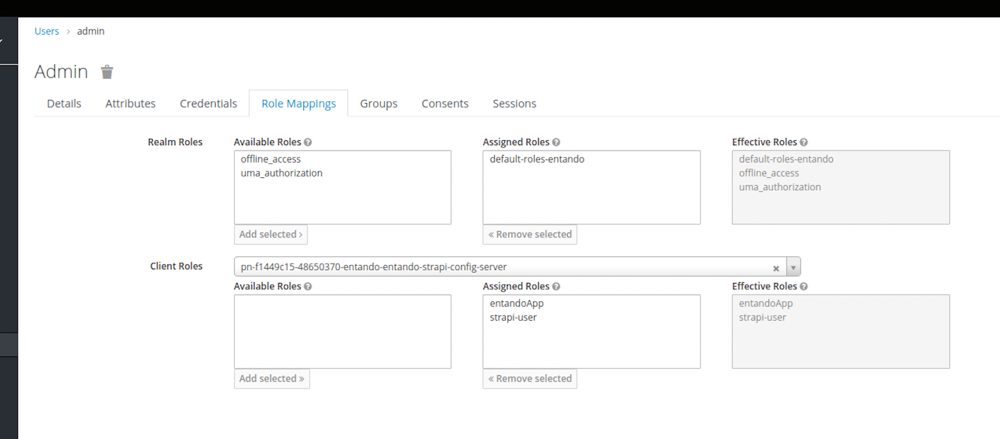
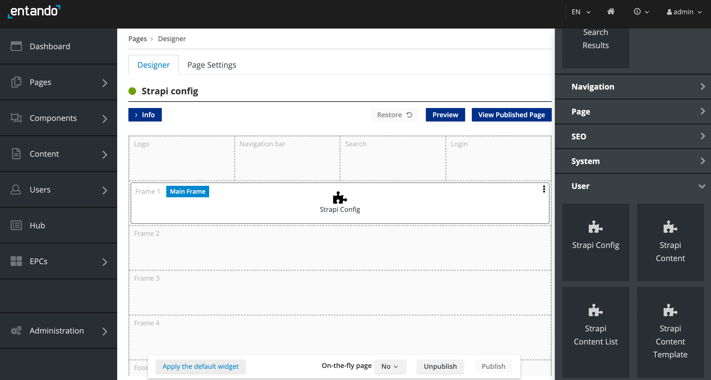
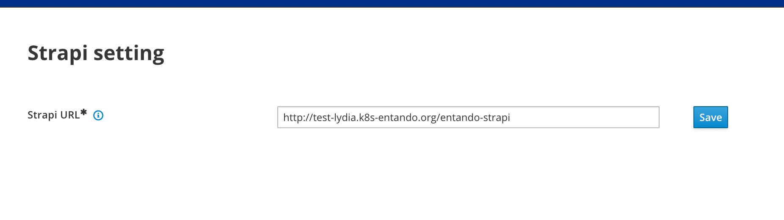
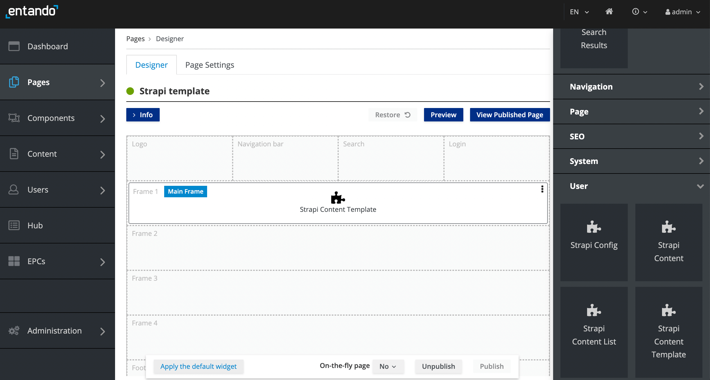
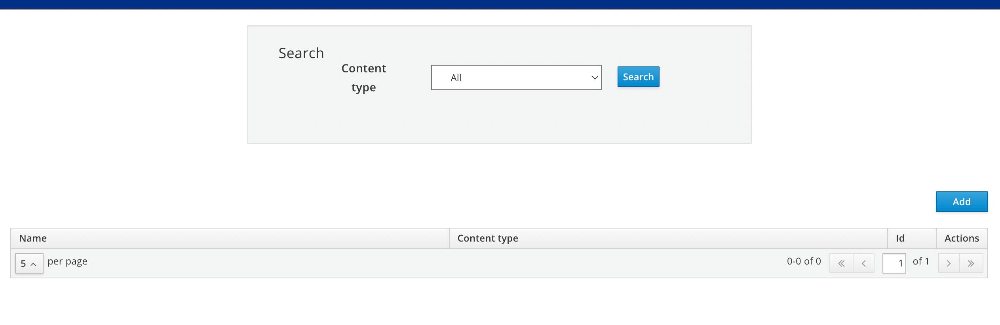
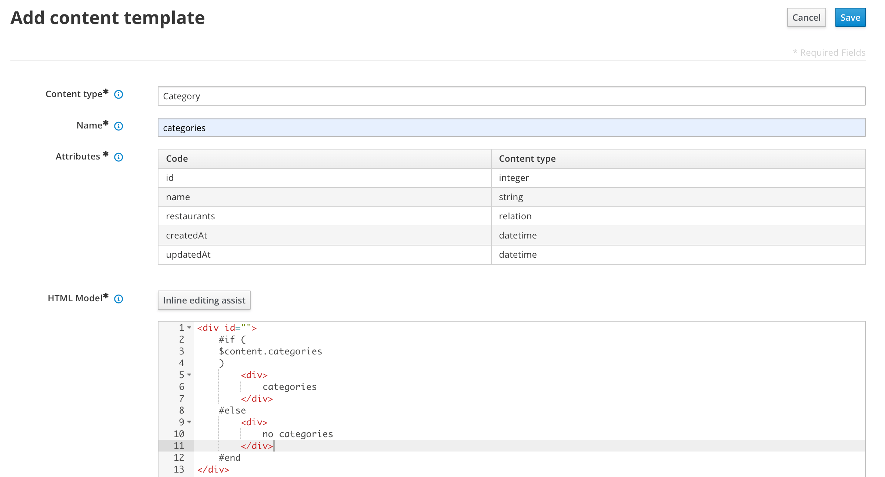
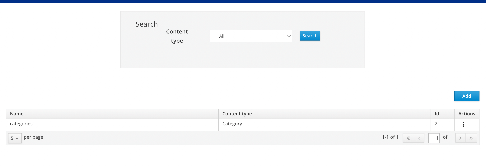
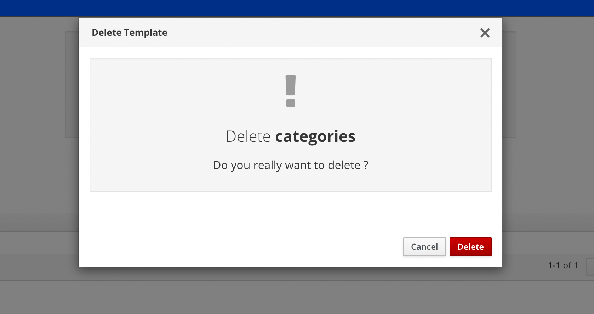

# Strapi Content Management

## Overview

This tutorial demonstrates how to create and manage the content in your Strapi instance from the App Builder user interface.

The Strapi Content Widget and Strapi Content List Widget enable the user to add or edit content and content lists, respectively, where it is mandatory to assign templates to selected content. The Strapi Content List Widget also allows content to be saved as a search. The following table compares widget capabilities.


## Prerequisites

- [A working instance of Entando](../../../docs/getting-started/)
- Verify dependencies with the [Entando CLI](../../docs/getting-started/entando-cli.md#check-the-environment): `ent check-env develop`
- [A configured Strapi instance running on Entando](pda-tutorial.md) PLACEHOLDER

## Widget Capabilities


## Strapi Content Widget

## Strapi Content List Widget

Entando's Strapi implementation is available from the Entando Cloud Hub via 3 bundles, which must be installed in the Local Hub of the App Builder.

1. Within your Entando instance, create a persistent volume claim with the following properties: 
   - Name: `pn-fe9131bb-ca5e5232-entando-strapi-server-pvc`
   - Storage size: 2GB

2. Using the ent CLI, apply the Custom Resource Definitions for the Strapi bundles:

```
ent ecr deploy --repo=https://github.com/Entando-Hub/entando-strapi-bundle.git
ent ecr deploy --repo=https://github.com/Entando-Hub/entando-strapi-config-bundle.git
ent ecr deploy --repo=https://github.com/Entando-Hub/entando-strapi-widgets-bundle.git
```

3. Install the bundles into your Local Hub:

```
ent ecr install entando-strapi-bundle
ent ecr install entando-strapi-config-bundle
ent ecr install entando-strapi-widgets-bundle
```

### Roles

#### Entando Strapi Config Application

All REST APIs are public. No Keycloak role is required.

#### Entando Strapi Content Template Application

All REST APIs are private and require the admin role. To add Keycloak role mapping for the `entando-strapi-config` and `entando-strapi-templates` clients:

1. [Login to your Keycloak instance](../../docs/consume/identity-management.md#logging-into-your-keycloak-instance) as an admin
2. From the left menu, select `Users`
3. Click on the ID associated with the admin username
3. Click on the tab `Role Mappings`
4. From the `Client Roles` drop-down, select the role ending in "strapi-config-server"
   - Select all `Available Roles` and add them to `Client Default Roles`
5. From the `Client Roles` drop-down, select the role ending in "strapi-template-server"
   - Select all `Available Roles` and add them to `Client Default Roles`



#### Entando Strapi Application

Access to Strapi admin APIs requires the the Super Admin user role and same username on record with the App Builder. The existing Entando Keycloak token is used for authentication.

### Registration

Strapi registration is available following bundle installation. To log in to Strapi:

1. Open a browser tab and enter your App Builder base URL followed by `/entando-strapi/admin/`, e.g. `http://hubdev.okd-entando.org/entando-strapi/admin/`

2. Enter the following credentials:
   - username: strapi@entando.local
   - password: adminadmin


## Configuration

The URL to access the Strapi instance and content templates must be provided before content can be managed. Note that the configuration of content templates relies on existing Strapi content. 

To properly prepare your Entando Application to use your Strapi instance:
1. Create Strapi content for use by the Strapi Content Template Widget
2. Configure the Strapi Config Widget with the URL of your Strapi instance
3. Configure the Strapi Content Template Widget using existing Strapi content

### Create Content in Strapi

Before you can configure the Strapi Content Template Widget, you must add content to your Strapi instance. Refer to the Strapi [Quick Start Guide](https://docs.strapi.io/developer-docs/latest/getting-started/quick-start.html) for a tutorial on content creation. Additional information is available in the [Strapi user guide](https://docs.strapi.io/user-docs/latest/getting-started/introduction.html).

### Configure the Strapi Config Widget

The Strapi Config Widget provides the Strapi Content Template, Strapi Content and Strapi Content List widgets with the application URL of the Strapi instance. The URL is managed from a single field entry, which must be defined prior to manipulating content. 

Follow the steps below to publish the Strapi Config Widget to a page in your Entando Application and expose the Strapi URL.

1. [Create a page](../compose/page-management.md#create-a-page) in your Entando Application dedicated to the Strapi Config Widget
2. Go to  `App Builder` → `Pages` → `Management`
3. Find the Strapi configuration page in the page tree and click on the three dots representing the `Actions` icon
4. Select `Design` from the drop-down
5. Click on the `Widgets` tab in the right panel and expand the `User` section
6. Drag and drop the Strapi Config Widget into an empty frame in the middle panel



7. Click `Publish`
8. Click `View Published Page`
9. On the published page, enter the URL of the Strapi instance, which is your App Builder base URL followed by `/entando-strapi`, e.g. `http://hubdev.okd-entando.org/entando-strapi`



### Configure the Strapi Content Template Widget

To manage Strapi content in your Entando Application, the content must belong to a type that is assigned attributes via a template. Follow the steps below to create and modify content templates with the Strapi Content Template Widget.

#### Create a Content Template

1. [Create a page](../compose/page-management.md#create-a-page) in your Entando Application dedicated to the Strapi Content Template Widget
2. Go to  `App Builder` → `Pages` → `Management`
3. Find the Strapi template page in the page tree and click on the `Actions` icon 
4. Select `Design` from the drop-down
5. Click on the `Widgets` tab in the right panel and expand the `User` section
6. Drag and drop the Strapi Content Template Widget into an empty frame in the middle panel



7. Click `Publish`
8. Click `View Published Page`
9. Click `Add` on the right



10. Add a content template, where the following fields are mandatory:
   - Content type: The drop-down displays [existing content types](#create-content-in-strapi)
   - Name: Name of the template associated with the selected content type
   - Attributes: Pre-populated from the Strapi definition of the content type
   - HTML Model: HTML code for the template, which is guided by clicking `Inline editing assist`



11. Click `Save`

#### Edit a Content Template

1. Go to  `App Builder` → `Pages` → `Management`
2. Find the Strapi template page in the page tree and click on the `Actions` icon 
3. Select `Design` from the drop-down
4. Click `View Published Page`
5. Click on the three dots on the right of the line listing the template 



6. Select `Edit` to edit the Name, HTML Model and/or Style Sheet fields
7. Click `Save`

>Notes:
> - You may not modify the content type
> - Editing the template will not change the ID of the content template

#### Delete a Content Template

1. Go to  `App Builder` → `Pages` → `Management`
2. Find the Strapi template page in the page tree and click on the `Actions` icon 
3. Select `Design` from the drop-down
4. Click `View Published Page`
5. Click on the three dots on the right of the line listing the template
6. Select `Delete`
7. Click `Delete` in the pop-up box to confirm



## Next Steps

You are now able to develop your Entando Application using Strapi! To learn how to apply and manage content, check out the following tutorials:

- TODO: Strapi Content Widget
- TODO: Strapi Content List Widget