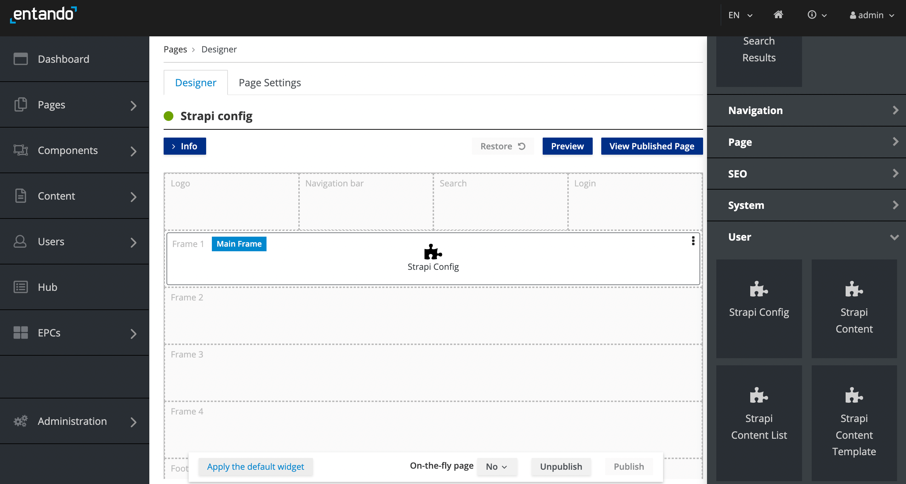
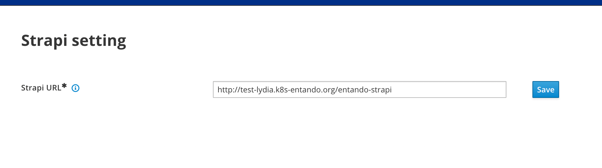
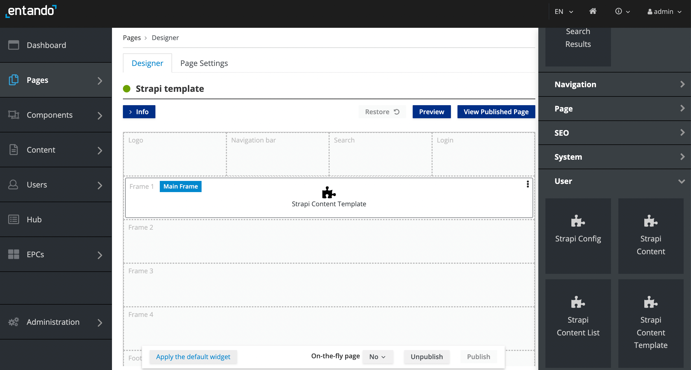
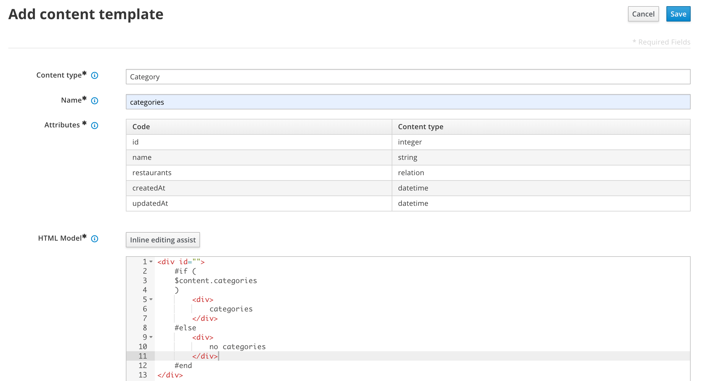
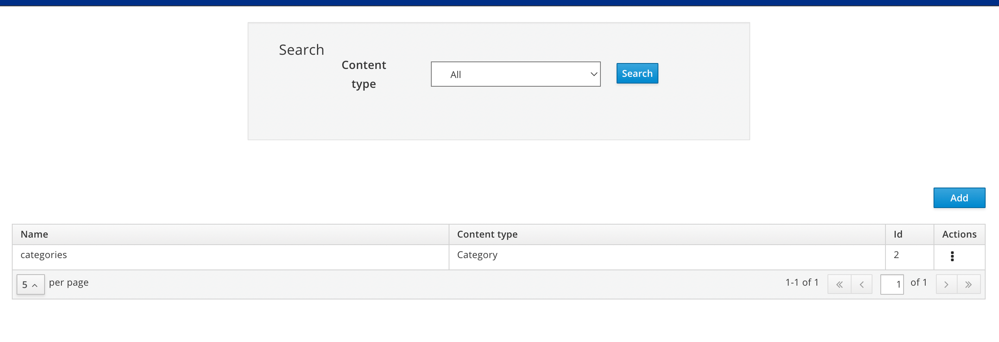

# Entando Strapi
## Overview

Entando 7 offers a Strapi packaged business capability (PBC) to provide the flexibility and customization of a leading open source and headless CMS. Users are able to create and organize application content through the seamless integration of Strapi into the App Builder experience. 

The Strapi PBC is available on the [Entando Cloud Hub](https://entando.com/composable-platform/packaged-business-capabilities/). This tutorial uses notable quotes as a content example to cover:

1. [Prerequisites](#prerequisites)
2. [Installation](#installation)
3. [Configuration and Content Creation](#configuration-and-content-creation)
4. [Create and Manage a Content Template](#create-and-manage-a-content-template)
5. [Next Steps](#next-steps)

## Prerequisites

- [A working instance of Entando](../../../docs/getting-started/)
- Verify dependencies with the [Entando CLI](../../docs/getting-started/entando-cli.md#check-the-environment): `ent check-env develop`
- An [ent profile](../../docs/getting-started/ent-profile.md#profile-management) linked to the Kubenetes context to be used in this tutorial

## Installation

Entando's Strapi implementation is available from the Entando Cloud Hub via three bundles, which must be installed in the Local Hub of the App Builder. 

1. Create a file named `strapi-pvc.yaml` with this snippet:
```yaml
apiVersion: v1
kind: PersistentVolumeClaim
metadata:
  name: pn-fe9131bb-ca5e5232-entando-strapi-server-pvc
spec:
  accessModes:
    - ReadWriteOnce
  resources:
    requests:
      storage: 2Gi
  storageClassName: csi-cinder-high-speed
```

2. Create the persistent volume claim (PVC) using this command:
```
ent kubectl apply -f strapi-pvc.yaml -n entando
```
>Note: Environments such as OKD require steps 1 and 2 to prevent an issue with memory allocation during microservice startup.  However, applying the persistent volume claim does not otherwise impact the installation of the Strapi bundles in other environments.

3. Using the ent CLI, deploy the Strapi bundles in the following order:

```
ent ecr deploy --repo=https://github.com/Entando-Hub/entando-strapi-bundle.git
ent ecr deploy --repo=https://github.com/Entando-Hub/entando-strapi-config-bundle.git
ent ecr deploy --repo=https://github.com/Entando-Hub/entando-strapi-widgets-bundle.git
```

4. Install the bundles into your Local Hub:

```
ent ecr install entando-strapi-bundle
ent ecr install entando-strapi-config-bundle
ent ecr install entando-strapi-widgets-bundle
```
### Role Mapping 

To add Keycloak role mapping for the `entando-strapi-config` and `entando-strapi-templates` clients:

1. [Log in to your Keycloak instance](../../docs/consume/identity-management.md#logging-into-your-keycloak-instance) as an admin. The Keycloak admin page is located at the App Builder base URL plus /auth, e.g. `http://YOUR-SERVER-URL/auth`.
2. From the left menu, select `Users`  → `View all users`
3. Click on the ID associated with the admin username
3. Click on the tab `Role Mappings`
4. From the `Client Roles` drop-down, select the role ending in "strapi-config-server"
   - Select all `Available Roles` and add them to Client `Assigned Roles`
5. From the `Client Roles` drop-down, select the role ending in "strapi-template-server"
   - Select all `Available Roles` and add them to Client `Assigned Roles`  


Note: To access the Strapi APIs, the App Builder user is given the Super Admin role using the existing Entando Keycloak token for authentication.

### Registration

You must register after installation and role mapping to use Strapi within the Entando Platform. The PBC creates a new Strapi instance for your Entando Application. It does not provide a mechanism to link an existing Strapi instance. 

To log in to your Entando Strapi instance:

1. Open a browser tab and enter your App Builder base URL followed by `/entando-strapi/admin/`, e.g. `http://YOUR-SERVER-URL/entando-strapi/admin/`

2. Enter the following credentials and log in:
   - username: strapi@entando.local
   - password: adminadmin


## Configuration and Content Creation

To begin using Strapi on Entando, you must first create content to configure Strapi access from the App Builder. This is done through the Strapi Config Widget. Then content templates are built for each content, providing type and display specifications. 

Perform the steps in the following order to properly prepare your Entando Application:
1. Create content for use by the Strapi Content Template Widget
2. Configure the Strapi Config Widget with the URL of your Strapi instance
3. Create a content template using the Strapi Content Template Widget 

### Create Content in Strapi

For this tutorial, a content collection consisting of quotes is used as an example.

1. Log in to Strapi

2. From the left sidebar, click `Content-Type Builder`, and `Create` a new collection type 

3. Enter “Quote” and click `Continue` 


4. Choose `Text` for the collection type 

5. Add a new field named "quotes" and select `Short text`. Click `Finish` and `Save` unless you want to add additional fields.

6. Select “Content Manager” from the left sidebar to add entries to the quotes field 

7. Select “Quote” under “Collection Types” and click `Create new entry`. Add a quote and click `Save`. Here are a few to choose from:  

``` 
“If life were predictable it would cease to be life, and be without flavor.” Eleanor Roosevelt
```

``` 
“Simplicity, carried to the extreme, becomes elegance.” Jon Franklin, computer scientist
```

``` 
"A good programmer is someone who always looks both ways before crossing a one-way street." Doug Linder, computer scientist
```

``` 
"You are your best thing." Toni Morrison
```

For a more in-depth look at creating content on Strapi, try the [Quick Start Guide](https://docs.strapi.io/developer-docs/latest/getting-started/quick-start.html) for a tutorial or the [Strapi user guide](https://docs.strapi.io/user-docs/latest/getting-started/introduction.html).

### Configure the Strapi Instance
The Strapi Config Widget provides the Strapi Content Template, Strapi Content and Strapi Content List widgets with the URL of the Strapi instance. The URL is managed from a single field entry, which must be defined prior to using the 3 dependent widgets.

Follow the steps below to publish the Strapi Config Widget to a page and expose the Strapi URL.

1. [Create a page](../compose/page-management.md#create-a-page) in your Entando Application dedicated to the Strapi Config Widget
2. Go to  `App Builder` → `Pages` → `Management`
3. Find the Strapi configuration page in the page tree and click on the three dots representing the `Actions` icon
4. Select `Design` from the drop-down menu
5. Click on the `Widgets` tab in the right panel and expand the `User` section
6. Drag and drop the Strapi Config Widget into an empty frame on the page 



7. Click `Publish`
8. Click `View Published Page`
9. On the published page, enter the URL of the Strapi instance, which is your App Builder base URL followed by `/entando-strapi`, e.g. `http://hubdev.okd-entando.org/entando-strapi`



## Create and Manage a Content Template 

The instructions below add the Strapi Content Template Widget to a page to create, edit and delete Content Templates directly from the App Builder. 

### Create a Content Template
1. [Create a page](../compose/page-management.md#create-a-page) in your Entando Application dedicated to the Strapi Content Template Widget
2. Go to  `App Builder` → `Pages` → `Management`
3. Find the Strapi template page in the page tree and click on the `Actions` icon 
4. Select `Design` from the drop-down
5. Click on the `Widgets` tab in the right panel and expand the `User` section
6. Drag and drop the Strapi Content Template Widget into an empty frame in the middle panel



7. Click `Publish`
8. Click `View Published Page`
9. Click `Add` on the right
10. Add a content template by choosing "Quote" from the collection you created, entering a `Name` such as "Quote Corner", and creating 
the `HTML Model` as shown below. The `Attributes` are automatically populated from the collection type you chose and created.



   - Content type: The drop-down displays [existing content types](#create-content-in-strapi)
   - Name: Name of the template associated with the selected content type
   - Attributes: Pre-populated from the Strapi definition of the content type
   - HTML Model: HTML for the template. You can use your own with the help of `Inline editing assist` or add the following snippet to display the content for "Quote".
  
      ```
     <div id="">
        #if ($content.quotes) 
        <div>
          $content.quotes
        </div> 
        #else 
        <div>
        no quotes
        </div> 
        #end
     </div>
     ```
11. Click `Save` to add to the Template list.

### Edit a Content Template

1. Go to  `App Builder` → `Pages` → `Management`
2. Find the Strapi template page in the page tree and click on the `Actions` icon 
3. Select `View Published Page` from the drop-down
4. Click the three dots drop-down menu on the right under `Actions` for the template and select `Edit`

 

5. Make changes to the name or HTML Model and/or Style Sheet fields and click `Save` when done

>Notes:
> - You may not modify the content type
> - Editing the template will not change the ID of the content template

### Delete a Content Template

1. Go to  `App Builder` → `Pages` → `Management`
2. Find the Strapi template page in the page tree and click on the `Actions` icon 
3. Select `View Published Page` from the drop-down menu
4. Click on the three dots on the right of the line listing the template
5. Select `Delete`
6. Click `Delete` in the pop-up box to confirm

## Next `Steps`

You are now able to develop your Entando Application using Strapi! To learn how to apply and manage content, check out the following tutorials:

- [Display and List Strapi Content](../create/strapi-content.md)
- TODO: Strapi Content Tutorial