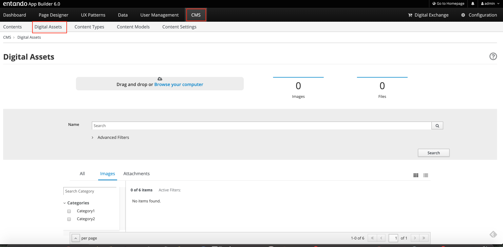
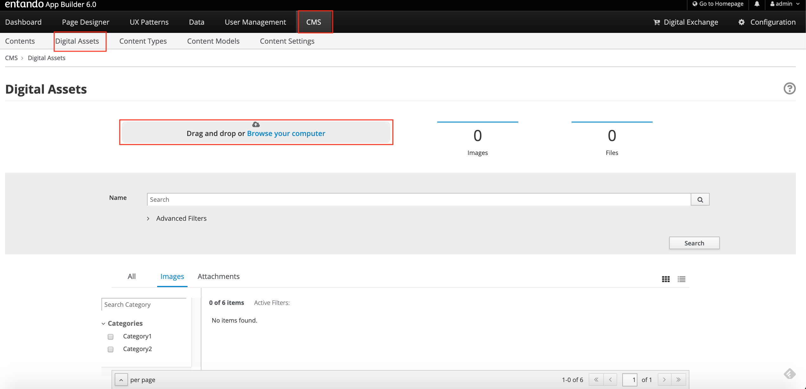
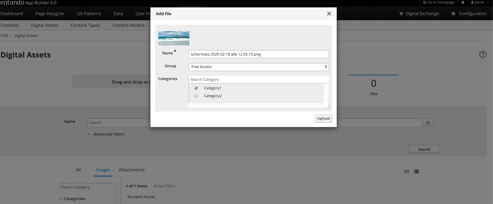
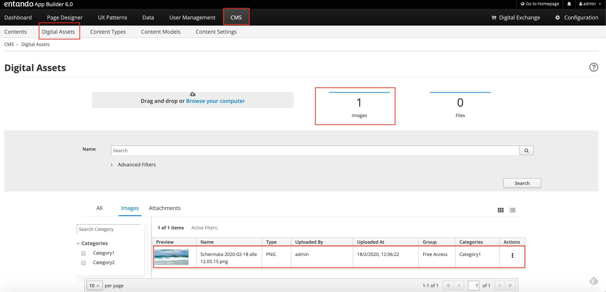
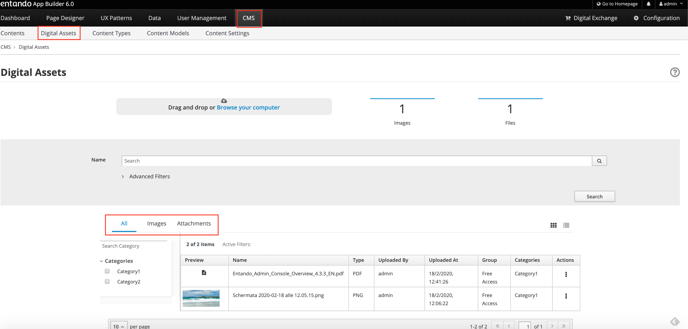

# Digital Assets

## Objective

This document provides an overview of the Digital Assets and
functionalities needed to manage images and documents.

## Overview

The WEB CMS includes capabilities that let you manage contents and
digital assets. Digital Assets are images, documents, and other media
files supported in specific format.

**Default Supported Document Formats:** The Entando CMS can be
configured to allow you to load or exclude any type of file extension
from being loaded to your site. For the app builder you should also include the MIME type of the asset you want to allow. The default set of extensions are:

pdf,xls,doc,ppt,txt,rtf,sxw,sxc,odt,ods,odp,tar,gz,zip,rar,flv,swf,avi,wmv,ogg,mp3,wav,ogm,mov,iso,nrg,docx,docm,xlsx,xlsm,xlsb,pptx,pptm,ppsx,ppsm,sldx,sldm.

**Default Supported Image Formats**: jpg, jpeg, png, svg,svg+xml

## How to create a Digital Asset

To manage the Digital Assets through the Web CMS integrated with App
Builder application

-   Select the CMS section and click on the Digital Assets subsection

Add a new image or a new document file

-   Press the **Drag and Drop or Browse your computer** button and
    choose, from your file system, images and documents files that you
    would like to upload

-   From the **Add file** modal window, you must choose one the
    available Groups and then the **Upload** button. If categories have
    been defined and displayed , you can join the file with the
    categories you want.

-   The image file that you just uploaded is displayed in the list; a
    statistical overview of the number of the uploaded resources (images
    and documents) is provided. The App Builder’s interface allows the
    users to choose grid and list view; most of the time, users prefer
    to use list view when they are searching with specific requirements,
    while they love grid view for exploring. For every resource, image,
    or document, the list shows the following information:

    -   **Preview**

    -   **Name**

    -   **Type**

    -   **Uploaded By**

    -   **Uploaded At**

    -   **Group**

    -   **Categories**

    -   **Actions**

Furthermore, the interface lets you perform all management actions, as:

-   **Edit:** update the information data related to every single
    resource (image and document)

-   **Duplicate:** copy identically the resource from the original

-   **Download:** transfer the resource in your local machine

-   **Delete:** remove the resource

You can list the contents by filtering with:

-   **All**: All added files are displayed, images and documents both.

-   **Images**: All added images are displayed

-   **Attachments**: All added documents are displayed. 
The Attachments name will be updated to the Documents name; the same for the Files label.

## Editing Assets
Once you have a digital asset in place, you have several editing and viewing options. Click the asset's *More Actions* button and select **Edit** to update the asset's name/description, categories, and the file represented.

### Cropping Images
You can crop images newly uploaded via Digital Assets. You can either crop the image dynamically or by using pre-configured crop ratios.

To set pre-configured crop ratios:
- Select Apps > CMS > Content Settings.
- Under “Settings Image Crop Dimensions,” click *Add*.
- Enter a crop ratio, using numeric values separated by a colon. See the screenshot below for an example.
- Click *Save*.

To dynamically crop an image:
- Edit the asset by opening *Actions* menu > Edit.
  - Buttons representing your pre-defined crop ratios are below the image. Clicking any of those buttons changes the selected crop area based on the chosen ratio.
  - You can create multiple crops of a single image as part of the upload process. The right side of the screen displays the list of crops created during the current session.

- Use your mouse or the buttons below the image to move or change the crop area, then click *Save* to crop the selected area. Repeat the process as many times as needed.
  - Click *Close* to return to the Digital Assets screen.

## Embedding an Asset in a Page
The uploaded asset can be embedded in a page by using `<@wp.resourceUrl path/to/asset`. The path can be found in the CMS Configuration > File Browser page.

Example usage:
`<img src="<@wp.resourceUrl cms/images/butterfly_d0_d3.jpg"`

## Including an Asset in a Content
The asset can be included in a content of a type that has an *Attach* or *Image* attribute.

- Create a content type with an image attribute.

- Create a content based on the created  type.

- Under the *Content Attributes* section at the bottom of the page, click the *Add* button beside the image attribute. It will then open a modal that allows you to select an asset by clicking the *Use* action.

## Configuring Allowed File Extensions for Upload

The types of files that can be uploaded to an Entando applicaiton are controlled by
configuration in the server side of the app builder. If you're using the quickstart this will be the
`entando-de-app`.

There are two properties that control these settings and they are set in `src/main/conf/systemParams.properties` and are a comma delimitted list of values. The property keys are

- `jacms.imageResource.allowedExtensions=`
- `jacms.attachResource.allowedExtensions=`

If you are configuring the upload for both the App Builder and the legacy Admin Console you should include
both the MIME type of the asset and the file extension. The APIs that support resources will check MIME type of the uploaded asset.

An example configuration for images.
- `jacms.imageResource.allowedExtensions=jpg,jpeg,png,svg,svg+xml`

Where `svg+xml` is the MIME type for an svg image.

The `systemParams.properties` file is bundled into the WAR and the image for the application so you will need to create and deploy image to reflect changes for these properties in your application.
