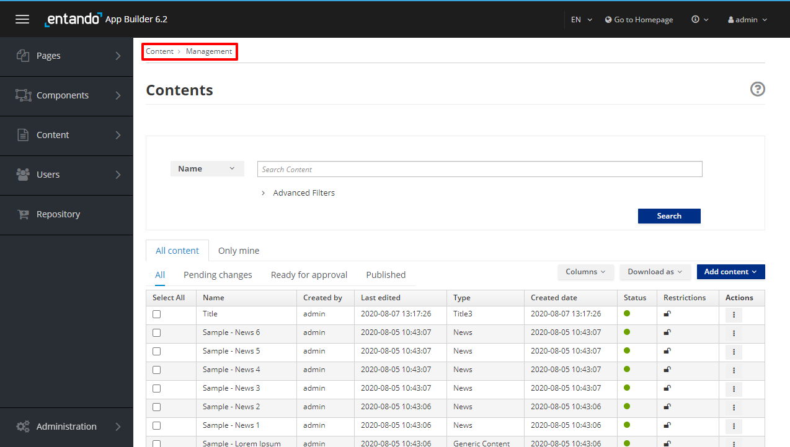
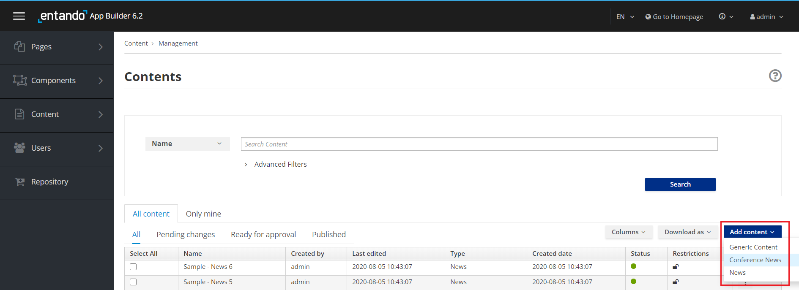
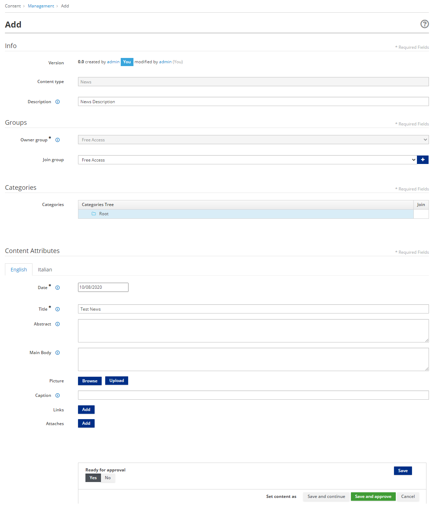
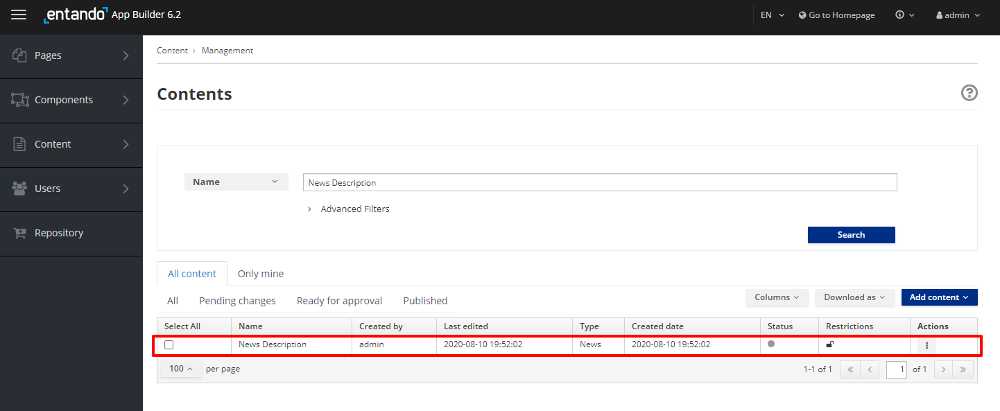
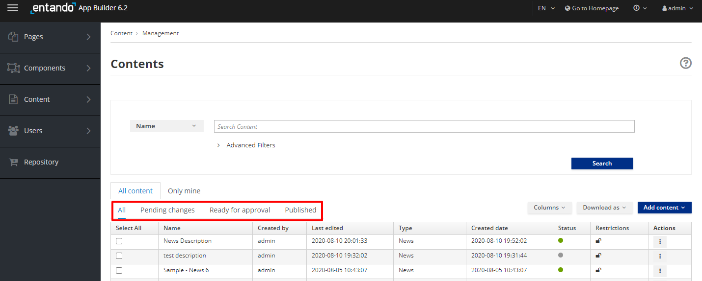
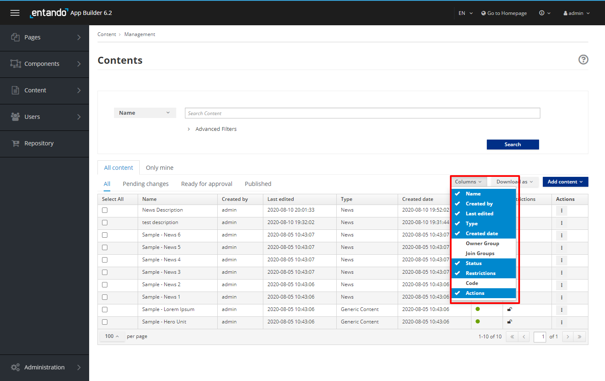
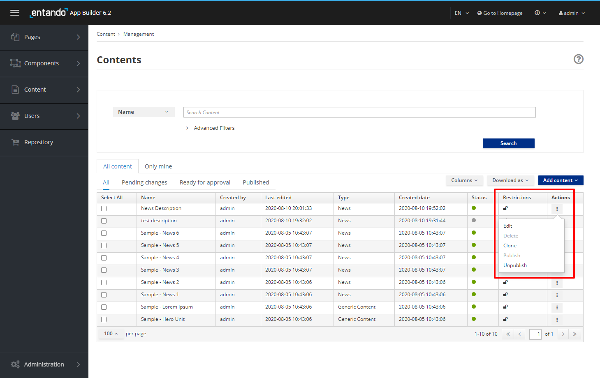
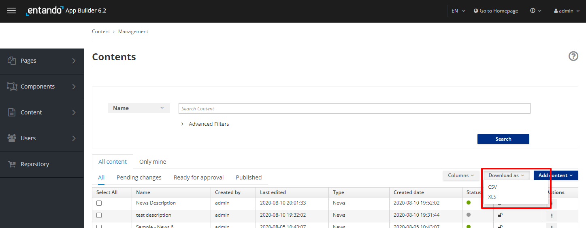

# Content Creation

## Objective

This document provides an overview of Content Management and how to create Content that can be displayed in an application.

## Overview

The App Builder is used to create, edit and position content stored in the web content management system WCMS.  

## Creating Content

To SEE/MANAGE what Content is already defined in the WCMS:

-   Select `Content - Management`. All existing 
    content is displayed in a table list.

To CREATE NEW Content and add it to the list

-   Select the **Add Content** button. A drop-down list will let you
    choose which Content Type the content will be based on.

You will be asked to provide the following information:

-   **Info**

    -   **Content Type**. This information is pre-defined, and lists the
        content type for the content.

    -   **Description**. The specific Content's name or description. This field
        is mandatory.

-   **Groups**

    -   **Owner Group.** Use the drop-down list to choose the
        available user group that can manage the content.
        This field is mandatory and may be predefined.

    -   **Join Group.** Use the drop-down list to choose the
        available user group to share the content with and select +. The group
        selected will only be able to share and can not
        administrate this content. This field is not mandatory.

    -   **Categories.** Select the category(s) and select + to add a classification to the 
        content to use for searching and sorting.  This field is not mandatory.

    -   **Content Attributes.** Define each required attributes field and any optional fields
        defined by the content types used for this Content. This field is mandatory.

SAVE THE NEW CONTENT added by selecting:

-   **Save**: The content will be saved in a draft version.

-   **Save and Continue**: The content will be saved and the editable form will be displayed.

-   **Save and Approve**: The content will be saved, approved and published.

## Finding Content

You can list specific Content by using the filters:

-   **All**: All created Content is displayed (Draft, To Approve and
    Approved/Published)

-   **Pending Changes**: All created Content that was saved by only clicking on the
    **Save** or **Save and Continue** button. The content is not
    approved and therefore is not ready to be published.

-   **Ready for Approval**: All created Content that is in **Ready** status,
    and saved by clicking on the **Save** or **Save and Continue** button.
    The content is ready for review but has not yet been approved and
    therefore has not been published.

-   **Published**: All created Content that has been saved and approved
    by clicking on the **Save and Approve** button. This content has been
    published.

In the table list, contents are listed with several parameters: Name,
Created by, Last Edited, Type, Created Date, Owner Group, Join Group,
Status, Restrictions, Code, Actions. Fields can be added or deleted from view by selecting or unselecting them
in the Columns drop-down menu.

## Content Actions

For all Content in the list, you have access to a set of actions
through the **Actions** kebab button, such as:

-   **Edit**: update the data fields in the content definition

-   **Delete**: remove the content

-   **Clone**: replicate the content

-   **Publish**: make the content visible

-   **Unpublish**: hide the content

All Content in the list can be saved to your local file system by clicking the
**Download** button and selecting either CSV or XLS format.

