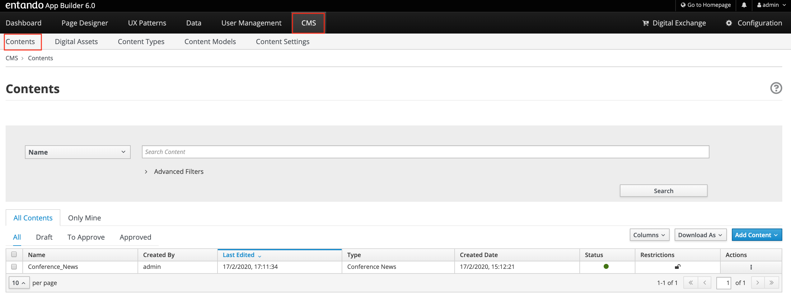
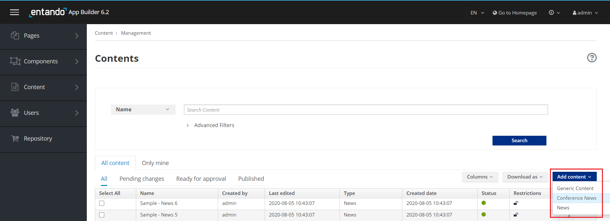
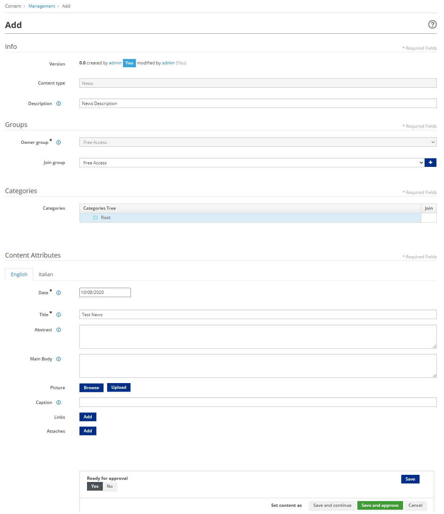
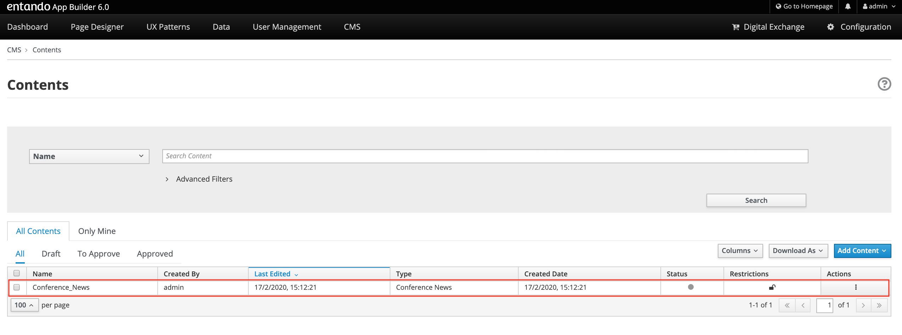
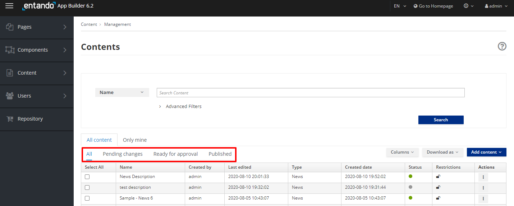
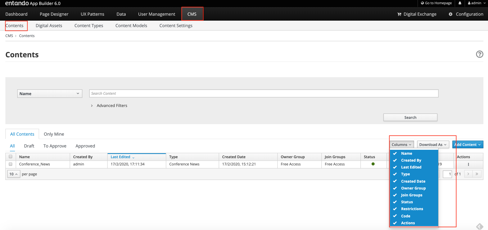
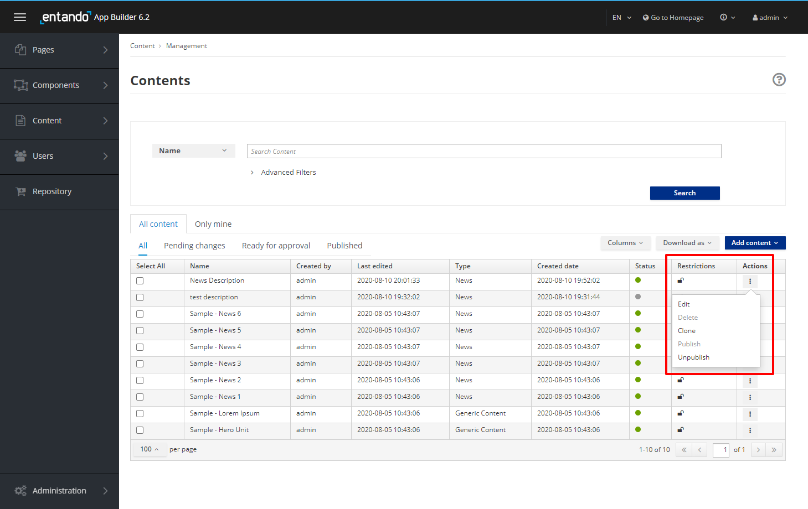
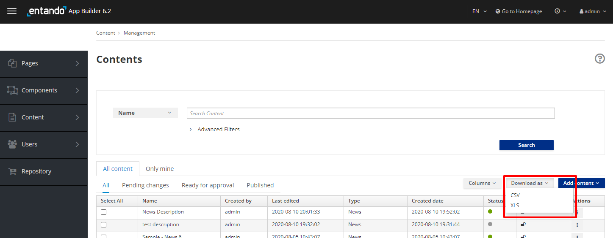

# Contents

## Objective

This document provides an overview of Contents and how to create them in
order to be displayed in your application’s pages.

## Overview

The App Builder application provides the interface to manage Contents to
the final user, using the WEB CMS integrated with the App Builder.

## How to create a Content

To manage Contents through the Web CMS

-   Select the CMS section and click on the Content subsection; all
    contents already existing are displayed in a table list.

To create an additional Content and add it to the list

-   Select the **Add Content** button. A drop-down list will let you
    choose which Content Type the content will be based on.

You will be asked to provide the information in distinct sections

-   **Info**

    -   **Content Type**. The information is pre-filled, it is the
        content type on which the content is based.

    -   **Description**. It’s the content ‘s name or description. It is
        mandatory.

-   **Groups**

    -   **Owner Group.** A drop-down list will let you choose the
        available users group that can administrate /manage the content.
        It is mandatory.

    -   **Join Group.** A drop-down list will let you choose the
        available users group to share the content with. They can’t
        administrate it. It is not mandatory.

    -   **Categories.** You can select the categories to join the
        contents to provide a classification schema of them. It is not
        mandatory.

    -   **Content Attributes.** You must fill out the attributes fields
        defined by the content types on which the content is based. It
        is mandatory.

At least the additional content is added and displayed in the list by
selecting

-   **Save** button. The content will be saved in a draft version.

-   **Save and Approve** button. The content will be saved, approved and
    published.

## 

You can list the contents by filtering with

-   **All**. All created contents are displayed (Draft, To Approve and
    Approved/Published)

-   **Draft.** All created contents and saved by only clicking on the
    **Save** or **Save and Continue** button. The content is not
    approved and consequently it is not ready to be published.

-   **To Approve.** All created contents, moved in **Ready** status,
    then saved by clicking on the Save or **Save and Continue** button.
    The content is ready for review but has not yet been approved and
    consequently it has not been published.

-   **Approved**. All created contents that have been saved and approved
    by clicking on the **Save and Approve** button. It has been
    published.

In the table list, contents are listed with several parameters: Name,
Created by, Last Edited, Type, Created Date, Owner Group, Join Group,
Status, Restrictions, Code, Actions. They can be shown, by setting them
in the Columns filter.

For every content in the list, you have access to a set of actions
through the **Actions** kebab button, from which you can:

-   Edit, update the information data related to the content

-   Delete, remove the content

-   Publish, making the content visible

-   Clone, replicate the content

-   Unpublish, making the content invisible

The contents list can be saved in your file system by clicking the
Download button and selecting CSV or XLS format.

