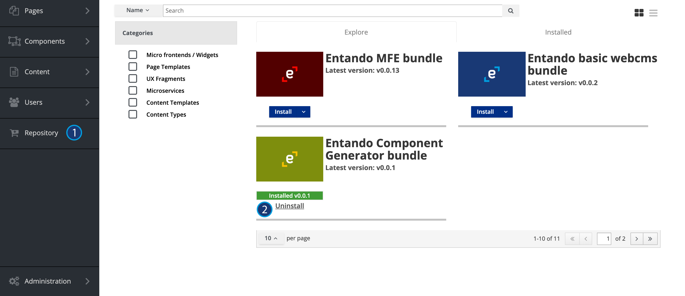

# Bundle uninstall

## Uninstall process
To uninstall a bundle that was previously installed on an Entando App Engine, from Entando App builder UI go to 
the **Component Repository** tab and select the bundle you want to uninstall

An initial check is made to verify none of the bundle components are in use. 
If any of the components are in use, a popup will alert you. 
Note that you can't force the removal of a bundle if its components are in use.

Once the removal process starts:

- Bundle resources are deleted from the Entando App Engine
- Components included in the bundle are removed from the Entando App Engine
- Plugins are unlinked

## Troubleshooting
If any error happens during the uninstall process and you don't know what to do, 
check out the [Troubleshooting guide](./ecr-troubleshooting-guide.md) or the [Entando Forum](https://forum.entando.com)

