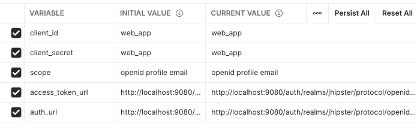
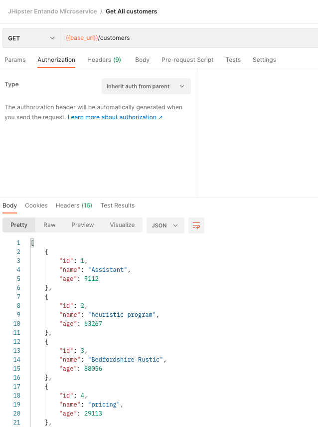

# Consume APIs with Postman and OAuth2

## Overview
The tutorial will help you to configure Postman to reach your APIs secured with OAuth2 using Keycloak.

In this tutorial, we will call an API from an application generated with the [Entando JHipster blueprint](./generate-microservices-and-micro-frontends.md).

## Prerequisites
Get the [Postman](https://www.postman.com/downloads/) application or create an account to use it on the web.
The screenshots present in this tutorial have been made with the Web version.

## Create a new Postman Collection
According to the official website 
> Postman's collection folders make it easy to keep your API requests and elements organized.

This helps us to gather the different requests under the same folder but also to share the configuration and the Auth mode among them.

Configure your Keycloak to add the Postman redirect URI in the "Valid Redirect URIs" list.
Click on the button when you are on the collection left menu.

Name it as you want, we usually try to have to create a collection per application.

## Defines collection variables
Postman allows us to define variables for a given collection, and we can use them at the collection level
to configure the OAuth2 settings but also at the request level.

Please note you can choose the variable names you want, according to what makes sense for you.

| Variable | Default value in a JHipster Entando App | Details |
|------|------|------|
| client_id | web_app | The client id account used to authenticate the user |
| client_secret | web_app | The secret for the client_id |
| scope | openid profile email | The scope to retrieve during the auth |
| access_token_url | http://localhost:9080/auth/realms/jhipster/protocol/openid-connect/token | The token endpoint |
| auth_url | http://localhost:9080/auth/realms/jhipster/protocol/openid-connect/auth | The authorization endpoint |
| base_url | http://localhost:8081/api | The url all the requests start with |

Notes:
> The base_url variable is added for convenience, but is not mandatory for the authentication purposes

> Use the .well-known endpoint to retrieve these values if you don't have them
> http://keycloak_host:keycloak_host/auth/realms/<realm>/.well-known/openid-configuration
> For a local running app it should be http://localhost:9080/auth/realms/jhipster/.well-known/openid-configuration

## Configure a new token generation
In your collection view, click on the Authorization tab and define the type to "OAuth2" as-is:

Fill the fields up with the variable previously defined, you can define the "Token Name" with the value you want though:

Update your Keycloak configuration
>To generate a new token you need, in the Keycloak admin panel, ensure the Postman redirect URL, here https://oauth.pstmn.io/v1/browser-callback, is present in the “Valid Redirect URIs” list for your client.
This URL is used to redirect to the Postman app after the authentication succeed.

## Generate a new token
Click on the “Get New Access Token” will open the Keycloack login form. Authenticate with the user you want to consume the API.
You should select the user according to the roles you want to have when you will call the API.

After the authentication succeeds, you should be redirected to the Postman app.

Then, the token is displayed in a window, you can confirm to use it by clicking on the "Use Token" button.

## Add a request
The next step is to add a request to the collection, using the previous OAuth2 config as an authorization method.
In your collection name click on the "add a request" entry

In the "Auth" tab select "Inherit auth from parent". The whole requests in the collection can inherit the settings,
allowing you to execute a configuration step every time you add a new one.

Then, it automatically adds an Authorization header with a Bearer "Token" value where "Token" is the token value generated in the previous step.

Note:
> By default, these headers are hidden. A button allows you to display them.

Finally, you can define the endpoint you want to consume, the HTTP method to use and, add headers if needed.

> The expected result should have a 200 or equivalent answer from our API.
> If you experience a 401 error, this probably means that the token is not valid anymore.
> Because the token has an expiration period, it's mandatory to refresh it frequently.

## Troubleshooting with Tokens timeout
For security reasons, the access token timeout should always be short to avoid security issues if someone stealth the token. 
The refresh token aim to get a new token when the access token has expired. The process would be:
 1. Get the Access token (and the Refresh Token)
 2. Call the API
 3. Check if the token is still valid
    - The token is valid: execute the call 
    - The token has expired: use the refresh token to generate a new Token and execute the call

Unfortunately, Postman doesn't handle the refresh action if the token has expired, and you need to generate a new one by yourself by clicking on the “Get new access token” button.
To avoid this manual action you can make the token longer by updating the timeout over 5 min. However, we do not recommend this solution.

The Postman team is tracking this issue and plans to include this feature in the next versions: https://github.com/postmanlabs/postman-app-support/issues/10112.
