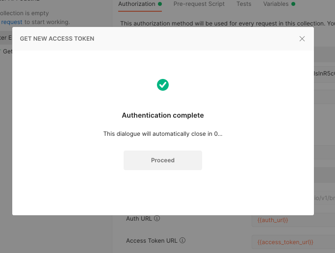

# Consume APIs with Postman and OAuth2

## Overview
The tutorial will help you to configure Postman to reach your APIs secured with OAuth2 using Keycloak.

In this tutorial we will call an API from an application generated with the [Entando JHipster blueprint](./generate-microservices-and-micro-frontends.md).

## Prerequisites
Get the [Postman](https://www.postman.com/downloads/) application or create an account to use it on the web.
The screenshots present in this tutorial have been made with the Web version.

## Create a new Postman Collection
According to the official website 
> Postman's collection folders make it easy to keep your API requests and elements organized.

This helps us to gather the different requests under the same folder but also to share the configuration and the Auth mode among them.

Configure your Keycloak to add the Postman redirect URI in the "Valid Redirect URIs" list.
Click on the button when you are on the collection left menu.

Name it as you want, we usually try to have to create a collection per application. Up to you to organize as you want
but keep in mind we are configuring the authentication settings per collection.

## Defines collection variables
Postman allows us to define variables for a given collection, and we can use them at the collection level
to configure the OAuth2 settings but also at the request level.

Please note you can choose the variable name you want, according to what makes sense for you.

| Variable | Default value in a JHipster Entando App | Details |
|------|------|------|
| client_id | web_app | The client id account used to authenticate the user |
| client_secret | web_app | The secret for the client_id |
| scope | openid profile email | The scope to retrieve during the auth |
| access_token_url | http://localhost:9080/auth/realms/jhipster/protocol/openid-connect/token | The token endpoint |
| auth_url | http://localhost:9080/auth/realms/jhipster/protocol/openid-connect/auth | The authorization endpoint |
| base_url | http://localhost:8081/api | The url all the requests start with |

Note 1
> The base_url variable is added for convenience, but is not mandatory for the authentication purposes

Note 2
> Use the .well-known endpoint to retrive these values if you don't have them
> http://keycloak_host:keycloak_host/auth/realms/<realm>/.well-known/openid-configuration
> For a local running app it should be http://localhost:9080/auth/realms/jhipster/.well-known/openid-configuration

## Configure a new token generation
In your collection view, click on the Authorization tab and define type to OAuth2 as is:

Fill the fields up with the variable previously defined, you can use the "Token Name" you want though:

Update your Keycloak configuration
>To generate a new token you need, in the Keycloak admin panel, ensure the Postman redirect URL, here https://oauth.pstmn.io/v1/browser-callback, is present in the “Valid Redirect URIs” list for your client.
This URL is used to redirect to the Postman app after the authentication succeed.

## Generate a new token
Click on the “Get New Access Token” will open the Keycloack login form. Authenticate with the user you want to consume the API.
You should select the user according to the roles you want to have when you will call the API.

After the authentication suceed, you should be redirected to the Postman app.

Then, the token is displayed in a window, you can confirm to use it on clicking on "Use Token" button.

