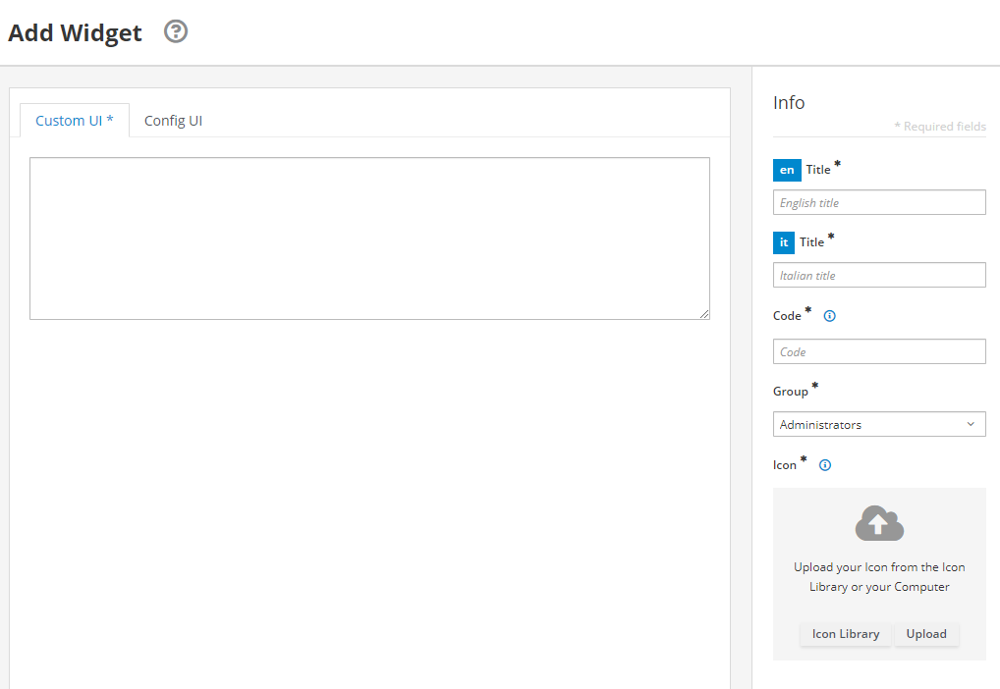
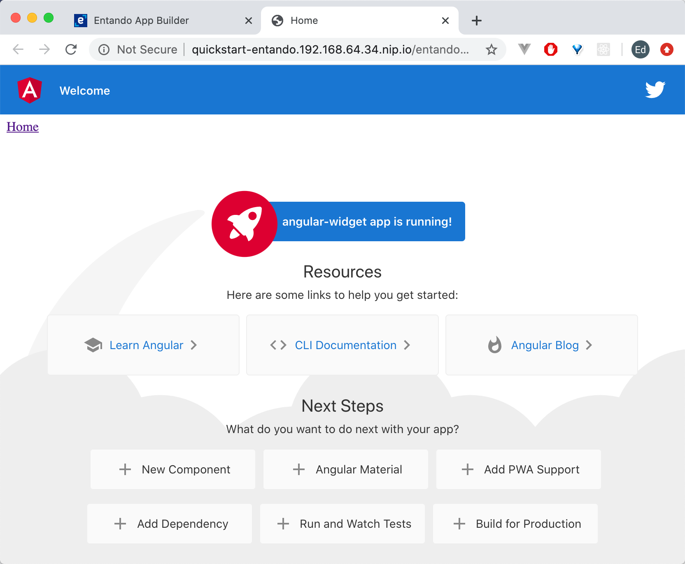

# Create an Angular Micro Frontend

::: warning Prerequisites
- [A working instance of Entando.](../../../docs/getting-started)
:::

::: warning Tested Versions
node v13.8.0 → We suggest using [nvm](https://github.com/nvm-sh/nvm) to handle node installations.
:::

## Create Angular App

Install Angular CLI.

``` bash
npm install -g @angular/cli
```

Generate a new angular application.

``` bash
ng new angular-widget
```

Choose the following options:

``` bash
? Would you like to add Angular routing? No
? Which stylesheet format would you like to use? CSS
```

Serve the application.

``` bash
cd angular-widget
```

``` bash
ng serve
```

This is the expected output:

    angular-widget
    ├── e2e
    │   └── src
    │       ├── app.e2e-spec.ts
    │       └── app.po.ts
    │
    ├── node_modules
    ├── src
    │   ├── app
    │   │   ├── app.component.css
    │   │   ├── app.component.html
    │   │   ├── app.component.spec.ts
    │   │   ├── app.component.ts
    │   │   └── app.module.ts
    │   │
    │   ├── assets
    │   │   └── .gitkeep
    │   │
    │   ├── environment
    │   │   ├── environment.prod.ts
    │   │   └── environment.ts
    │   │
    │   ├── favicon.ico
    │   ├── index.html
    │   ├── main.ts
    │   ├── polyfills.ts
    │   ├── styles.css
    │   └── test.ts
    │
    ├── .editorconfig
    ├── .gitignore
    ├── angular.json
    ├── browserlist
    ├── karma.conf.js
    ├── package.json
    ├── README.md
    ├── tsconfig.app.json
    ├── tsconfig.json
    ├── tsconfig.spec.json
    └── tslint.json

### Convert to Custom Element

Next, let's convert our Angular app into a custom element. We'll use [Angular elements](https://angular.io/guide/elements) to transform components into custom elements.

``` bash
ng add @angular/elements
```

::: warning
Install the Angular elements package using `ng add`, not with `npm install` as it runs additional steps behind the scenes like adding the `document-register-element` polyfill.
:::

::: tip
[Angular elements are Angular components packaged as custom elements (also called Web Components), a web standard for defining new HTML elements in a framework-agnostic way.](https://angular.io/guide/elements)
:::

Open `angular-widget/src/app/app.module.ts`.

- Here's what the initial file looks like:

``` js
import { BrowserModule } from '@angular/platform-browser';
import { NgModule } from '@angular/core';

import { AppComponent } from './app.component';

@NgModule({
  declarations: [
    AppComponent
  ],
  imports: [
    BrowserModule
  ],
  providers: [],
  bootstrap: [AppComponent]
})
export class AppModule { }
```

Replace the entire file with:

``` js
import { BrowserModule } from '@angular/platform-browser';
import { NgModule, Injector } from '@angular/core';
import { createCustomElement } from '@angular/elements';
import { AppComponent } from './app.component';

@NgModule({
  declarations: [
    AppComponent
  ],
  imports: [
    BrowserModule
  ],
  providers: [],
  entryComponents: [AppComponent]
})
export class AppModule {
  constructor(private injector: Injector) {}

  ngDoBootstrap() {
    const el = createCustomElement(AppComponent, { injector: this.injector });
    customElements.define('angular-widget', el);
  }
}
```

1. In the initial file, `AppModule` is bootstrapped directly during application launch.
2. In the updated file, we booststrap our custom element using the [`ngDoBootstrap()` method](https://angular.io/guide/entry-components).

::: warning Custom Elements
- [Must contain a hyphen `-` in the name.](https://stackoverflow.com/questions/22545621/do-custom-elements-require-a-dash-in-their-name):
- Cannot be a single word.
- Should follow `kebab-case` for naming convention.
:::

### Test Micro Frontend

Now, let's check our custom element to see if it's working.

Open `angular-widget/src/index.html`.

In the `<body>`, replace `<app-root></app-root>` with your custom element `<angular-widget />`.

``` html
<!doctype html>
<html lang="en">
<head>
  <meta charset="utf-8">
  <title>AngularWidget</title>
  <base href="/">
  <meta name="viewport" content="width=device-width, initial-scale=1">
  <link rel="icon" type="image/x-icon" href="favicon.ico">
</head>
<body>
  <angular-widget />
</body>
</html>
```

::: tip Congratulations!
You’re now running `Angular` in a micro frontend.
:::

## Build It

From the project root, type:

``` bash
ng build --prod --outputHashing=none
```

This will generate an `angular-widget/dist` directory.

If we assume browser support for [ES6 (ECMAScript 2015)](https://www.w3schools.com/js/js_versions.asp), we can focus on the following JavaScript files to publish our app:

- `main-es2015.js`
- `polyfills-es2015.js`
- `runtime-es2015.js`

::: warning Generated Build Files
`--outputHashing=none` generates files without hashes so we can deploy new versions of the micro frontend without having to reconfigure our widget in Entando to point to the newly built files.
:::

If you want to use file names with content hashes to avoid potential caching issues in your browser, you can update the `Custom UI` field of your widget after building new versions of your micro frontend. Widget configuration is covered in the next section.

## Host Micro Frontend

Now we're ready to host our micro frontend in Entando.

### Create Public Folder

1. Navigate to `Entando App Builder` in your browser.

2. Click `Administration` at the lower left hand side of the screen.

3. Click the `File Browser` tab.

2. Click the `public` folder.

4. Click `Create Folder`.

5.  Enter `angular-widget`

7. Click `Save`.

8. Click `angular-widget`.

9. Click 'Upload Files`.

10. Upload the following files from `angular-widget/dist/angular-widget`:

- `main-es2015.js`
- `polyfills-es2015.js`
- `runtime-es2015.js`

::: warning Additional Deployment Options
1. Install the micro frontend from a bundle in the `Entando Component Repository`.
2. Add the micro frontend to `Entando App Builder`.
3. Load the micro frontend from an API.
:::

### Add Widget

1. Go to `Components > Micro frontends & Widgets` in the Entando App Builder.
2. Click `Add` at the lower right.



3. Enter the following:
- `Code: angular_widget` → note: dashes are not allowed
- `Title: Angular Widget` → for both English and Italian languages
- `Group: Free Access`
- `Custom UI:`

``` ftl
<#assign wp=JspTaglibs[ "/aps-core"]>
<script async src="<@wp.resourceURL />angular-widget/main-es2015.js"></script>
<script async src="<@wp.resourceURL />angular-widget/polyfills-es2015.js"></script>
<script async src="<@wp.resourceURL />angular-widget/runtime-es2015.js"></script>

<angular-widget />
```

4. Click `Save`.

::: tip
`<#assign wp=JspTaglibs[ "/aps-core"]>` gives you access to the `@wp` object where you can use environment variables like `resourceURL`.
:::

### See It in Action

Let's see the Angular micro frontend in action on our page.

#### Add Page

::: warning Note
If you've already configured your home page:

<ol type="i">
  <li>Next to the <b>Home</b> folder, under <b>Actions</b>, click <b>Configure</b>.</li>
  <li>Skip to the <b>Add Widget</b> section.</li>
</ol>
:::

Let's add our widget to the `Home` page.

1. Go to `Pages` → `Management`

2. Next to the `Home` folder, under `Actions`, click `Edit`.

3. Next to `Page Template` select `Service Page`.

4. Click `Save and Configure`.

#### Add Widget

1. In the Search field in right-hand sidebar, enter `Angular Widget`.

2. Drag and drop `Angular Widget` into the `Sample Frame` in the main body of the page.

3. Click `Publish`.

4. At the upper right, click `Go to Homepage`.



::: tip Congratulations!
You now have an Angular micro frontend running in Entando.
:::
