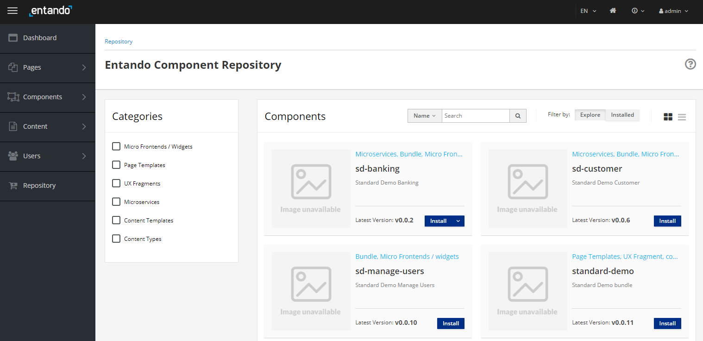

# Entando Standard Demo Application

[[toc]]

## Introduction

This tutorial will take you through installing a full application using the Entando Component Repository and Entando
Bundles. The application includes microservices, micro frontends, many pages, and CMS content. The goal of this install
is to demonstrate how Entando Bundles can be used to quickly install and create functionality in a brand new
installation, enable portable capability, and can enable developers to re-use full stack functionality in a bundle.

After the installation section some of the key elements of the bundle are reviewed in
the [application details section](#application-details)

## Installation

### Prerequisites

- An Entando application on any Kubernetes provider. Follow one of the tutorials for your platform to install the
  Entando platform
- The ent command line tool installed and connected to your Kubernetes instance.

### Installation Steps

1. Create and deploy the Standard Demo Bundle. Replace "entando" in the second part of the command with your namespace
   if it is different.

```
ent bundler from-git -d -r https://github.com/entando-samples/standard-demo-bundle.git | ent kubectl apply -n entando -f -
```

2. Log into your App Builder instance

3. Select Repository from the menu on the left. Your bundle will be visible in the repository as shown in the screenshot
   below
   

4. Select `Install`.

5. You should not see any conflicts in a new Entando 6 install but if there are any conflicts you will be presented with
   an Installation Plan like the one shown below.
   

Select `Update All` in the upper right after making your selections.

6. The installation can take a few minutes as the application downloads the docker images for the microservices and
   installs all of the assets.
   

7. (Option 1) If you'd like to make the Standard Demo your default home page, go to `App Builder → Pages → Settings`. In
   the dropdown for Home Page select `Home / Home SD` and click `Save`.
   

You can now navigate to your applications home page using the home icon in the upper right of the app builder to view
the application homepage


8. (Option 2) Alternatively, you can simply view the Standard Demo home page by going to `Pages → Management`,
   finding `Home SD` in the page tree, and clicking `View Published Page` from its actions.

:::tip
There are many assets installed as part of the standard demo. Entando Bundles can be very large like the standard demo or smaller depending on the goals of your team. It is recommended that organizations develop guidelines for bundle sizing that fit the goals of their applications and teams. In the future Entando will provide a standard demo installation examples composed of several bundles rather than one very large bundle.
:::

## Application Details

The Entando Standard Demo application demonstrates a number of the major features in the Entando platform including:
 * Keycloak integration for role based access controls
 * Micro frontends implemented using React and Angular and co-existing on the same dashboard page
 * Micro front communication techniques
 * Microservices run via Spring Boot
 * Entando Content Management

### Micro Frontends (MFE)

The application includes six custom micro frontends which are described below.

#### 1. Seeds Card


  - The Seeds Card MFE is a React micro frontend that is visible on the My Dashboard page. The MFE makes an API call to the banking microservice to fetch a numeric result depending on the configured card type. The value displayed will change as the configuration is changed.
  - The MFE is authorization-aware and will pass the bearer token to the microservice for authorization and authentication. If you render the dashboard page and you aren't authenticated the widget shows an error message.
  - This widget emits events that are consumed by the Seedscard Transaction Table widget

#### 2. Seeds Card NG


  - The Seeds Card NG MFE is an Angular widget that is identical to the Seeds Card widget above except for the choice of front end technology.
  - This MFE communicates with Seedscard Transaction Table widget which is implemented in React.

#### 3. Manage Users

Authorized View


Not Authorized View


  - The Manage Users MFE makes an API call to Entando Identity Management to fetch user information. The MFE is visible under the dropdown under the username when the user is logged into the app.
  - By default the users provisioned in the application do not include the authorization required to manage users in Entando Identity Management. This is used to demonstrate role based access control for an MFE using Keycloak. To enable the Manage Users widget login to Keycloak and assign the `view-users` and `manage-users` roles from the realm-management client to the desired user.

#### 4. Seedscard Transaction Table


  - This MFE is a React micro frontend that consumes events from the Card MFEs detailed above.
  - The Transaction Table widget makes an API call to the banking microservice to fetch transaction data for the logged in user.

#### 5. Signup


  - The Sign Up MFE is a form widget that makes an API call to the customer microservice to create a new user. The Signup MFE is visible on the sign up page and can be accessed from any page when a user is not authenticated.

#### 6. Alert Icons


  - The Alert Icon MFE displays an icon on the dashboard page and includes a configuration MFE to allow the user to select the appropriate icon and datatype to display.
  - The Alert Icon MFE makes an API call to the banking microservice to fetch data in the default deployment.  

### Configuration Micro Frontends

Many of the MFEs detailed above include configuration screens visible in the App Builder when the MFE is placed on a page. In the App Builder navigate to `Components -> Micro frontends & Widgets` to see the configured MFEs. To see the rendered config screen place the MFEs above on a new page.

### Microservices

The application includes two microservices (service paths: `/banking` and `/customer`) to support the data visible in the MFEs detailed above. Both microservices demonstrate the automated deployment and linking of a microservice to an Entando application via the Entando operator.

The data for the microservices is created using Liquibase and demonstrates using the operator and Liquibase + Spring Boot to automatically provision data into an environment. The demo data is available in the source code for the microservices on GitHub.

### Static Widgets

The application uses static HTML, FreeMarker, and JavaScript widgets to display content including headers, footers, images and other content in the application. To view the static widgets log into the App builder and select `Components -> Micro frontends & Widgets`

### Static CMS Content

The application makes extensive use of the Entando CMS. This includes the creation of content templates, content types, and content. If you want to learn more about the Entando CMS in the application log into the App Builder and select `Content ->  Templates`, `Content -> Management`, or `Content -> Types` as good starting points to view the content and static assets.


## Source Code

The source for the Entando Standard Demo can be found with our other open source examples and tutorials on GitHub at:

<https://github.com/entando-samples/standard-demo>
