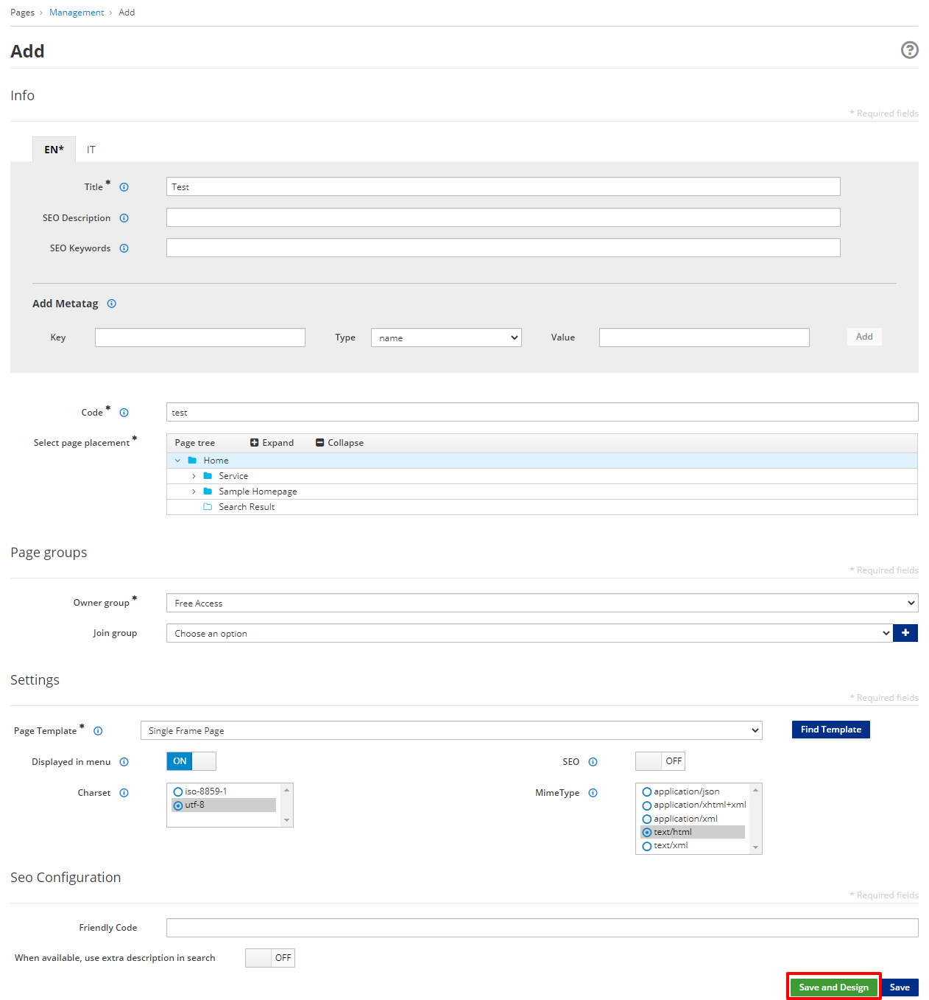

# Page Management

The App Builder provides the capability to publish application pages containing content as well as other Entando components. Page Templates are used to layout the available frames on a page.

## Create a Page

- Go to `Pages → Management`
- Click **Add**


You will need to supply at least the following fields:
- `Title`: used for SEO
- `Code`: must be unique
- `Page placement`: the location of the Page in the Page Tree
- `Owner Group`: the Group that has access to the Page
- `Page Template`: the structure and presentation of the Page



-   Click the green **Save and Design** button. This brings you to the Designer section which lets you place widgets into the Page Template frames.


-   Add widgets by dragging them from the right column into the desired frame. 
-   If you select the **Content** widget, its corresponding settings page will be shown.


-   Click **Add existing content** to bring up the Content selection view.


-   In the Search field, you can type the name of the content that you
    would like to publish. Remember
    that in order to publish the content on your page, it must first be saved
    and approved.

-   Select the appropriate content item from the list. 

-   Press the **Save** button.


-   The title of the selected content item will now be displayed in the widget settings.

-   Press the **Save** button.

-   Click on the **Preview** button to show the page preview with the updated settings.

-   Click on the **Publish** button to publish the page.

-   Click on the **View published page** button to view the published page in your application.

## Create a Page Template
Page Templates provide the scaffolding of a Page and are constructed using two main elements:

1. A `JSON configuration` field which lists the set of frames that can be used on a page. 
   - Each item in the frames array represents a frame or slot in the page, characterized by the following values:
      - `pos` - a zero-based position index (starts from zero). This value is used in
    APIs to address a specific widget on the page.
      - `descr` - the frame description displayed on Page Design view
      - `mainFrame` - designates the primary frame in the Page Template
      - `defaultWidget` - widget code for a default widget to use in this frame. Page Template developers can use this field to provide suggestions on common widgets, e.g. header and footer widgets.
      - `sketch` - an object with 4 coordinates (x1,x2,y1,y2) to allow the developer to place the widgets in the Page preview. Sketch’s x and y values go from 0 to 11 (similar to columns in Bootstrap), so if you want to place a 2x2 frame at the top left corner of the page, the values would be `x1: 0, x2: 1 y1: 0 y2: 1`.
2. A `Template` field which uses Freemarker code to setup the HTML page itself.
   - To add a frame in a specific place of the page, add `<@wp.show frame=0 />`, where frame is the pos variable from the `JSON configuration`. `<#assign wp=JspTaglibs["/aps-core"]>` is required at the top of the template to setup the `wp` variable.
   - Common code can be shared across pages by using [UX Fragments](app-builder/hello-world.md#create-a-ux-fragment) and ```<@wp.fragment code="\<FRAGMENT\_CODE\>" escapeXml=false /\>```.

This tutorial prepares a Page Template with two frames on it.

1. Go to `Pages → Templates → Add`

2. Enter the following:

- `Code: double_frame`
  - Note: dashes are not allowed
- `Name: Double Frame`
- `JSON Configuration:`

``` json
{
  "frames": [
    {
      "pos": 0,
      "descr": "Frame 1",
      "mainFrame": false,
      "defaultWidget": null,
      "sketch": null
    },
    {
      "pos": 1,
      "descr": "Frame 2",
      "mainFrame": false,
      "defaultWidget": null,
      "sketch": null
    }
  ]
}
```


- `Template:`

``` ftl
<#assign wp=JspTaglibs["/aps-core"]>
<!DOCTYPE HTML PUBLIC "-//W3C//DTD HTML 4.0 Transitional//EN">
<html>
  <head>
      <title><@wp.currentPage param="title" /></title>
  </head>
  <body>
    <h1><@wp.currentPage param="title" /></h1>
    <div><@wp.show frame=0 /></div>
    <div><@wp.show frame=1 /></div>
  </body>
</html>
```
3. You should see the `Template preview` reflecting the desired two frame layout.
4. Click `Save`. 
