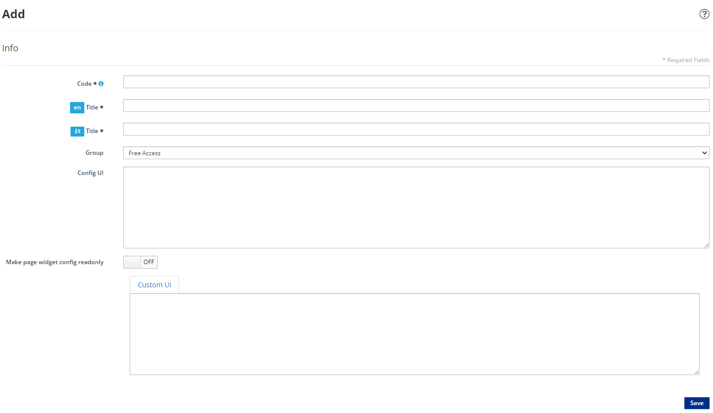
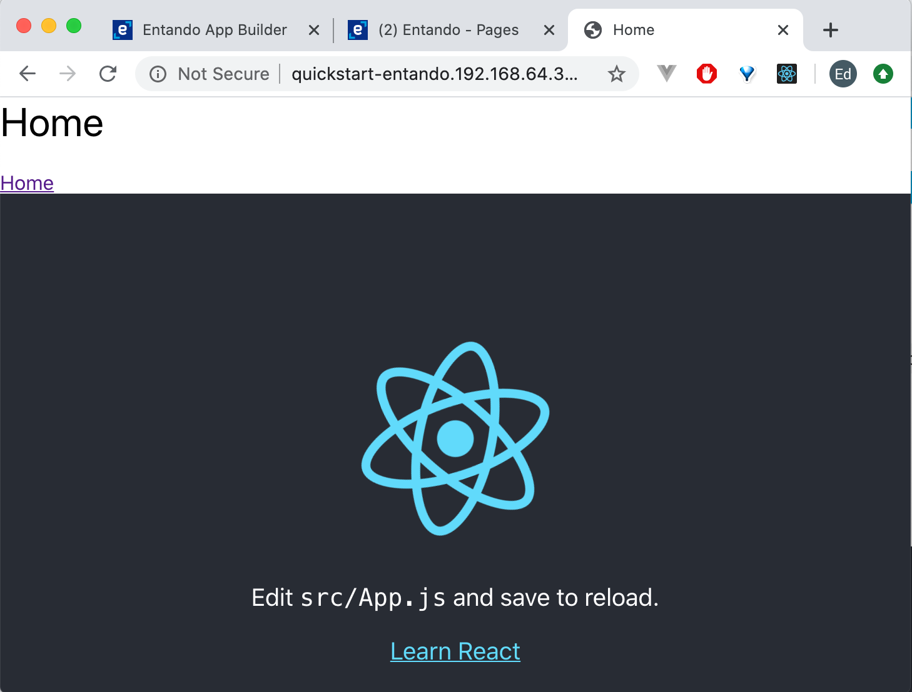

# Create a React Micro Frontend

::: warning Prerequisites
- [A working instance of Entando.](../../docs/getting-started)
:::

::: warning Tested Versions
node v13.8.0 → We suggest using [nvm](https://github.com/nvm-sh/nvm) to handle node installations.
:::

## Create React App

We'll use [Create React App](https://create-react-app.dev/) to create a simple app in seconds.

``` bash
npx create-react-app my-widget --use-npm
```

This is the expected output:

    my-widget
    ├── README.md
    ├── node_modules
    ├── package.json
    ├── .gitignore
    ├── public
    │   ├── favicon.ico
    │   ├── index.html
    │   ├── logo192.png
    │   ├── logo512.png
    │   ├── manifest.json
    │   └── robots.txt
    └── src
        ├── App.css
        ├── App.js
        ├── App.test.js
        ├── index.css
        ├── index.js
        ├── logo.svg
        ├── serviceWorker.js
        └── setupTests.js

Start the app.

``` bash
cd my-widget
npm start
```

### Wrap with Custom Element

Add a new file `src/WidgetElement.js` with the custom element that will wrap the entire React app.

``` js
import React from 'react';
import ReactDOM from 'react-dom';
import App from './App';

class WidgetElement extends HTMLElement {
    connectedCallback() {
        this.mountPoint = document.createElement('div');
        this.appendChild(this.mountPoint);
        ReactDOM.render(<App />, this.mountPoint);
    }
}

customElements.define('my-widget', WidgetElement);

export default WidgetElement;
```

::: tip
`connectedCallback` is a lifecycle hook that [runs each time the element is added to the DOM.](https://developer.mozilla.org/en-US/docs/Web/Web_Components/Using_custom_elements#Using_the_lifecycle_callbacks)
:::

The React `root` node is programatically generated in the `connectedCallback` method when our custom element is added to the DOM.

::: warning Custom Elements
- [Must contain a hyphen `-` in the name.](https://stackoverflow.com/questions/22545621/do-custom-elements-require-a-dash-in-their-name):
- Cannot be a single word.
- Should follow `kebab-case` for naming convention.
:::

### Import Custom Element

Open `src/index.js`. Here's what the initial file looks like:

``` js
import React from 'react';
import ReactDOM from 'react-dom';
import './index.css';
import App from './App';
import * as serviceWorker from './serviceWorker';

ReactDOM.render(<App />, document.getElementById('root'));

// If you want your app to work offline and load faster, you can change
// unregister() to register() below. Note this comes with some pitfalls.
// Learn more about service workers: https://bit.ly/CRA-PWA
serviceWorker.unregister();
```

Replace the entire file with these two lines.

``` js
import './index.css';
import './WidgetElement';
```

### Test Micro Frontend

1. Open `public/index.html`.

2. Replace `<div id="root"></div>` with the custom element `<my-widget />`.

``` html
  <body>
    <noscript>You need to enable JavaScript to run this app.</noscript>
    <my-widget />
    ...
  </body>
```

::: tip Congratulations!
You’re now running `React` in a containerized micro frontend.
:::

## Get Resource URL

Let's add our micro frontend to Entando by adding our JavaScript and CSS files to the `public` folder.

::: tip
Entando makes files publicly available through the `public` folder.
:::

#### Add Widget

Initially, we'll add a widget to get the resource URL for the `public` folder. Later on, we'll use the same widget to add our micro frontend to Entando.

1. Go to `Components > Micro frontends & Widgets` in the Entando App Builder.

2. Click `Add` at the lower right.



3. Enter the following:
- `Code: my_widget` → note: dashes are not allowed
- `Title: My Widget` → for both English and Italian languages
- `Group: Free Access`
- `Custom UI:`

``` ftl
<#assign wp=JspTaglibs[ "/aps-core"]>
<@wp.resourceURL />
```

::: tip
`<#assign wp=JspTaglibs[ "/aps-core"]>` gives you access to the `@wp` object where you can use environment variables like `resourceURL`.
:::

4. Click `Save`.

#### Add Page

Next, let's add our widget to a page so we can view the `Resource URL`.

If you're getting started with a new install of Entando, let's add our widget to the `Home` page:

---

> For Experienced Entando users:
>
> Add a new page → Add your widget to the page

---

1. Go to `Pages` → `Management`

2. Next to the `Home` folder, under `Actions`, click `Edit`.

4. Next to `Page Template` select `Service Page`.

5. Click `Save and Configure`.

6. In the Search field in right-hand sidebar, enter `My Widget`.

7. Drag and drop `My Widget` into the `Sample Frame` in the main body of the page.

8. Click `Publish`.

9. At the upper right, click `Go to Homepage`.

- This will take you to a blank home page with your widget.

10. Copy the `Resource URL`.

```
/entando-de-app/cmsresources/
```

## Build It

Now that we have the resource URL where we'll host our `Create React App`, we're ready to build.

1. Create an `.env` file in the project root of your `Create React App`.

2. Add the `PUBLIC_URL` where we'll be hosting our files.

Example:

```
PUBLIC_URL=http://quickstart-entando.192.168.64.34.nip.io/entando-de-app/cmsresources/my-widget
```

3. Replace `quickstart-entando.192.168.64.34.nip.io/entando-de-app` with the URL for your Entando application.

::: warning Notes
- `quickstart-entando.192.168.64.34.nip.io` represents the base URL for your Entando application
- `/entando-de-app/cmsresources/` is the Resource URL for your Entando application
- `/my-widget` is the public folder we'll create to host our files
:::

::: tip
[When you run `npm run build`, `Create React App` will substitute `%PUBLIC_URL%` with a correct absolute path so your project works even if you use client-side routing or host it at a non-root URL.](https://create-react-app.dev/docs/using-the-public-folder/)
:::

### npm build

1. Open a command line, and navigate to the project root of your `Create React App`.

2. Run the command:

``` bash
npm run build
```

3. Rename the following generated files in the `build` directory.

| Example of Generated Build File           | Rename to                 | Function
| :---                                      | :---                      | :---
| build/static/js/2.f14073bd.chunk.js       | `static/js/vendor.js`     | Third-party libraries
| build/static/js/runtime-main.8a835b7b.js  | `static/js/runtime.js`    | Bootstrapping logic
| build/static/js/main.4a514a6d.chunk.js    | `static/js/main.js`       | App
| build/static/css/main.5f361e03.chunk.css  | `static/css/main.css`     | Stylesheet

::: warning Generated Build Files
We rename the JavaScript and CSS files so we can deploy new versions of the micro frontend without having to update the `Custom UI` field of our widget to reference the new files.
:::

If you want to use the original [file names with the content hashes to avoid potential caching issues in your browser](https://create-react-app.dev/docs/using-the-public-folder/#adding-assets-outside-of-the-module-system), update the `Custom UI` field of your widget when deploying new versions of your micro frontend. The `Custom UI` settings will be covered in the next section.

::: warning Additional Deployment Options
1. Install the micro frontend from a bundle in the `Entando Component Repository`.
2. Add the micro frontend to `Entando App Builder`.
3. Load the micro frontend from an API.
:::

## Host Micro Frontend

Now we're ready to host our micro frontend in Entando.

### Create Public Folder

1. Navigate to `Entando App Builder` in your browser.

2. Click `Administration` at the lower left hand side of the screen.

3. Click the `File Browser` tab.

4. Click the `public` folder.

5. Click `Create Folder`.

6. Enter `my-widget`.

7. Click `Save`.

8. Click `public` → `my-widget`.

9. Create the same folder structure as your generated build directory

- `my-widget/static/css`
- `my-widget/static/js`

10. Upload the files we renamed in the corresponding `js` and `css` folders.

- `my-widget/static/css/main.css`
- `my-widget/static/js/main.js`
- `my-widget/static/js/runtime.js`
- `my-widget/static/js/vendor.js`

Note: You can drag and drop the files in your browser.

11. Upload the `React` logo.

- `my-widget/static/media/logo.5d5d9eef.svg` → You don't need to rename this file.

### Update Custom UI Field

1. Go to `Components` → `Micro frontends & Widgets`.

2. Under the `My Widgets` category → next to `My Widget` → under `Action` → select `Edit`.

3. Update `Custom UI` field:

``` ftl
<#assign wp=JspTaglibs[ "/aps-core"]>
<link rel="stylesheet" type="text/css" href="<@wp.resourceURL />my-widget/static/css/main.css">
<script async src="<@wp.resourceURL />my-widget/static/js/runtime.js"></script>
<script async src="<@wp.resourceURL />my-widget/static/js/vendor.js"></script>
<script async src="<@wp.resourceURL />my-widget/static/js/main.js"></script>
<my-widget />
```

4. Click `Save`.

### View in Homepage

Let's see the React micro frontend in action on our page.

1. In the `Entando App Builder` dashboard, click `Go to Homepage` at the upper right.

2. Go to the page that you created, and click refresh.



::: tip Congratulations!
You now have a React micro frontend running in Entando.
:::
