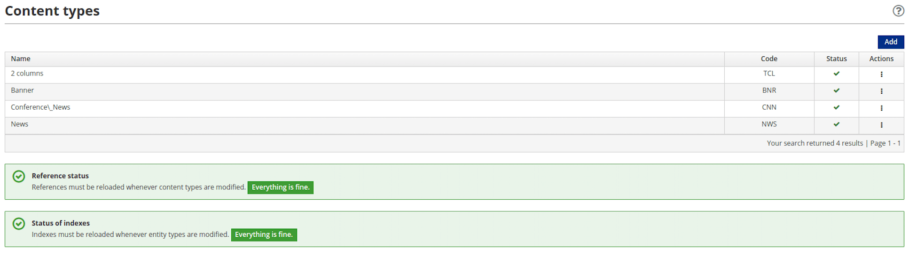

# Content Types

Content is a specific instance of a content type. A content type provides a template to specify and represent content. 

Content types are characterized by [attributes](./content-attributes.md). Each attribute is a specialized instance of an attribute type and defined by the parameters available to that attribute type. 
## Create a Content Type

Content types are managed by the Entando Web Content Management System (WCMS), through a user interface accessible from the [App Builder](../../docs/getting-started/concepts-overview.md#entando-app-builder). Follow the steps below to create and configure a content type.

**1. From the left menu of the App Builder, go to `Content` → `Types`**

**2. Click the `Add` button in the upper right corner**

**3. Configure the content type**

- When adding a content type, it is mandatory to enter `Code` and `Name` values consistent with the following:

  - `Code`: A unique identifier of the content type consisting of 3 uppercase letters

  - `Name`: A string of 50 characters or less consisting of one or more of the following: uppercase letters, lowercase letters, numbers and/or special characters

- To specify a meaningful content type, you must choose the appropriate attribute type from the `Type` drop-down menu

**4. Click the `Add` button**

This launches the configuration of an attribute based on the selected attribute type. 

## Attribute Configuration

Clicking `Add` loads a form to configure the attribute. The `Type` field is pre-filled with the attribute type you selected.

**1. Define the characteristics of the attribute**

 

- `Code`: It is mandatory to enter a unique name for the attribute. This field supports a string value of 10 characters or less and should consist of one or more of the following: uppercase letters, lowercase letters, numbers and/or special characters.

- `Name`: Enter a description of the attribute. This field supports a string of 50 characters or less and should consist of one or more of the following: uppercase letters, lowercase letters, numbers and/or special characters.

- Certain attribute types support the option to declare that the attribute is `Mandatory`, `Searchable` and/or `Can be used as a filter in lists` via toggle buttons.

- Certain attribute types support the option to choose an attribute `Role`. Be sure to click the `Add` button after making your selection.  

> Note: Certain attribute types support the `Role` of `jacms:title - The main title of a Content` to inform plugins or services that the attribute is a title, regardless of the value entered for `Code`. A `Code` value of "title" avoids confusion if `jacms:title - The main title of a Content` is selected.

- The remaining fields are not mandatory and may be left empty.

**2. Click the `Continue` button**

This adds the configured attribute to the content type. Complete the additional configuration steps required by your attribute type, if applicable.

**3. (Optional) Add other attributes to your content type, if desired**

Each attribute requires its own configuration. 

**4. Click the `Save` button**

The content type you created is now displayed in the table.

