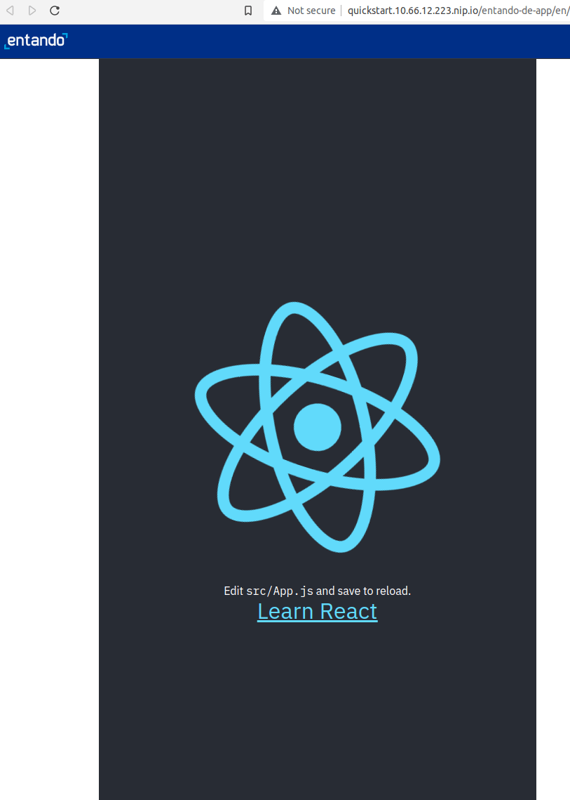

# Create a React Micro Frontend


## Prerequisites
- [A working instance of Entando.](../../../docs/getting-started/)
- Use the Entando CLI to verify all dependencies are installed with the command `ent check-env develop`.

## Create React App
Use [Create React App](https://create-react-app.dev/) to generate a simple app in seconds.
1. Create the React App with this command: 

``` bash
npx create-react-app my-widget --use-npm
```

These are the files you'll update for this tutorial:

    my-widget
    ├── README.md
    ├── public
    │   └── index.html
    └── src
        ├── App.js
        └── index.js


2. Start the app

``` bash
cd my-widget
npm start
```

You should see your React App in your browser at http://localhost:3000.

Next we'll take the React App and set it up as a custom HTML elmeent.

### Set up the Custom Element

1. Add a new file `src/WidgetElement.js` with the following code. This wraps the App component with a custom element.

``` js
import React from 'react';
import ReactDOM from 'react-dom/client';
import App from './App';

class WidgetElement extends HTMLElement {
    connectedCallback() {
        this.mountPoint = document.createElement('div');
        this.appendChild(this.mountPoint);
        const root = ReactDOM.createRoot(this.mountPoint);
        root.render(<App />);
    }
}

customElements.define('my-widget', WidgetElement);

export default WidgetElement;
```
The React App is rendered by the `connectedCallback` method when the custom element is added to the DOM.

::: tip Custom Element Names
- [Must contain a hyphen `-` in the name.](https://stackoverflow.com/questions/22545621/do-custom-elements-require-a-dash-in-their-name)
- Cannot be a single word.
- Should follow `kebab-case` for naming convention.
:::

### Display the Custom Element

1. Replace the full contents of `src/index.js` with these two lines: 

``` js
import './index.css';
import './WidgetElement';
```

2. Edit `public/index.html` and replace `<div id="root"></div>` with this:

``` html
    <my-widget />
```

3. Your browser window should automatically redisplay the React App.

::: tip Congratulations!
You’re now displaying a React App using a custom element.
:::

Now we'll take this custom element and put it into Entando as a micro frontend.

## Display the Micro Frontend in Entando

### Build the React App

First we'll need to perform a production build of the React App

1. Create an `.env.production` file in the `my-widget` directory. It should have one line:
``` text
PUBLIC_URL=/entando-de-app/cmsresources/my-widget
```

::: warning Notes
- `/entando-de-app/cmsresources/` is the Resource URL for your Entando application. This matches nearly all development environments. Consult your Entando admin or use the following fragment to discover the Resource URL.
``` ftl 
  <#assign wp=JspTaglibs[ "/aps-core"]>
  <@wp.resourceURL />
``` 
- `/my-widget` is the public folder you'll use to host the JavaScript and CSS files for the React App
:::


2. Go to the `my-widget` directory and build the app

``` bash
npm run build
```

Now you are ready to finish setting up and using the micro frontend in Entando.

### Upload the React files

1. In the App Builder, go to 'Administration' → 'File browser' → 'public'

2. Click `Create folder` and name it 'my-widget'. This needs to match the .env.production path from above.

3. Click `Save`

4. Click `my-widget`

5. Create the same folder structure as your generated build directory

- `my-widget/static/css`
- `my-widget/static/js`
- `my-widget/static/media`

6. Upload the css, js, and logo files from the corresponding directories under 'my-widget/build/static'. The generated id in each file name (e.g. '073c9b0a') may be different after each build. There may also be LICENSE.txt or .map files but they are not necessary for this tutorial.

- `my-widget/build/static/css/main.073c9b0a.css`
- `my-widget/build/static/js/main.b9eb8fa4.js`
- `my-widget/build/static/media/logo.6ce2458023.svg`

### Create the Widget

Now add a widget for your MFE.

1. Go to `Components → MFE & Widgets` in the App Builder

2. Click `Add` in the lower right corner


3. Enter the following:
- `Title: My Widget` → enter both English and Italian languages
- `Code: my_widget` → dashes are not allowed
- `Group: Free Access`
- `Icon`: upload or select an icon of your choice
- In the center panel under `Custom UI`, enter the following. Make sure to use the actual file names from your build.

``` ftl
<#assign wp=JspTaglibs[ "/aps-core"]>
<link rel="stylesheet" type="text/css" href="<@wp.resourceURL />my-widget/static/css/main.073c9b0a.css">
<script async src="<@wp.resourceURL />my-widget/static/js/main.b9eb8fa4.js"></script>
<my-widget />
```

4. Click `Save`

### View the Widget

View the React micro frontend in action on a page.

1. In the `Entando App Builder` go back to `Pages` → `Management` 

2. Choose an existing page (or create a new one (LINK TODO)) and click `Actions`→ `Design`. 

3. Find your widget in the `Widgets` side bar and drag it onto the page.

4. Click 'Publish'

3. Click on `View Published Page`

TODO: A smaller image would be better here, or an updated one that shows the non-prefixed URL.


::: tip Congratulations!
You now have a React micro frontend running in Entando.
:::
