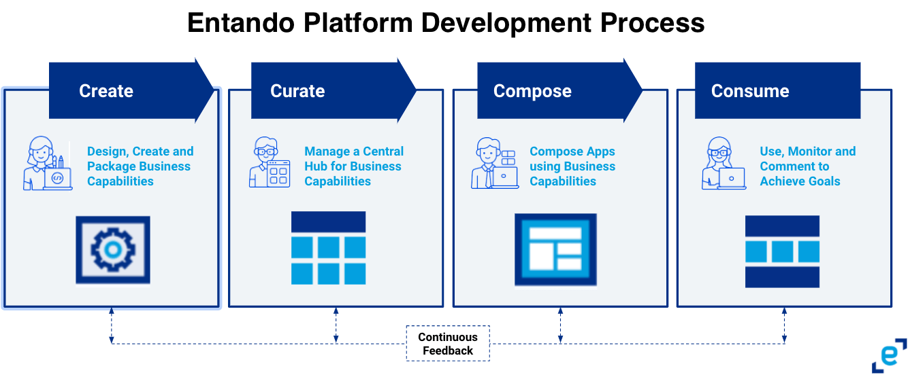

# Entando Platform

Entando is the leading open source **Application Composition Platform** for Kubernetes. It enables parallel teams to accelerate development and innovation of business capabilities on a modern, cloud-native, and Kubernetes-native stack.

It is a distributed and composable environment in which components can be built, scaled and iterated independently, helping teams build agile applications that can adapt to change.

 

On the Entando Platform, development of an application is organized into four stages: Create, Curate, Compose, and Consume. In the simplest terms, you create functional building blocks, curate them into a catalog, compose the blocks onto an app or website, which is then consumed by a user.

## Create Components 
The first step in building a modern application on Entando is to design and create each independent component or functional block. Developers can use the [Entando Component Generator](./create/component-gen-overview.md) and [Blueprint](./create/blueprint-features.md) to automate the building and packaging of project files, with the flexibility to customize while using software they are accustomed to. The modular design of apps built on Entando means new business capabilities can be integrated into your application without reworking existing systems. 

| Documentation | Tutorials        |
| :------------ | :--------- |
| [Entando Component Generator](./create/component-gen-overview.md) | [Micro Frontends](../tutorials/create/mfe/) |
| [Entando Blueprint Feature](./create/blueprint-features.md) | [Microservices](../tutorials/create/ms/generate-microservices-and-micro-frontends.md) |
| [Component Generation Technologies](./create/component-gen-tech.md) | [Build and Publish Project Bundles](../tutorials/create/pb/publish-project-bundle.md) |

## Curate and Share Components 
On the Entando Platform, Curate and Share means development teams can bundle and share components within a central catalog. Multiple teams can collaborate on a single component or packaged business capabilities (PBCs) and share them across organizations and applications. They can test and assess components for readiness, manage and publish versions, and share metadata for continuous upgrades. 

| Documentation | Tutorials        |
| :------------ | :-------- |
| [Bundle and Component Descriptors](./curate/bundle-details.md) | [Install Bundles from a Private Git Repository](../tutorials/curate/private-git-repo.md) |
| [Filtering Bundles](./curate/bundle-filters.md) | [Install Bundle Plugins from a Private Image Repo](../tutorials/curate/private-images.md) |
| [Customize Bundle Info in App Builder](./curate/bundle-presentation-config.md) |   |
| [Bundle Version and Updates FAQ](./curate/bundle-versions-faq.md) |  |
| [Bundle Uninstall](./curate/uninstall-flow.md) |  |

## Compose an Application 
The Compose stage is centered around the [Entando App Builder](./compose/app-builder.md), a low-code composition user interface. In the App Builder, application owners can assemble new components or upgrade existing ones with templates, widgets and PBCs. The [Entando Component Manager](./compose/ecm-overview.md) and [Local Hub](./compose/local-hub-overview.md) are integrated into the App Builder to manage your components, making the process flexible and agile.

| Documentation | Tutorials        |
| :------------ | :-------- |
| [Welcome Wizard](./compose/welcome-wizard.md) | [Page Management](../tutorials/compose/page-management.md) |
| [Local Hub](./compose/local-hub-overview.md) | [Widgets and Fragments](../tutorials/compose/widgets-fragments.md) |
| [Entando App Builder](./compose/app-builder.md) | [Content Creation](../tutorials/compose/content-tutorial.md) |
| [Entando Component Manager](./compose/ecm-overview.md) | [Content Templates](../tutorials/compose/content-templates-tutorial.md)  |
|  | [Digital Assets](../tutorials/compose/digital-assets-tutorial.md) |

## Consume Applications 
In the development lifecycle of an application, Consume is the execution stage where users interact with the app. On Entando, the modular design of components and services means they can be scaled individually, or as a whole, according to those interactions. Likewise, content can be updated, engine rules adapted, and upgrades carried out seamlessly. As a result, the development cycle is a continuous process with minimal disruptions and faster time to market.

| Documentation | Tutorials        |
| :------------ | :-------- |
| [Accessibility](./consume/accessibility.md) | [External Identity Management System](../tutorials/devops/external-id-management.md) |
| [Entando Operator](./consume/operator-intro.md) | [Add REST API](../tutorials/devops/add-rest-api.md) |
| [Entando APIs](./consume/entando-apis.md) | [Invoke Entando core APIs](../tutorials/devops/build-core-image.md) |
| [Custom Resources](./consume/custom-resources.md) | [Change Default Datasource](../tutorials/devops/change-default-datasource.md) |
| [Entando Identity Management System](./consume/identity-management.md) |  |

## Learn More
* [Entando Architecture](./getting-started/concepts-overview.md)
* [Solutions Templates](./getting-started/landing-page.md)
* [Getting Started](./getting-started/README.md)