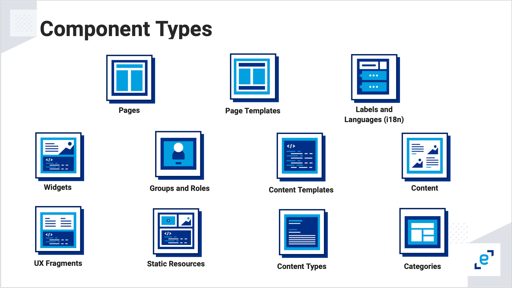

# Bundle Component Descriptors 


Elements such as pages, content, simple widgets, fragments, and static resources are classified as platform components on Entando. This page describes each of these elements with an example.

Currently, Entando supports the following component types: 



Each component is defined by a descriptor YAML located in the bundle `platform` directory, inside the corresponding type as listed below. During the bundle pack phase, the descriptors are added to build the Docker images for the bundle. 

Here is an example structure of a bundle project:

```
bundle-project/
...
  platform/
    assets/
    categories/
    contentTemplates/
    contentTypes/
    contents/
    fragments/
    groups/
    labels/
    pageTemplates/
      my-page-template.yaml
    pages/
      my-page.yaml
    widgets/
      my-widget.yaml
    resources/
      css/
        my-css-format.css
  ...
  entando.json		<= Bundle project descriptor
```
>Note: Older names `pageModels` and `contentModels` for `pageTemplates` and `contentTemplates`, respectively, are still supported on Entando 7.1 but may be removed in a future release. 

## Widgets 

**widgets-descriptor.yaml**

    code: my-widget # Name of widget

    titles: # Widget's titles
      en: Example Widget # Title in English
      it: Widget d'esempio # Title in Italian

    group: free # The owner group of my-widget

    # Optional. The UI path, where the widget.ftl file will have the customUi content
    customUiPath: widget.ftl

    # Optional. The Custom UI
    customUi: >-
        <h1>Hi from my_widget- Custom Widget UI</h1>

    # Optional. The configUI
    configUi:
      customElement: my-widget-config # The name of the custom element used to render the configUi
      resources:
        - <bundleid>/static/js/main.js # The resources necessary for the custom element to render the configUI, like the code  
<!-- check line 65 after static resource issue is resolved-->

## Fragments

**fragments-descriptor.yaml**

    code: my_fragment # Fragment name

    # Optional. The fragment content
    guiCode: >-
      "<div>Here is the content</div>"

    # Optional. A path to a FreeMarker file containing the fragment content
    guiCodePath: my_fragment.ftl  

## Page Templates

**pageTemplate-descriptor.yaml**

    code: my_page_template # The page template identification
    description:  Basic page template # The page template description

    titles: # my_page_template's titles
      en: my_page_template # Title in English
      it: il_mio_modello # Title in Italian

    # The page template configuration
    configuration:
      frames: # All frames
        - pos: 0 # Frame position
          description: Header # Frame description
          sketch: # Frame sketch configuration
            x1: 0
            y1: 0
            x2: 11
            y2: 1
          defaultWidget:
            code: my-widget # The widget code to apply when using the button "apply default widgets" in the page configuration UI

        # A simplified way to define frames
        - pos: 1
          description: Breadcrumb
          sketch: { x1: 0, y1: 0, x2: 11, y2: 1 }

    # Optional. Define the page template in a separate file or inside the descriptor file with `template`
    templatePath: page.ftl

    # Optional. Define the page template as below or in a separate file with `templatePath`
    template: >-
      <#assign wp=JspTaglibs[\"/aps-core\"]>
      <!DOCTYPE HTML PUBLIC \"-//W3C//DTD HTML 4.0 Transitional//EN\">
      <html>
          <head>
              <title><@wp.currentPage param=\"title\" /></title>
          </head>
          <body>
              <h1><@wp.currentPage param=\"title\" /></h1>
              <a href=\"<@wp.url page=\"homepage\"/>\">Home</a><br>
              <div>
                  <h1>Bundle 1 Page Template</h1>
                  <@wp.show frame=0 />
              </div>
          </body>
      </html>

## Pages
This descriptor creates a page for a bundle. The page layout can be fully configured with a configuration widget. Page status can be `published` or `draft`.

Groups in a page descriptor are configured by `ownerGroup` and `joinGroups`. The `ownerGroup` property specifies the group of users who can manage the entity in the App Builder. The `joinGroups` property specifies those who can view or access the page. For example, setting `ownerGroup` to "free" means anyone with access to the App Builder can manage the page, whereas setting `joinGroup` to "free" means any end user can view the page in the application. 

**pages-descriptor.yaml**

    code: my-dashboard
    parentCode: homepage
    titles:
      en: my dashboard
      it: La mia Dashboard
    pageModel: dashboard
    ownerGroup: free
    joinGroups: []
    displayedInMenu: true
    seo: false
    charset: utf-8

    # ECR will publish the page according to this property
    status: published|draft

    # Page Configuration
    widgets:
      - code: Brand-Logo
        config: null
        pos: 0
      - code: Login_buttons
        config: null
        pos: 2
      - code: seeds_card
        config:
          cardname: creditcard
        pos: 6
      - code: list_item
        config:
          icon: managealerts
          count: '0'
          title: Alerts
        pos: 7
      - code: list_item
        config:
          icon: viewstatements
          count: '0'
          title: View Statements
        pos: 11
      - code: seedscard-transaction-table
        config: null
        pos: 13

## Assets
The CMS asset descriptor contains the metadata required for uploading and updating bundle assets.

**assets-descriptor.yaml**

    correlationCode: 'my-reference-code'
    type: image

    # This file should be placed in the same folder as the descriptor.yaml
    name: 113f4437cac3b3f3d4db7229f12287a4_d3.png
    description: 113f4437cac3b3f3d4db7229f12287a4_d3.png
    group: free
    categories: []

## Content Templates

**contentTemplates-descriptor.yaml**

    id: 8880003
    contentType: CNG
    description: Demo Content Template

    # Optional. Define the content template shape in a separate file or inside the descriptor file with `contentShape`
    contentShapePath:

    # Optional. Define the content template shape as shown below or in a separate file with `contentShapePath`
    contentShape: >-
      <article>
        <h1>$content.Title.text</h1>
        <h2>Demo content template</h2>
        #if ( $content.MainBody.text != "" )
        $content.MainBody.text
        #end
      </article>

    widgets:
      - code: Brand-Logo
        config: null
        pos: 0
      - code: Login_buttons
        config: null
        pos: 2
      - code: seeds_card
        config:
          cardname: creditcard
        pos: 6
      - code: list_item
        config:
          icon: managealerts
          count: '0'
          title: Alerts
        pos: 7
      - code: list_item
        config:
          icon: viewstatements
          count: '0'
          title: View Statements
        pos: 11
      - code: seedscard-transaction-table
        config: null
        pos: 13


## Content Types

For more details on content type properties, refer to the [Content Type documentation](../../tutorials/compose/content-types-tutorial.md).

**contentTypes.yaml**

    code: CNG
    name: Demo
    status: 0

    attributes:
      - code: title
        type: Text
        name: Title
        roles:
          - code: jacms:title
            descr: The main title of a Content
        disablingCodes: []
        mandatory: true
        listFilter: false
        indexable: false

        enumeratorStaticItems: string
        enumeratorStaticItemsSeparator: string
        enumeratorExtractorBean: string

        validationRules:
          minLength: 0
          maxLength: 100
          regex: string
          rangeStartString: string
          rangeEndString: string
          rangeStartStringAttribute: string
          rangeEndStringAttribute: string
          equalString: string
          equalStringAttribute: string
          rangeStartDate: string
          rangeEndDate: string
          rangeStartDateAttribute: string
          rangeEndDateAttribute: string
          equalDate: string
          equalDateAttribute: string
          rangeStartNumber: 0
          rangeStartNumberAttribute: string
          rangeEndNumber: 0
          rangeEndNumberAttribute: string
          equalNumber: 0
          equalNumberAttribute:
          ognlValidation:
            applyOnlyToFilledAttr: false
            errorMessage: Something
            keyForErrorMessage: some
            keyForHelpMessage: thing
            ognlExpression: string

## Contents
This descriptor enables content to be created and published via a bundle, according to the `status` property. The content ID is optional and enables linking from other components, like content widgets. It can be auto-generated or explicitly declared.

Groups in a content descriptor are configured by the owner group `mainGroup` and the join group `groups`. The owner group consists of users who can manage the content within the App Builder, while the join group consists of users who can view the content.

**contents-descriptor.yaml**

    id: NWS650
    typeCode: NWS
    description: Dealing with a financial emergency
    mainGroup: free
    groups:
      - free
    status: PUBLIC
    attributes:
      - code: date
        value: '2020-04-23 00:00:00' # the date should be in ISO-8601 format
      - code: title
        values:
          en: Dealing with a financial emergency
      - code: subtitle
        values:
          en: |
            <p>How to tackle financial stress</p>
      - code: body
        values:
          en: |
            <p>For many people, financial concerns are their number one stress point. Here are 6 ways to help reduce your money stress and get motivated to take control of your finances.</p>
      - code: img
        values:
          en:
            correlationCode: '651'
            name: bank_750xx684385064_d0.jpg
      - code: links
        elements:
          - code: links
            value:
              symbolicDestination: '#!U;http://www.yoursite.com/!#'
              destType: 1
              urlDest: 'http://www.yoursite.com/'
              pageDest: null
              contentDest: null
              resourceDest: null
            values:
              en: vostro sito
          - code: links
            value:
              symbolicDestination: '#!U;http://www.yoursite.com/!#'
              destType: 1
              urlDest: 'http://www.yoursite.com/'
            values:
              en: vostro sito 2
      - code: attaches
        elements:
          - code: attaches
            values:
              en:
                correlationCode: '205'
                name: Entando_Admin_Console_Overview_4.3.3_EN.pdf

## Categories
This descriptor contains a list of categories. 

**categories-descriptor.yaml**

    - code: my-category # Category name
      parentCode: home # The parent category; home is the base category
      titles:
        it: "Una nuova categoria" # Category name in Italian
        en: "New category" # Category name in English

## Groups
This descriptor contains a list of groups.

**groups-descriptor.yaml**

    - code: my_group # Identifies the group
      name: "My group" # The name of the group

## Labels
This descriptor contains a list of labels.

**labels-descriptor.yaml**

    - key: my-first-label # Identifies the label
      titles: # The titles for the label
        it: Vostro Titolo # The title in Italian
        en: Your Title # The title in English

## Languages
This descriptor contains a list of languages to enable during the installation process.

**languages-descriptor.yaml**

    - code: en
      description: English
    - code: it
      description: Italian


## Static Resources

The `resources` folder in the `platform` directory contains all static resources. These files will be uploaded to Entando using the same structure, found in the App Builder File Browser public folder.
```
platform/ 
   ...
   resources/  
       css/  
         styles.css  
       js/  
         script.js  
       images/  
         favicon.ico  
         logo.png  
       page.html
```

### Accessing Static Resources

To use static files in a Widget or Page Template, use the FTL tag `<@wp.resourceURL />` with YOUR-BUNDLE-CODE. This code is a unique identifier that provides access to each bundle's resources. 

#### Determine YOUR-BUNDLE-CODE
1. Use the ent CLI to fetch YOUR-BUNDLE-ID to formulate the code:
```
ent ecr get-bundle-id repo=url
```
It should return an 8 digit string of numbers and letters, e.g. bundle-id=8785d979.

2. YOUR-BUNDLE-CODE is YOUR-BUNDLE-NAME-YOUR-BUNDLE-ID: 
    
    If YOUR-BUNDLE-NAME=first-bundle and YOUR-BUNDLE-ID=8785d979, then 
    YOUR-BUNDLE-CODE=first-bundle-8785d979

#### Samples
Here are example tags to access static resources in a typical bundle: 
```
  bundles/YOUR-BUNDLE-CODE/images/logo.png">
  <link rel="stylesheet" href="<@wp.resourceURL />bundles/YOUR-BUNDLE-CODE/resources/css/styles.css">
  <link rel="shortcut icon" href="<@wp.resourceURL />bundles/YOUR-BUNDLE-CODE/images/favicon.ico" type="image/x-icon"/>
  <script type="application/javascript" src="<@wp.resourceURL />bundles/YOUR-BUNDLE-CODE/js/script.js"></script>
 ```  
