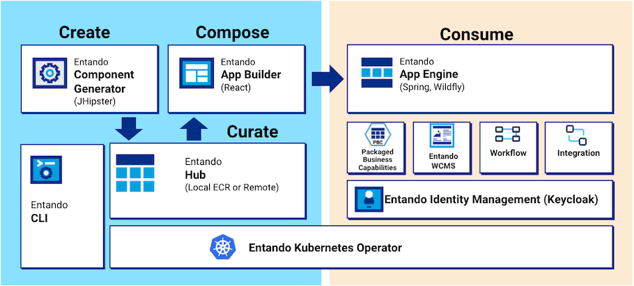

# Entando Architecture Concepts

Entando simplifies the process for enterprises looking to modernize across on-prem and cloud infrastructures with native support for Javascript app development, micro frontend and microservices architecture, deployment of apps in scalable containers, and automated management of containers with Kubernetes. 

This document explores the architecture of the platform and some notable runtime characteristics.

- [Entando App Engine](#entando-app-engine)
- [Entando App Builder](#entando-app-builder)
- [Entando Component Generator](#entando-component-generator)
- [Local Hub](#local-hub)
- [Entando Identity Management](#entando-identity-management)
- [Entando WCMS](#entando-wcms)
- [Entando Cluster Citizens](#entando-cluster-citizens)
- [Entando Ingresses](#entando-ingresses)

> Note: A portal, website, web app, or mobile app built with Entando is called an Entando Application.
An Entando Application is an assembly of out-of-the-box and/or custom built components running on the
Platform. Components can be widgets, micro frontends, microservices, page templates, WCMS content or WCMS content types.

## Entando App Engine
The Entando App Engine is the heart of the Platform, providing the primary out-of-the-box services for
developing applications. Key features:
* Expose the APIs that the Entando App Builder uses to deliver the page and content management interface for your application.
* Assemble and coordinate micro frontends and microservices to make them available in the App Builder for use on specific pages.
* Provide the data access layer to persist the page and application design.
* Manage the cluster infrastructure.

See also: [APIs tutorial](../consume/entando-apis.md)

## Entando App Builder
The [Entando App Builder](../compose/app-builder.md) is the feature-rich user interface to design and build pages, manage content, and utilize the component hub for building applications.

See also: [Widget Tutorial](../../tutorials/compose/widgets-fragments.md)

## Entando Component Generator
The Entando Component Generator is Entando's implementation of [JHipster](https://www.jhipster.tech/) that allows users to
quickly and efficiently generate the skeleton of an Entando Component. The generator provides advanced
data modeling capabilities, including object relational mapping and automatic generation of micro frontends and microservices.
The generated skeleton serves as a starting point to help a development team swiftly meet the needs of the business.

See also: [Entando JHipster Blueprint](../../tutorials/create/ms/generate-microservices-and-micro-frontends.md)

## Local Hub 
The [Local Hub](../compose/local-hub-overview.md) is used to store and retrieve shareable components so they can be reused within an
Entando Application. 

## Entando Identity Management
[Entando Identity Management](../consume/identity-management.md) is the [Keycloak-](https://www.keycloak.org/) and token-based authentication mechanism used by the
Platform. With the ability to add Single Sign On capabilities across multiple domains, it connects service
providers with identity providers.

See also: [Entando Authentication](../../tutorials/create/mfe/authentication.md)

## Entando WCMS
The Entando Web Content Management System (WCMS) is a lightweight content and digital asset management system with support
for headless operations. It manages widgets, html fragments, and other content types to be used in an application.

See also: [Content Types](../../tutorials/compose/content-types-tutorial) or [Content Templates](../../tutorials/compose/content-templates-tutorial)

## Entando Cluster Citizens

The following is an overview of the members of an Entando cluster and their roles.

### Architecture -Members of the Cluster

This picture of an Entando cluster shows how the various citizens interact with each other. Most of the citizens have a Custom Resource Definition
file associated with them. They are deployed on Kubernetes, through the
Entando operator and controllers.

#### EntandoApp

The EntandoApp is composed of three parts:

1.  **Entando App Builder**: the user interface to build and customize an application.

2.  **Entando App Engine**: the backend APIs providing access to 
    services.

3.  **Entando Component Manager (ECM)**: the service integrating the Local Hub into the App Builder providing bundle management for deploying and versioning components.

The interaction between these three components, and the rest of the cluster, use the authorization/authentication features provided by Keycloak.

#### Entando Component Manager

The [Entando Component Manager](../compose/ecm-overview.md) lists the EntandoDeBundles accessible from the EntandoApp and provides the install/uninstall/upgrade/downgrade services to manage a bundle. The K8s service communicates with the cluster to provide these services. It is the only service, other than the operator, that can interact with the cluster and the required custom resources. 

#### Entando Kubernetes Service

The Entando Kubernetes integration service is part of the cluster
infrastructure custom resource. It provides an access point to some of
the custom resources defined by Entando, in particular:

-   Entando Applications
-   Entando plugins
-   Entando links
-   Entando Bundles

Some of the main services provided by the Entando Kubernetes service
are:
-   Provide a list of the available EntandoDeBundles to the
    ECM
-   Deploy a plugin during the installation of a bundle or expose
    an already available plugin 
-   Create a link between an EntandoApp and an EntandoPlugin to expose
    the plugin’s APIs to the EntandoApp and the MFEs

#### EntandoDeBundle

An EntandoDeBundle - or Entando Bundle - is a package with
a set of Entando components and resources. The ECM
can identify the packages and install the components to
extend the functionality of an EntandoApp. For more details on the
EntandoDeBundle and the Local Hub, check out the
[Local Hub Overview](../compose/local-hub-overview.md).

#### Entando Plugin

An Entando plugin is a microservice that exposes APIs reusable by one or
more Entando apps. Usually the plugin services are exposed to the developer and end users via micro frontends. Check the
[micro frontends](../../tutorials/create/mfe/react) tutorial for more details. You can
quickly generate an Entando plugin using the [Entando JHipster Blueprint](../../tutorials/create/ms/generate-microservices-and-micro-frontends.md). The generated project will be ready to work in an Entando environment, providing Keycloak integration, a set of default micro frontends,
and exposing the plugin via an EntandoDeBundle.

#### Keycloak

Keycloak is responsible for authorization and
authentication on Entando. All members of an Entando cluster interact with
Keycloak to verify user/service authorization in performing any
task. More details on Keycloak are below.

## Entando Ingresses

### What is an Ingress?

An ingress is a Kubernetes resource that exposes HTTP and HTTPS routes from outside the cluster to services within it. Traffic routing is controlled by rules defined on the ingress resource.

### How Ingresses are used in an Entando Cluster

When deploying a cluster, ingresses are generated for the resources that require exposure to the outside world. The Entando Operator and custom resource controllers create the ingresses and set the correct routes and certificates.

#### Keycloak Ingress
A dedicated ingress is created for Keycloak to expose the authentication and authorization functionalities. This is required to guarantee that both token issuing and validation work correctly, even when the services using the Keycloak instance are in different namespaces.

#### EntandoApp Ingress
An ingress is automatically created to expose the App Builder, App Engine and ECM.
The three containers are served under the same domain. This is beneficial since they are able to interact without cross-origin issues.

The EntandoApp ingress is also used when linking a plugin with an EntandoApp, which occurs when a bundle containing the plugin is installed via the ECR. 

####  Entando Plugin Ingress
Plugins are automatically exposed via an ingress when deployed in an Entando cluster.

### Default Ingress HTTP Routes

This table lists the default routes exposed for each ingress.
<table>
<colgroup>
<col width="50%" />
<col width="50%" />
</colgroup>
<thead>
<tr class="header">
<th align="left">Ingress</th>
<th align="left">Ingress Http route</th>
<th align="left">Application</th>
</tr>
</thead>
<tbody>
<tr class="odd">
<td align="left">
Keycloak ingress
</td>
<td align="left">
<code>/auth</code>
</td>
<td align="left">
Keycloak
</td>
</tr>
<tr class="odd">
<td align="left" rowspan="4">
EntandoApp ingresses
</td>
<td align="left">
<code>/entando-de-app</code>
</td>
<td align="left">
App engine
</td>
</tr>
<tr class="even">
<td align="left">
<code>/app-builder/</code>
</td>
<td align="left">
App builder
</td>
</tr>
<tr class="odd">
<td align="left">
<code>/digital-exchange</code>
</td>
<td align="left">
Entando component manager
</td>
</tr>
<tr class="even">
<td align="left">
<code>/plugin-ingressPath</code>
</td>
<td align="left">
Entando plugin linked to the app
</td>
</tr>
<tr class="odd">
<td align="left">
Entando plugin ingress
</td>
<td align="left">
<code>/plugin-ingressPath</code>
</td>
<td align="left">
Entando plugin
</td>
</tr>
</tbody>
</table>

>Note: The Entando plugin variable `ingressPath` is defined in the plugin custom resource under the `spec` element. The plugin ingress path is also used to expose the plugin within the EntandoApp domain.

### Exposing Plugins in the EntandoApp Domain
Exposing a plugin under the same domain (ingress) of the EntandoApp is done through the `EntandoAppPluginLink` custom resource and the corresponding controller.

Once the link between the EntandoApp and the plugin is created, the controller reads the specification of the link and automatically creates the HTTP routes in the EntandoApp so that the plugin is exposed in the same domain as the App Builder, App Engine and Component Manager.

This allows micro frontend developers, who need access to the plugin, to disregard CORS policy and the full path where the plugin is exposed. The plugin can be referenced using relative URLs.

**Learn More**

* Learn more about the [Entando Deployment Structure](../reference/deployment-structure.md)

* [Check the ingresses in your cluster](../reference/check-ingress.md)

