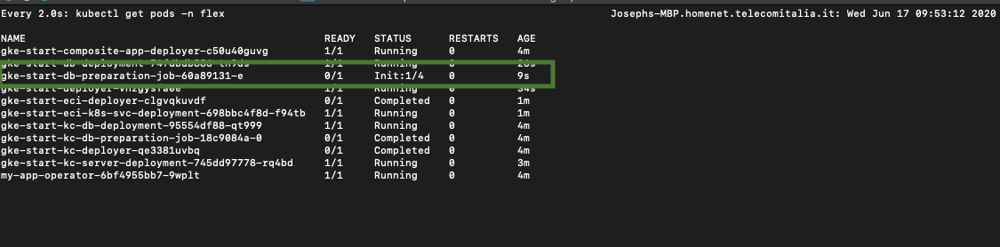

# Entando Deployment Structure

This page provides an overview of the key Entando GitHub repositories with brief descriptions 
of how these repositories are realized in a running Entando deployment. It also explores the architecture behind the Entando Platform and how its functions are structured.

## entando-operator
The Entando Operator coordinates the installation and configuration of all the components in an Entando 
cluster. The operator can be installed once per cluster and is used to coordinate the plugin lifecycle for multiple Entando Applications across many namespaces.

* GitHub: <https://github.com/entando-k8s/entando-k8s-controller-coordinator/>
* DockerHub: <https://hub.docker.com/repository/docker/entando/entando-k8s-controller-coordinator>

#### Customization
Use existing [Entando Custom Resources](../consume/custom-resources.md) to extend the Entando Platform.

## Database Init Containers
During installation, an Entando Application needs to create and initialize several databases when deploying from a backup of your images. 

* GitHub: <https://github.com/entando-k8s/entando-k8s-dbjob>
* DockerHub: <https://hub.docker.com/repository/docker/entando/entando-k8s-dbjob>

The screenshot below highlights the init containers for the Entando Application schema creation, DB initialization, and component repository database.

Many managed Kubernetes instances like OpenShift don’t display init containers on their dashboards. If you’re troubleshooting, the logs may provide some useful information. To fetch logs for an init container using kubectl, you must 
pass the container name as an argument. 

For example:

        kubectl logs YOUR-POD -c YOUR-CONTAINER-NAME -n YOUR-NAMESPACE        
        kubectl logs default-sso-in-namespace-deployment-db-preparation-job-ddbdbddb-a  -c default-sso-in-namespace-deployment-db-schema-creation-job -n sprint1-rc

#### Customization
The init containers automatically restore a backup included in your application so that you can create custom images with your application setup.

## entando-de-app
The **entando-de-app** is a J2EE application and an instance of the [**entando-core**](#entando-core). It provides pathways for other Entando Components and the server image the Entando Operator requires to manage the deployment. The pom.xml for the application reveals its dependencies.

* GitHub: <https://github.com/entando/entando-de-app/>
* DockerHub: <https://hub.docker.com/repository/docker/entando/entando-de-app-eap>,<https://hub.docker.com/repository/docker/entando/entando-de-app-wildfly>

#### Customization
The **entando-de-app** is very likely to be customized as part of an Entando implementation. 
A customized image can include:
* New APIs 
* Legacy Entando plugins
* New database tables  
* Other extensions to the **entando-core** 

It is recommended that most extensions to the Entando Platform occur in microservices. However, legacy 
integrations, extensions to the CMS, and migrations from earlier Entando versions may require changes to the **entando-de-app**. 

## App Builder
The App Builder is the user-friendly frontend UI for the **entando-de-app**. A ReactJS application, it is served via node in the default deployment. In a quickstart deployment, the App Builder container is deployed in the **entando-app** multi-container pod. It communicates with the **entando-de-app** and the Entando Component Manager (ECM) via [REST 
APIs](../consume/entando-apis.md).  The ECM provides information about bundles deployed to the Local Hub.

* GitHub: <https://github.com/entando/app-builder/>
* DockerHub: <https://hub.docker.com/repository/docker/entando/app-builder/>

#### Customization
The App Builder is customized as part of many Entando implementations. 
It can be customized at runtime via micro frontends 
[widget configuration](../../tutorials/create/mfe/widget-configuration.md).

## Entando Component Manager (ECM)
The ECM provides the link between the **entando-de-app**, or your custom core instance, and the ECR. The ECM queries the Entando Kubernetes service to fetch available 
bundles that have been deployed as custom resources inside the cluster. 

The ECM also manages relationships between an Entando Application and the 
installed plugins. This can be seen in the plugin link custom resource in Kubernetes. 

* GitHub: <https://github.com/entando-k8s/entando-component-manager/>
* DockerHub: <https://hub.docker.com/repository/docker/entando/entando-component-manager/>

## entando-k8s-service
The **entando-k8s-service** acts as an abstraction layer to fetch data from Kubernetes APIs. Its primary 
function is to discover and make available Entando plugins for installation. The 
**entando-k8s-service** is invoked by the ECM. 
* GitHub: <https://github.com/entando-k8s/entando-k8s-service/>
* DockerHub: <https://hub.docker.com/repository/docker/entando/entando-k8s-service/>

## Keycloak
The **entando-keycloak** project is an extension of the base Keycloak images. It provides default themes for Entando, a customized realm and clients, and Oracle JDBC JARs for connecting to Oracle databases.
* GitHub: <https://github.com/entando/entando-keycloak/>
* DockerHub: <https://hub.docker.com/repository/docker/entando/entando-keycloak/>

#### Customization
The Keycloak image can be customized as part of an Entando implementation. Some common extensions are: 
* Change the theme 
* Add default connections 
* Add default social logins 
* Add default clients 

## Other Key Repositories 
### entando-core
The **entando-core** project is a J2EE application that exposes APIs for the Entando CMS, including the admin console and the portal UI project that performs the server side composition for pages rendered via an Entando Application. Note that only the composition is performed server side. JavaScript code is rendered client-side. The **entando-core** is realized via an instance that includes the 
WAR files generated from a core build as dependencies. In a default deployment, this is the **entando-de-app**.

* GitHub: <https://github.com/entando/entando-core/>
* DockerHub: None (deployed to maven central)

#### Customization
For users familiar with versions prior to Entando 6, there will be cases where the **entando-core** is customized. 
Often, these customizations will be delivered via a WAR overlay in the instance project. 
Using a WAR overlay is a functional approach for users already familiar with the process, but it is highly 
recommended to extend the platform using microservices for new projects.

### entando-cms
The **entando-cms** project is the App Builder (ReactJS) side of the Entando WCMS. It is bundled into the 
App Builder at build time and is included in the default deployment of the App Builder in most cases.
* GitHub: <https://github.com/entando/entando-cms/>
* DockerHub: None (deployed to npm)

#### Customization
In some cases, the **entando-cms** may be customized if new custom features are added to CMS-specific 
functionality. However, most cases will use the more general App Builder extension points noted above. The **entando-cms** does not expose any dedicated extension interfaces outside of those already provided by the App Builder.

### Entando Kubernetes Controllers
There are a number of controllers that are available to the Entando Operator to manage installations and 
components in an Entando cluster. These are small and lightweight images that execute as 
run-to-completion pods, managing the installation flow for different parts of the infrastructure. The 
controllers are implemented using Quarkus. For more information on the controllers, Entando custom 
resources, and configuring your Entando deployment, see also: 
[Custom Resources](../consume/custom-resources.md).

GitHub: 
* <https://github.com/entando-k8s/entando-k8s-composite-app-controller/>
* <https://github.com/entando-k8s/entando-k8s-plugin-controller/>
* <https://github.com/entando-k8s/entando-k8s-cluster-infrastructure-controller/>
* <https://github.com/entando-k8s/entando-k8s-app-controller/>
* <https://github.com/entando-k8s/entando-k8s-app-plugin-link-controller/>

DockerHub: 
* <https://hub.docker.com/repository/docker/entando/entando-k8s-composite-app-controller/>
* <https://hub.docker.com/repository/docker/entando/entando-k8s-plugin-controller/>
* <https://hub.docker.com/repository/docker/entando/entando-k8s-cluster-infrastructure-controller/>
* <https://hub.docker.com/repository/docker/entando/entando-k8s-app-controller/>
* <https://hub.docker.com/repository/docker/entando/entando-k8s-app-plugin-link-controller/>

#### Customization
It is unlikely that the controllers will be customized as part of an Entando implementation.
