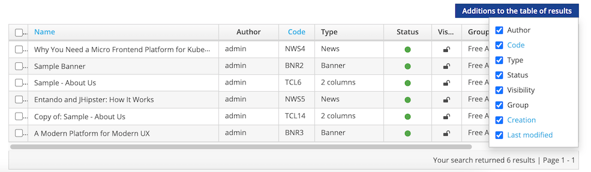
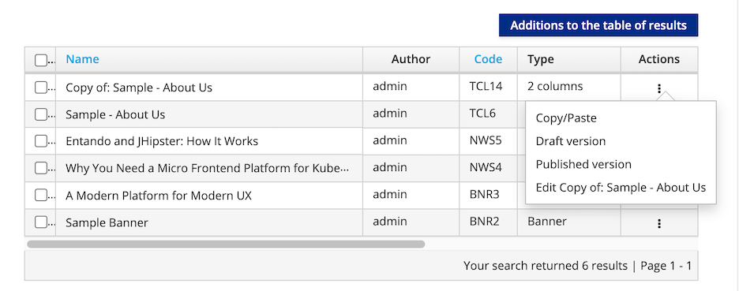
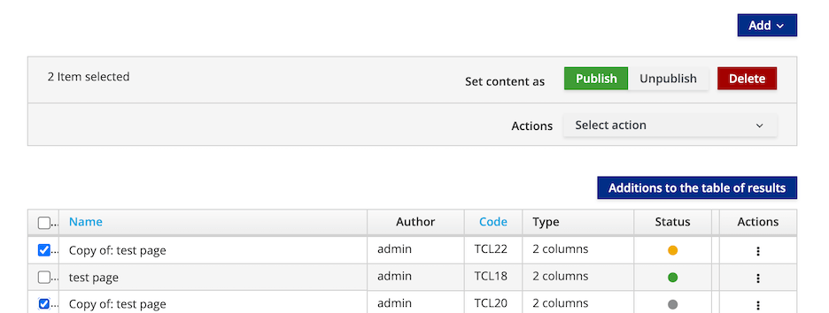

# Create and Manage Content

This tutorial describes how to create, edit and publish content in an application from the [App Builder](../../docs/compose/app-builder.md) using the Entando Web Content Management System (WCMS).

## Create Content

1. Log into your App Builder
2. From the left sidebar, go to `Content` → `Management`. All existing content is displayed in a table.

3. Click the `Add` button on the right side of page and select the desired content type from the drop-down list. This loads a form to further define the content. See [Content Type](./content-types-tutorial.md) for how to add new types.

4. Provide the following information:
    * `Info` 
         * `Content description`: Enter the content name or description. This field is required.
    *  `Groups`
         * `Owner Group`: From the drop-down list, choose an available user group to manage the content, then click `Set group`. This field is required and can be amended in the App Builder's `Users` section under `Groups`.
         * `View Only Groups`: Provide groups with viewing access to content by highlighting an available group and clicking `+` to add it. This field is required. 
    *  `Categories`: If categories have been added, you can select a category and click `+` under `Join` to include the content in that category for searching and sorting. This field is not required.
    *  `Content attributes`: You are required to enter a title for the content type in the `Title` field. Populate the remaining optional fields as needed.
    > Note: `History` displays the iterations of the saved content. You can view the content details or revert to a previous version. 

5. Determine the status of the content to inform how it should be saved:  
 * `Draft`: The content is in the development stage and not ready for approval or publication. The `Save` or `Save and Continue` buttons establish `Draft` status for the content.
 * `Ready`: The content is ready for review, but has not been approved or published. Content with this status can be approved later or published immediately.

6. Choose from the options to save the content:
 * `Save`: Save the content as work in progress without approving it
 * `Save and Continue`: Save the content as a draft and continue editing it
 * `Save and Approve`: The content is saved, approved, and ready to use in an application

## Manage Content

### Find Content

From `Content` → `Management` you can use the `Advanced Filters` feature to search for content by type, category, group or status. 

In the resultant table, a set of parameters identifies matching content. Any parameter can be deleted from view by unchecking it in the `Additions to the table of results` drop-down menu.

### Content Actions

For all content shown in the table, the Actions menu provides the following options:
 * `Copy/Paste`: Replicate the content
 * `Draft version`: Edit the unpublished draft version
 * `Published version`: Edit the published content or revert to a previous version
 * `Edit`: Modify the content definition

### Publish, Unpublish, or Delete Content

To publish, unpublish or Delete content:

1. In the App Builder, go to `Content` → `Management`
2. Select the check boxes next to the content you want to manage
3. Use the buttons above the table to `Publish`, `Unpublish` or `Delete` content. This takes you to a confirmation page that displays the current status of the content. 

