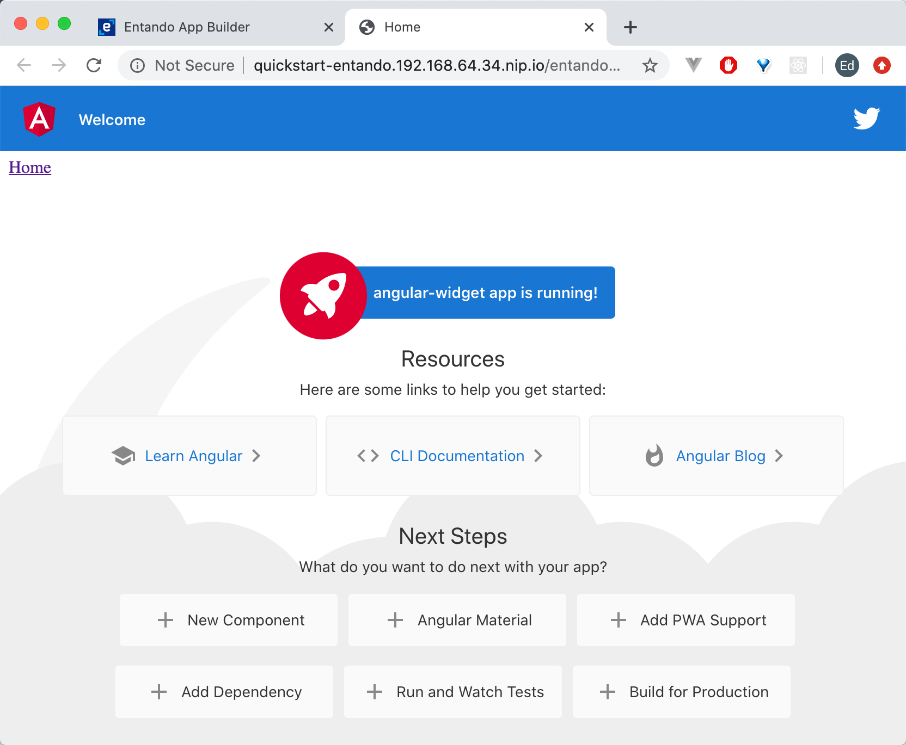

# Create an Angular Micro Frontend
This tutorial describes the process of building an Angular widget on Entando. It creates a docker-based bundle using the ent bundle CLI tool, which is the standard method starting with Entando 7.1.

Git-based bundles are also supported and to follow this tutorial in that format, see this [Angular tutorial](../../../../v7.0/tutorials/create/mfe/angular.md). 

## Prerequisites
* [A working instance of Entando.](../../../docs/getting-started/README.md)

* node v13.8.0: Use [nvm](https://github.com/nvm-sh/nvm) to handle node installations.

## Initialize your Bundle Project
1. To initialize your project, give it a name and build the scaffolding. This name will be used for the default bundle Docker image. 
```sh
ent bundle init YOUR-BUNDLE
``` 
2. Change to the bundle directory:
```sh
cd YOUR-BUNDLE
```

3. Add the first MFE with the name `angular-widget`:
```sh
ent bundle mfe add angular-widget
```

## Create the Angular MFE

1. Navigate into the `microfrontends` directory:
```sh
cd microfrontends
```

2. Install the Angular CLI:

``` bash
npm install -g @angular/cli
```

3. Generate a new Angular application:

``` bash
ng new angular-widget
```

4. Choose the following options:

``` bash
? Would you like to add Angular routing? `No`
? Which stylesheet format would you like to use? `CSS`
```

5. From the `angular-widget` directory, serve the application:

  ``` bash
   cd angular-widget
   ng serve
   ```

   This is the expected output:

    angular-widget
    ├── .angular
    ├── .vscode
    ├── node_modules
    ├── src
    │   ├── app
    │   │   ├── app.component.css
    │   │   ├── app.component.html
    │   │   ├── app.component.spec.ts
    │   │   ├── app.component.ts
    │   │   └── app.module.ts
    │   │
    │   ├── assets
    │   │   └── .gitkeep
    │   │
    │   ├── environment
    │   │   ├── environment.prod.ts
    │   │   └── environment.ts
    │   │
    │   ├── favicon.ico
    │   ├── index.html
    │   ├── main.ts
    │   ├── polyfills.ts
    │   ├── styles.css
    │   └── test.ts
    │
    ├── .browserlistrc
    ├── .editorconfig
    ├── .gitignore
    ├── angular.json
    ├── karma.conf.js
    ├── package.json
    ├── package-lock.json
    ├── README.md
    ├── tsconfig.app.json
    ├── tsconfig.json
    └── tsconfig.spec.json
    

### Configure the Custom Element

Next, convert the Angular widget into a custom element, using [Angular elements](https://angular.io/guide/elements) to transform components into custom elements.
1. Install the Angular elements
``` bash
ng add @angular/elements
```
[Angular elements](https://angular.io/guide/elements) are Angular components packaged as custom elements, a web standard for defining new HTML elements independent of any framework.

::: warning
Install the Angular elements package using `ng add` (not with `npm install` as it runs additional steps behind the scenes).
:::

2. Open `angular-widget/src/app/app.module.ts`. Here's what the initial file looks like:

   ``` js
   import { BrowserModule } from '@angular/platform-browser';
   import { NgModule } from '@angular/core';

   import { AppComponent } from './app.component';

   @NgModule({
     declarations: [
       AppComponent
     ],
     imports: [
       BrowserModule
     ],
     providers: [],
     bootstrap: [AppComponent]
   })
   export class AppModule { }
   ```

3. Replace the entire file with:

   ```js
   import { BrowserModule } from '@angular/platform-browser';
   import { NgModule, Injector } from '@angular/core';
   import { createCustomElement } from '@angular/elements';
   import { AppComponent } from './app.component';

   @NgModule({
     declarations: [
       AppComponent
     ],
     imports: [
       BrowserModule
     ],
     providers: [],
     entryComponents: [AppComponent]
   })
   export class AppModule {
     constructor(private injector: Injector) {}

     ngDoBootstrap() {
       const el = createCustomElement(AppComponent, { injector: this.injector });
       customElements.define('angular-widget', el);
     }
   }
   ```

   In the original file, `AppModule` is bootstrapped directly during the application launch. In the updated file, the custom element is bootstrapped using the [`ngDoBootstrap()` method](https://angular.io/guide/entry-components).

::: warning Custom Elements
- [Must contain a hyphen `-` in the name.](https://stackoverflow.com/questions/22545621/do-custom-elements-require-a-dash-in-their-name):
- Cannot be a single word.
- Should follow `kebab-case` for naming convention.
:::

### Test the Custom Element 

1. Open `angular-widget/src/index.html`.

2. In the `<body>`, replace `<app-root></app-root>` with `<angular-widget />`:

   ``` html
   <!doctype html>
   <html lang="en">
   <head>
     <meta charset="utf-8">
     <title>AngularWidget</title>
     <base href="/">
     <meta name="viewport" content="width=device-width, initial-scale=1">
     <link rel="icon" type="image/x-icon" href="favicon.ico">
   </head>
   <body>
     <angular-widget />
   </body>
   </html>
   ```
3. Go back to the bundle root directory
4. Test run the Angular widget:
```sh
ent bundle run angular-widget
```
You should see a response after a few moments: 

```sh
** Angular Live Development Server is listening on localhost:4200, open your browser on http://localhost:4200/ **
```
5. Open your browser at this location and see the Angular widget running. 
::: tip Yay!
You now have an Angular micro frontend running.
:::

## Build, Publish and Install the Bundle

### Build and Publish the Bundle 

1. Open `entando.json` in the bundle root folder and add the following under the `angular-widget` parameters. 
```json
"buildFolder": "dist/angular-widget"
```
2. (Optional) Add a thumbnail JPEG or PNG file to the root bundle folder. It must be named `thumbnail` and not exceed 100kB, e.g. thumbnail.png.

3. Pack the bundle which includes the build and generate Docker images steps:
```sh
ent bundle pack
```
4. Publish the image to a Docker registry:
```sh
ent bundle publish 
```
5. Deploy the bundle to the Local Hub of your Entando Application:
```sh
ent bundle deploy 
```
6. Log into the App Builder and navigate to the `Hub` in the left nav. Click `DEPLOYED` for `YOUR-BUNDLE`. Click `Install` in the pop-up window. 

### Add the Bundle to a Page
Let's see the Angular micro frontend in action on a page.

1. In the App Builder, go to `Page` → `Management`

2. Choose an existing page (or [create a new one](../../compose/page-management.md#create-a-page)). Select `Design` from its `Actions`.

3. In the `Search` field in the right sidebar, enter `YOUR-BUNDLE` name to find your widget. It can also be found under `User` in the same sidebar.

4. Drag and drop `YOUR-BUNDLE` into the `Sample Frame` in the main body of the page.
5. Click `Publish`

6. Click on `View Published Page`



::: tip Congratulations!
You now have an Angular micro frontend running in Entando.
:::

**Next Steps**
* Learn more about [Communication between Micro Frontends](communication.md). 

* Try the [Add a Configuration Screen in App Builder](widget-configuration.md) tutorial.
* [Generate Microservices and Micro Frontends](../ms/generate-microservices-and-micro-frontends.md) with an Entando Blueprint. 