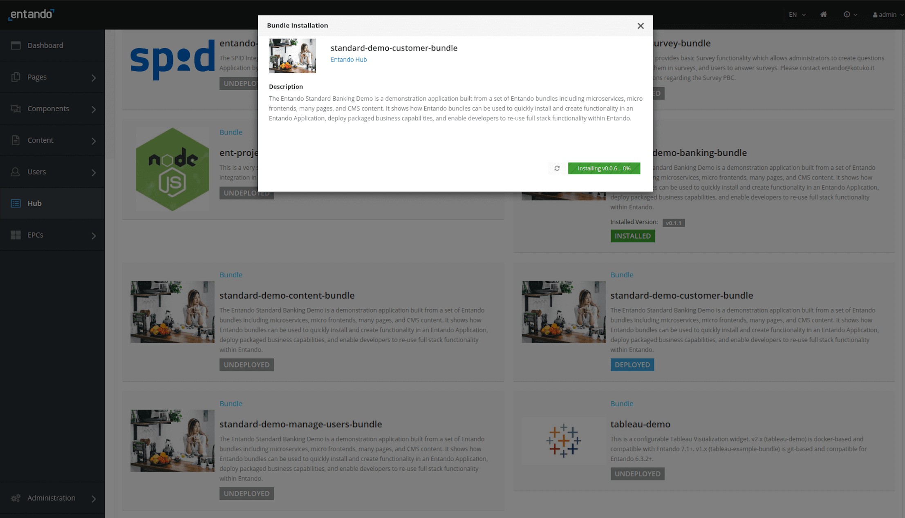

# Entando Standard Banking Demo

This tutorial will guide you through installing a demo application using the Local Hub and a set of Entando
Bundles. This solution template includes: 

- Microservices
- Micro frontends
- Multiple pages
- CMS content

The goal of this exercise is to demonstrate how Entando Bundles can be used to: 

- Quickly install and create functionality in an Entando Application
- Enable packaged business capabilities (PBCs)
- Allow developers to reuse full-stack operations via bundles

Some of the key elements of this template are reviewed in the [Application Details section](#application-details) below.

## Installation

Numerous assets are installed in the course of the Standard Banking Demo. Entando Bundles can include more or less components, depending on developer objectives. It is recommended that organizations develop guidelines for bundle sizing that fit the goals of their applications and teams.

### Prerequisites

- A working instance of Entando running on Kubernetes. [Install Entando on any Kubernetes provider](../#operations) or see [Getting Started](../../docs/getting-started/) for more information. 
- The [Entando CLI](../../docs/getting-started/entando-cli.md), installed and connected to your Kubernetes instance.

### Automatic Install Using the Entando Cloud Hub
Install the Standard Banking Demo by integrating the Entando Hub into your App Builder. 

1. Log in to your App Builder

2. Go to `Hub` → `Select Registry`

3. Choose `Entando Hub` if it has been configured. If not:
     1. Choose `New Registry`
     2. In the pop-up window, enter: \
         Name: Entando Hub \
         URL: https://entando.com/entando-hub-api/appbuilder/api
     3. Click `Save` 
     3. In `Select Registry`, choose `Entando Hub` 

2. From the Hub Catalog, `Deploy` and `Install` each of the four Standard Banking Demo bundles. **Order of installation is important.** The `standard-demo-content-bundle` must be installed last, as it relies on MFEs from the other bundles to set up each of the pages. 

     `standard-demo-banking-bundle` \
     `standard-demo-customer-bundle` \
     `standard-demo-manage-users-bundle` \
     `standard-demo-content-bundle` 

     1. Click on the bundle entry
     2. In the pop-up box, click "Deploy"
     3. Click on the "Install" button that appears in this same pop-up box once the bundle deploys
     4. Exit out of the pop-up box
     5. Repeat steps 1-4 for each bundle

      

   >Note: Each installation can take several minutes while the application downloads Linux images for the microservices and installs related assets. The `standard-demo-banking-bundle` and `standard-demo-customer-bundle` include microservices that require container initializations and take longer to install.

     ::: tip
     These bundles will appear in your Local Hub with abbreviated names: 

     `standard-demo-banking-bundle` → `sd-banking` \
     `standard-demo-customer-bundle` → `sd-customer` \
     `standard-demo-manage-users-bundle` → `sd-manage-users` \
     `standard-demo-content-bundle` → `standard-demo` 

     
     :::

### Manual Install
1. Apply the definitions for the four bundles that comprise the Standard Banking Demo. 
```
ent ecr deploy --repo="https://github.com/entando-samples/standard-demo-banking-bundle.git"
```
```
ent ecr deploy --repo="https://github.com/entando-samples/standard-demo-customer-bundle.git"
```
```
ent ecr deploy --repo="https://github.com/entando-samples/standard-demo-manage-users-bundle.git"
```
```
ent ecr deploy --repo="https://github.com/entando-samples/standard-demo-content-bundle.git"
```

2. Log in to your App Builder instance.

3. Select `Hub` from the menu on the left to view the bundles deployed to your Local Hub.

4. `Install` each bundle. **Order of installation is important.** The `standard-demo-content-bundle` must be installed last, as it relies on MFEs from the other bundles to set up each of the pages.

     1. Click on the bundle entry
     2. In the pop-up box, click "Install"
     3. Exit out of the pop-up box
     4. Repeat steps 1-4 for each bundle

      

     >Note: The command line deploys the Standard Banking Demo bundles without thumbnails, which will not reappear when the bundles are installed.

     >Note: Each installation can take several minutes while the application downloads Linux images for the microservices and installs related assets. The `standard-demo-banking-bundle` and `standard-demo-customer-bundle` include microservices that require container initializations and take longer to install.

     ::: tip
     In the unlikely event of conflicts during an initial installation, you will be presented with an Installation Plan like the one shown below. Select `Update All` in the upper right after making your selections.
     
     :::

## Access the Standard Banking Demo

Access the Standard Banking Demo via one of the following options.

**Option 1:** Make the Standard Banking Demo your default home page. The home icon shortcut will then navigate to the Standard Banking Demo home page. 

1. Go to `App Builder` → `Pages` → `Settings` 
2. In the drop-down menu for Home Page, select `Home / Home SD`
3. Click `Save`

4. Click the home icon in the upper right of the App Builder


**Option 2:** Navigate to the Standard Banking Demo home page from your App Builder page tree.

1. Go to `App Builder` → `Pages` → `Management` 
2. Find `Home SD` in the page tree
3. From the `Actions` pull-down menu, go to `View Published Page`


## Application Details

The Entando Standard Banking Demo application demonstrates a number of the major features of the Entando Platform:

* Keycloak integration for role based access controls
* React and Angular micro frontends that coexist on the same dashboard
* Micro frontend communication techniques
* Spring Boot Microservices
* Entando Content Management

### Micro Frontends

The application includes six micro frontends (MFEs) showcasing complementary features and custom functionality.

#### 1. Card MFE


- A React micro frontend placed on the My Dashboard page.
- Makes an API call to the banking microservice to fetch a numeric result dependent on the current card selection. The displayed value updates with changes to the card configuration.
- Authorization-aware and passes the bearer token to the microservice. If an unauthenticated user renders the dashboard page, the widget displays an error message.
- Emits events that are consumed by the Transaction Table widget.

#### 2. Card NG MFE


- An Angular widget that is similar to the Card widget above, except for the choice of frontend technology.
- Communicates with the Transaction Table widget, which is built with React.

#### 3. Manage Users MFE

- Makes an API call to Keycloak to fetch user information. 
- Visible from the username drop-down menu when the user is logged in to the app.
- By default, application users are not granted Keycloak user management privileges. 
   - To use Keycloak to apply role based access controls to an MFE:
      1. Enable the Manage Users widget.
      2. Log in to Keycloak and assign the realm-management `view-users` and `manage-users` client roles to the desired user. 
   - See the [Entando Identity Management System](../../docs/consume/identity-management.md) page for details.

Authorized View


Unauthorized View


#### 4. Transaction Table MFE

- A React micro frontend that consumes events from the Card MFEs.
- Makes an API call to the banking microservice to fetch transaction data.


#### 5. Sign Up MFE

- A form widget placed on the sign up page.
- Makes an API call to the customer microservice to create a new user.
- Accessible from any page if a user is not authenticated.


#### 6. Alert Icon MFE

- Displays an icon on the dashboard page. 
- Includes a configuration MFE for user selection of the displayed icon and datatype.
- By default, it makes an API call to the banking microservice to fetch data.


### Configuration Micro Frontends

When placed on a page, many of the Standard Banking Demo MFEs include configuration screens. These are visible in the App Builder at `Components` → `Micro frontends & Widgets`. To view a rendered configuration screen, place the MFE on a new page.

### Microservices

The Standard Banking Demo includes two microservices (service paths: `/banking` and `/customer`) to help generate the data shown by its MFEs. Both implementations leverage the Entando Operator to automate the deployment and linking of a microservice to an Entando Application.

The data for the microservices are created with Liquibase to demonstrate how to use the Entando Operator, Liquibase, and Spring Boot to automatically provision data. The demo data is available in the [source code](#source-code) for the microservices.

### Static Widgets

The Standard Banking Demo uses static HTML, FreeMarker, and JavaScript widgets to display content, e.g. headers, footers, and images. To view the static widgets, log in to the App Builder and select `Components` → `Micro frontends & Widgets`.

### Static CMS Content

The Standard Banking Demo relies on the Entando CMS, e.g. to create content templates, content types, and content. To learn more about the Entando CMS, log in to the App Builder and select `Content` →  `Templates`, `Content` → `Management`, or `Content` → `Types`.

## Source Code

The source code for the Entando Standard Banking Demo can be found on GitHub [here](https://github.com/entando-samples/standard-demo) along with our other open source examples and tutorials.
