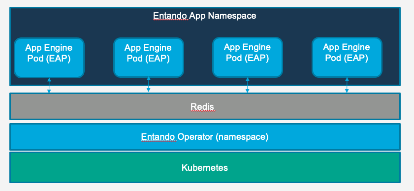

# High Availability in an Entando Application

## App Engine Clustering and High Availability

The Entando App Engine can be deployed as a clustered set of instances using the clustering and replication ability of Kubernetes. It is backed by a shared cache with two default choices for implementation. 

This document examines the issues to consider when creating highly availailable clusters of the Entando App Engine.

Microservices clustering that adds functionality to an Entando Application is different from clustering used by the Entando App Engine. Microservices rely on a custom clustering configuration and setup based on implementation and selections made during their creation. Refer to documentation addressing [clustered microservices and caching implementation](../../tutorials/consume/high-availability.md) for configuration and deployment details.

::: tip
To scale an Entando Application without the use of clustered storage assumes all instances are scheduled to a single node and requires a `ReadWriteOnce (RWO)` policy in conjunction with taints on other nodes. Understanding the pros and cons of same-node scheduling is critical for node resource optimization and application recovery should the instance become unreachable. Note that if the node quits or is shut down, the application will be unavailable until Kubernetes reschedules the pods to an alternate node.
:::

## Caching

### Data Management

At startup, the Entando App Engine loads all database data into the shared cache. Applicable content is served from the cache when a page is rendered or content is fetched. In the event of a write to the cache, both the cache and database will be updated.  

The following objects are cached in the base implementation of the Entando App Engine:

- Pages
- Page templates
- Categories
- Widgets
- Configuration (Application level configuration)
- Roles
- Groups
- Languages
- Labels (i18n)
- User profiles
- API Catalog (legacy API metadata separate from swagger)
- Data models and data types (deprecated)

## Redis Implementation

An Entando Application can be configured to utilize an external [Redis](https://redis.io/) cache. In a Redis implementation of an Entando Application, the cache is deployed independently of the Entando App Engine and the App Engine is configured to connect to the deployed instance.

The Redis cache is not deployed by the Entando Operator and must be managed by a DevOps team member or Kubernetes cluster administrator.

Check out the [High Availability on Entando tutorial](../../tutorials/consume/high-availability.md#clustering) for more information and step-by-step instructions to use a Redis cache in an Entando Application.

## Performance

Consider the following when designing an Entando App Engine cluster:

- In a read only implementation, or an implementation with infrequent writes to the cached objects listed above, the network latency between pods on different nodes will not be a major driver of runtime performance. Each pod will have a fully replicated copy of the cache.
- In write heavy implementations, network latency between nodes can factor into performance.
- The overall performance impact of network latency will vary depending upon implementation. Performance is impacted by the types of objects written, the size of those objects, and whether the writes invalidate single or entire lists of objects in the cache.

It is generally recommended that performance testing on clustered instances correlates to the expected runtime traffic pattern of a live application. Every application will have a unique performance profile.

### Cache Management

When a new replica of an Entando Application joins a cluster of applications, the cache is replicated to that node. If the cache is relatively large or the network is slow, this may add to the total startup time of the new instance. Existing instances will continue to function.
