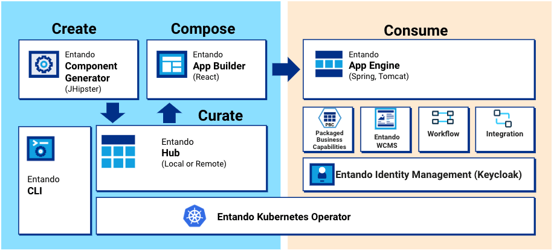

# Entando Architecture Concepts

Entando is an application composition platform that simplifies and accelerates enterprise modernization across on-prem and cloud infrastructures. It offers native support for Javascript app development, a micro frontend and microservice architecture, scalable app deployment, and automated container orchestration via Kubernetes. 

This document explores the architecture of the Entando Platform and some notable runtime characteristics.

- [Key Entando Concepts](#key-entando-concepts)
- [Entando Cluster Elements](#entando-cluster-elements)
- [Entando Ingresses](#entando-ingresses)

> Note: A portal, website, web app, or mobile app built with Entando is called an Entando Application.
An Entando Application is an assembly of out-of-the-box and/or custom-built components running on the
Entando Platform. Entando components can be widgets, micro frontends, microservices, page templates, WCMS content or WCMS content types.

## Key Entando Concepts
### Entando App Builder
The [Entando App Builder](../compose/app-builder.md) is the frontend of the Entando Platform with which an Entando Application is created and customized. It hosts the Entando WCMS and provides a feature-rich, low-code user interface to configure and interact with components, design and create pages, manage content, and build modular applications.

See also: [Widget Tutorial](../../tutorials/compose/widgets-fragments.md)

### Entando App Engine
The Entando App Engine is the core runtime engine responsible for the primary out-of-the-box services required to develop Entando Applications. It exposes the backend APIs used to deliver the page and content management interface of an Entando Application, assembles and coordinates components within the Entando App Builder, and provides the data access layer to persist pages and application design.

See also: [APIs tutorial](../consume/entando-apis.md)

### Entando Component Generator
The Entando Component Generator implements a [JHipster](https://www.jhipster.tech/) blueprint to quickly and efficiently generate the skeleton of an Entando project using automation and templating. The generator provides advanced data modeling capabilities, including object relational mapping, and the autogeneration of micro frontends and microservices. The [Entando Blueprint](../../tutorials/create/ms/generate-microservices-and-micro-frontends.md) fast-tracks development by creating the folders, files and infrastructure required by a project.

See also: [Component Generation Technologies](../create/component-gen-tech.md)

### Entando Identity Management System
[Entando Identity Management System](../consume/identity-management.md) is Entando's [Keycloak](https://www.keycloak.org/)-based user management and authentication system. It applies Single Sign On capabilities across multiple domains to connect service providers with identity providers.

See also: [Entando Authentication](../../tutorials/create/mfe/authentication.md)

### Entando Local Hub 
The [Entando Local Hub](../compose/local-hub-overview.md) is the component repository of an Entando App Builder. The Entando Bundles available to the Entando Application are represented and can be deployed, installed, updated or versioned using the App Builder UI.

### Entando WCMS
The Entando Web Content Management System (WCMS) is a lightweight content and digital asset management system. It manages widgets, HTML fragments, and other content types used in an Entando Application.

See also: [Content Types](../../tutorials/compose/content-types-tutorial), [Content Templates](../../tutorials/compose/content-templates-tutorial) and [Digital Assets](../../tutorials/compose/digital-assets-tutorial.md)

## Entando Cluster Elements

The following is an overview of the elements comprising an Entando Cluster.

### Architecture - Members of the Cluster

Below is a diagram of an Entando Cluster and depicts how the various elements interact with one another. Entando deploys this infrastructure on Kubernetes using the Entando Operator and controllers. Each element is associated with a custom resource definition (CRD) file, if applicable.

#### EntandoApp
The EntandoApp is comprised of the Entando App Builder, the Entando App Engine and the Entando Component Manager. Keycloak-based authorization and authentication enable these to interact with each other and other cluster elements.
#### Entando Component Manager
The purpose of the [Entando Component Manager](../compose/ecm-overview.md) is to:
- Provide the functionality to deploy and install micro frontends and widgets
- Manage the connections between an application and the installed microservices

It integrates the Local Hub into the App Builder to list the Entando Bundles accessible from the EntandoApp, provisioning bundle management services such as install, uninstall, upgrade, downgrade and versioning. The Entando Kubernetes integration service communicates with the cluster to supply these bundle services and is the only service, other than the Entando Operator, that can interact with the cluster and custom resources. 

#### Entando Kubernetes Service
The Entando Kubernetes integration service (`entando-k8s-service`) is a function of the Entando Cluster infrastructure custom resource, providing an abstraction layer between Entando microservices and the APIs exposed by Kubernetes. It supplies access points to several custom resources defined by Entando, in particular Entando Applications, Entando Plugins, Entando Bundles and Entando links. 

The `entando-k8s-service` is used to:
-   Provide a list of the available Entando Bundles to the Entando Component Manager
-   Deploy a microservice, or expose an already available microservice, during the installation of a bundle
-   Create a link between an EntandoApp and an EntandoPlugin to expose microservice APIs to the EntandoApp and micro frontends

#### Entando Bundle
An Entando Bundle is a packaged set of components and resources created for the Entando Platform. The Entando Component Manager identifies the bundles and can install their components to extend the functionality of an Entando Application. 

See also: [Local Hub Overview](../compose/local-hub-overview.md)

#### Entando Plugin
An Entando Plugin is a microservice that exposes APIs reusable by one or more Entando Applications. Plugin services are commonly accessible from micro frontends and can be quickly generated with the [Entando Blueprint](../../tutorials/create/ms/generate-microservices-and-micro-frontends.md). A blueprint-generated project can be used as-is in an Entando environment and provides Keycloak integration, a set of default micro frontends, and microservices exposed by the bundle.

#### Keycloak
Keycloak is responsible for authorization and authentication on Entando. All members of an Entando Cluster interact with Keycloak to verify user and service authorization.

## Entando Ingresses

An ingress is a Kubernetes resource that exposes HTTP and HTTPS paths from outside an Entando Cluster to services within it. Traffic routing is controlled by rules defined on the ingress resource.

When deploying a cluster, ingresses are generated for the resources that must be exposed to external services. The Entando Operator and custom resource controllers create the ingresses and set the correct paths and certificates. Entando implements Keycloak and EntandoApp ingresses.
#### Keycloak Ingress
A dedicated ingress is created for Keycloak to expose authentication and authorization functionalities. This is required to guarantee that both token issuing and validation work correctly, even when the services using the Keycloak instance are in different namespaces.

#### EntandoApp Ingress
The EntandoApp ingress is automatically created to expose the App Builder, App Engine and Component Manager. The three containers are served under the same domain, which allows them to interact without cross-origin issues. 

The EntandoApp ingress is also used to link a microservice with an EntandoApp when a bundle containing the microservice is installed via the Local Hub. 

### Default Ingress HTTP Paths

The table below lists the default paths exposed for each ingress.
<table>
<colgroup>
<col width="50%" />
<col width="50%" />
</colgroup>
<thead>
<tr class="header">
<th align="left">Ingress</th>
<th align="left">Ingress Http route</th>
<th align="left">Application</th>
</tr>
</thead>
<tbody>
<tr class="odd">
<td align="left">
Keycloak ingress
</td>
<td align="left">
<code>/auth</code>
</td>
<td align="left">
Keycloak
</td>
</tr>
<tr class="odd">
<td align="left" rowspan="4">
EntandoApp ingress
</td>
<td align="left">
<code>/entando-de-app</code>
</td>
<td align="left">
App Engine
</td>
</tr>
<tr class="even">
<td align="left">
<code>/app-builder/</code>
</td>
<td align="left">
App Builder
</td>
</tr>
<tr class="odd">
<td align="left">
<code>/digital-exchange</code>
</td>
<td align="left">
Entando Component Manager
</td>
</tr>
<tr class="even">
<td align="left">
<code>/plugin-ingressPath</code>
</td>
<td align="left">
Entando Plugin linked to the application
</td>
</tr>
</tbody>
</table>

>Note: The Entando Plugin variable `ingressPath` is defined in the plugin custom resource under the `spec` element and used to expose the plugin within the EntandoApp domain. See also: [Microservice Specifications](../curate/bundle-details.md#microservices-specifications).

### Exposing Microservices in the EntandoApp Domain
A microservice under the same domain (ingress) as the EntandoApp is exposed using the `EntandoAppPluginLink` custom resource and the corresponding controller.

Once the link between the EntandoApp and the microservice is created, the controller reads the link specification. It then automatically creates HTTP paths in the EntandoApp to expose the microservice in the same domain as the App Builder, App Engine and Component Manager. This allows micro frontend developers to reference the microservice using relative URLs.

See also: [Entando Deployment Structure](../reference/deployment-structure.md) and [Check Ingresses](../reference/check-ingress.md)

