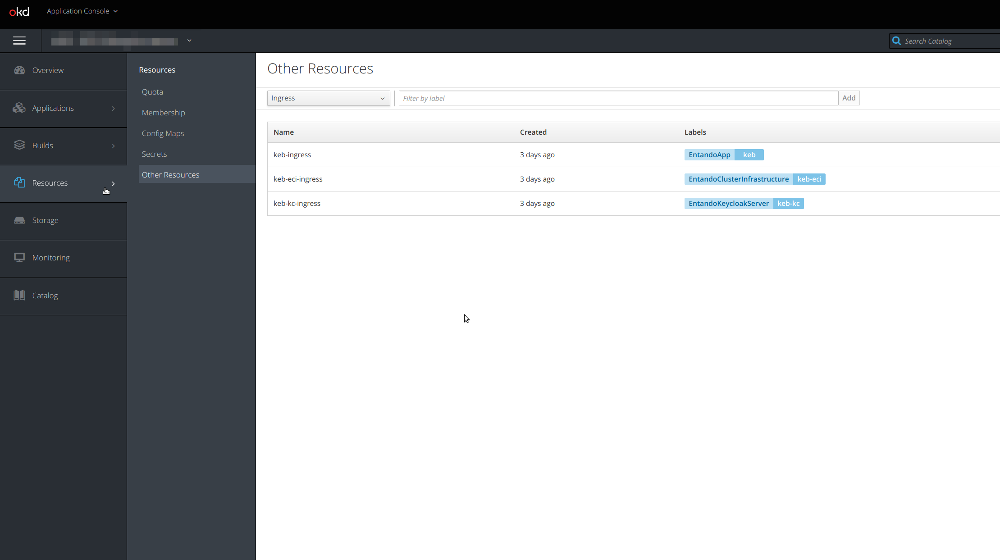

# Check Ingresses 

 The Entando Operator and custom resource controllers manage the ingresses which allow external access to services within an Entando cluster. The following directions show you how to examine these ingresses with two different methods.

## Using the OpenShift Dashboard

In the OpenShift dashboard, ingresses are not exposed directly as pods and deployments. The dashboard provides direct access to the ingress routes under the `Applications` → `Routes` menu.


To see the ingress resources, choose `Resources`  → `Other resources` from the left navigation menu. From the drop-down, select `Ingress` and you should see the ingresses available in that namespace or project.




## Using kubectl from the Command Line

* From the command line, use the following command with the namespace of your cluster:
```
kubectl get ingress -n YOUR-NAMESPACE
```

Here is an example of the result for the namespace entando:
```
> kubectl get ingress -n entando

NAME                               CLASS    HOSTS                             ADDRESS         PORTS   AGE
default-sso-in-namespace-ingress   nginx   quickstart.192.168.64.15.nip.io   192.168.64.15   80      19d
quickstart-ingress                 nginx   quickstart.192.168.64.15.nip.io   192.168.64.15   80      19d
```

* For more details about a specific ingress, use the kubectl `get` command, specifying the ingress name you want to check and the `yaml` output format.

```
> kubectl get ingress -n local quickstart-ingress -o yaml

apiVersion: extensions/v1
kind: Ingress
metadata:
  creationTimestamp: "2020-05-13T15:27:08Z"
  generation: 1
  labels:
    EntandoApp: qst
  managedFields:
  - apiVersion: extensions/v1beta1
    fieldsType: FieldsV1
    fieldsV1:
      f:status:
        f:loadBalancer:
          f:ingress: {}
    manager: nginx-ingress-controller
    operation: Update
    time: "2020-05-13T15:27:08Z"
  name: qst-ingress
  namespace: local
  ownerReferences:
  - apiVersion: entando.org/v1
    blockOwnerDeletion: true
    controller: true
    kind: EntandoApp
    name: qst
    uid: aa7053e1-fd8b-419f-bdee-df3018c013fa
  resourceVersion: "16802097"
  selfLink: /apis/extensions/v1beta1/namespaces/local/ingresses/qst-ingress
  uid: e9b6f027-369a-4b84-b4b1-736a6e49f180
spec:
  rules:
  - host: local.192.168.1.9.nip.io
    http:
      paths:
      - backend:
          serviceName: qst-server-service
          servicePort: 8080
        path: /entando-de-app
        pathType: ImplementationSpecific
      - backend:
          serviceName: qst-server-service
          servicePort: 8083
        path: /digital-exchange
        pathType: ImplementationSpecific
      - backend:
          serviceName: qst-server-service
          servicePort: 8081
        path: /app-builder/
        pathType: ImplementationSpecific
status:
  loadBalancer:
    ingress:
    - ip: 127.0.0.1
```

**Learn More**

* Learn more about [Entando ingresses and architecture](../getting-started/concepts-overview.md) 
* For more details about ingress concepts in Kubernetes, please refer to the [Kubernetes Ingress documentation](https://kubernetes.io/docs/concepts/services-networking/ingress/).