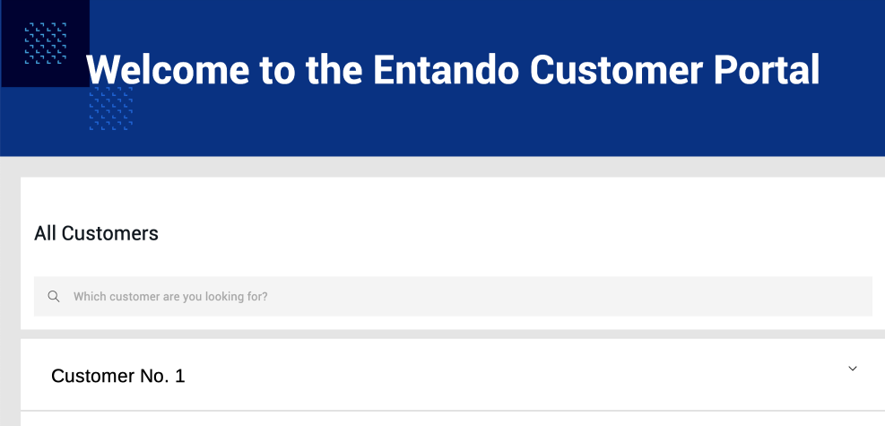
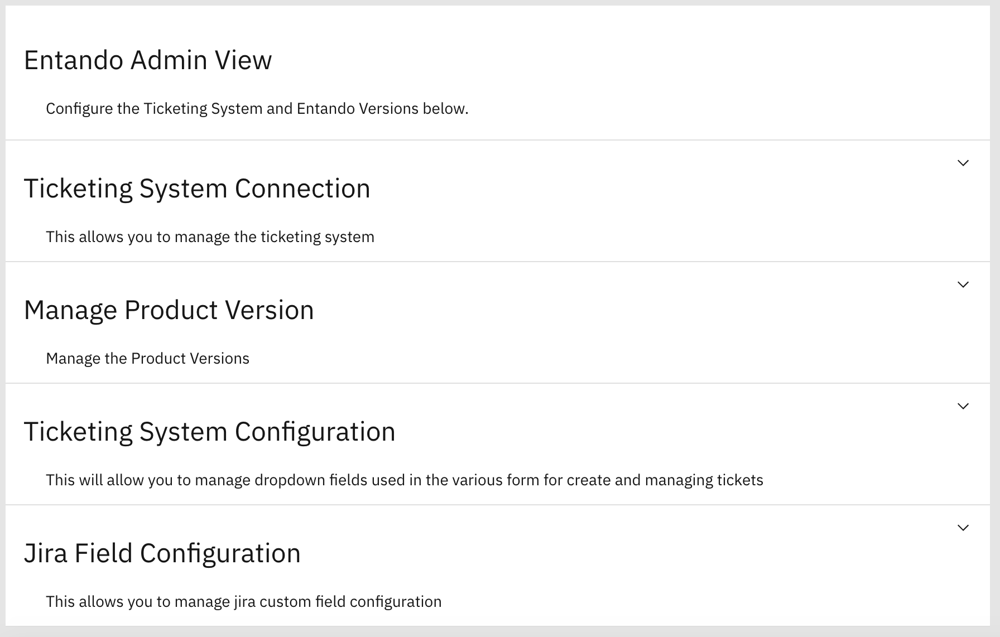
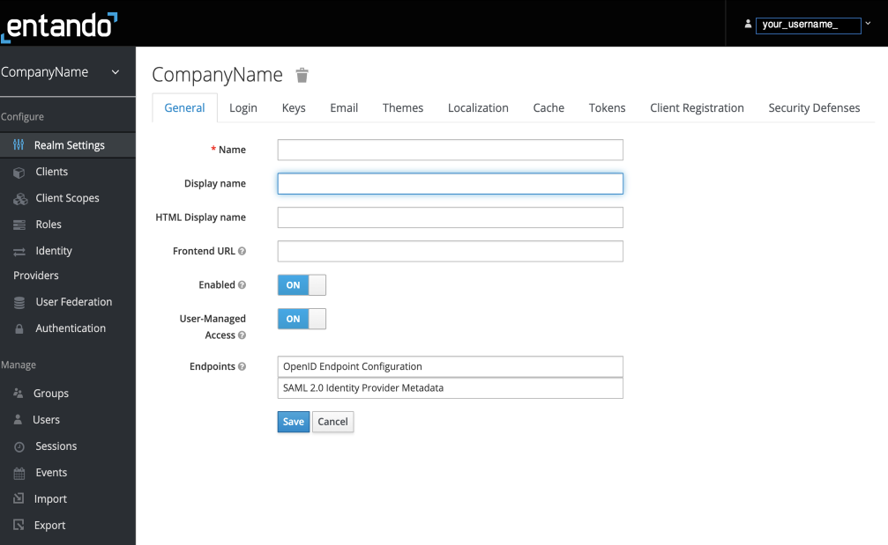
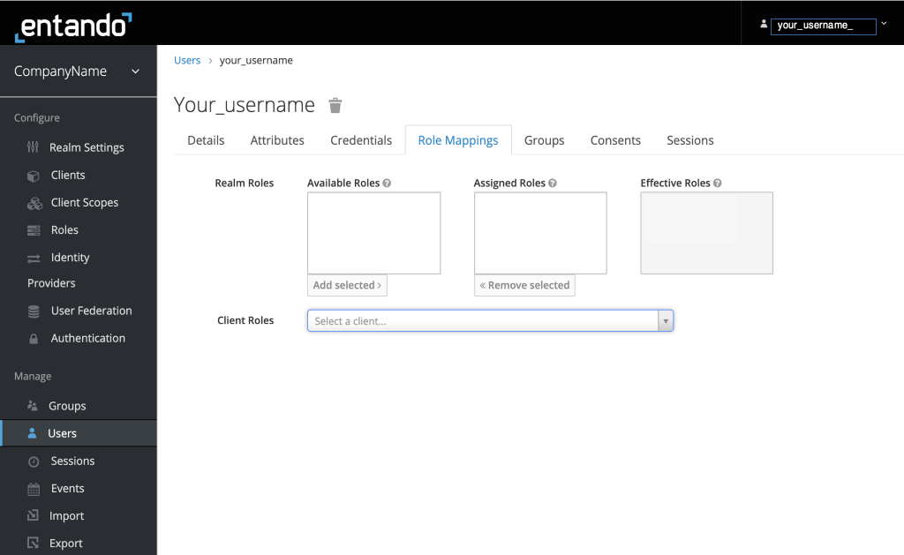
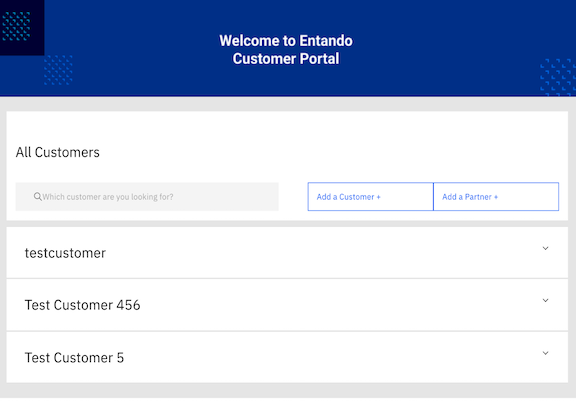
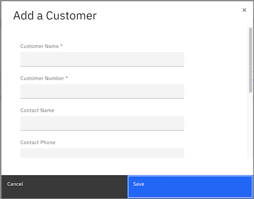
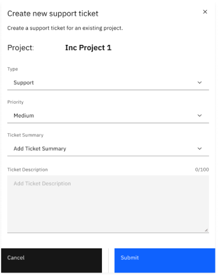

# Entando Customer Portal 
## Overview
The Entando Customer Portal enables an organization to quickly provide a modern, self-service, customer-facing application for managing subscriptions. It includes a lightweight integration to Jira Service Management for access to service tickets and a role based access control (RBAC) design for granting users varying levels of access.

Key Features:

* Customizable service ticket tracking system with Jira Service Management
* Role based access control with Entando Identity Management System
* Integrated user, customer, project, and subscription management 

This tutorial covers: 
1. [Installation](#installation)
2. [Configuration](#configuration)
4. [Managing the Customer Portal](#managing-the-customer-portal)
5. [Using the Customer Portal](#using-the-customer-portal)
6. [Resources](#resources)

## Installation
### Prerequisites
* A working instance of Entando running on Kubernetes. See [Getting Started](../../docs/getting-started/) for more information or [install Entando on any Kubernetes provider](../#operations). 
* Use the [Entando CLI](../../docs/getting-started/entando-cli.md) command `ent check-env develop` to verify dependencies
* A Jira Service Management account
* A [Keycloak server](https://www.keycloak.org/docs/15.0/server_admin/#_email) configured with the SMTP settings to enable email verification for users

### Automatic Install via the Entando Hub

#### Integrate the Entando Hub into your App Builder
1. Log in to your `App Builder` and go to `Hub` → `Select Registry`
2. Choose `Entando Hub` if it has been configured, otherwise:
   1. Choose `New Registry`
   2. In the pop-up window, enter `Entando Hub` and `https://entando.com/entando-hub-api/appbuilder/api` for the URL, then `Save`
   3. Click on the Hub in the Registry

#### Install the Customer Portal
From the Hub Catalog, `Deploy` and `Install` the Customer Portal application first, then the content bundle

#### Assign Roles to Configure the Service
1. [Log in to your Keycloak instance](../../docs/consume/identity-management.md#logging-into-your-keycloak-instance) as an admin
2. Give at least one user the ability to manage the Customer Portal by granting the `cp-admin` role
    - The `cp-admin` role is assigned from the `pn-a71d68dd-166dc0f4-entandodemo-customerportal-server` client. See [Role Assignment in ID Management](../../docs/consume/identity-management.md#authorization) for more details.
3. Give the generated plugin client permission to manage users:
    1. From the left sidebar, go to `Clients` and select client ID `pn-a71d68dd-166dc0f4-entandodemo-customerportal-server`
    2. Click the `Service Account Roles` tab at the top of the page and select `realm-management` from the `Client Roles` field
    3. Choose `realm-admin` from `Available Roles`, then click `Add selected`. It should appear as an `Assigned Role`.

#### Navigate to Your Customer Portal 
1. From the sidebar, go to `Page` → `Management`
2. Find the `Customer Portal` folder
3. From the `Actions` pull-down menu, go to `View Published Page`



### Manual Install 
1. To install the Customer Portal manually, run the following commands:

``` bash
ent ecr deploy --repo="https://github.com/entando-samples/customerportal-application-bundle.git"
```

``` bash
ent ecr deploy --repo="https://github.com/entando-samples/customerportal-content-bundle.git"
```
2. Log in to the App Builder

3. Go to the `Hub` in the left sidebar to view the two Customer Portal bundles. `Install` the `customerportal-application-bundle` first, then the `customerportal-content-bundle`.

4. To navigate to your Customer Portal: 
   1. From the sidebar, go to `Page` → `Management`
   2. Find the `Customer Portal` folder
   3. From the `Actions` pull-down menu, go to `View Published Page`

## Configuration
### Administrators
In order to configure the Customer Portal and its users, the administrator needs Jira Service Management and Entando Identity Management System credentials. The admin can then connect the Customer Portal to Jira and customize its features. 

>Note: The built-in mapper for email must be enabled on the server client so that user accounts can be retrieved from Jira and new tickets can use that account information.

### Jira Service Management 

Users who need access to the Customer Portal, beyond subscription and project information, must have a Jira Service Management account. The administrator utilizes Jira Service Management to create users and projects, define the organization, and configure the service ticket system.

::: tip
The password for Jira Service Management must be an [API token generated by Jira](https://id.atlassian.com/manage-profile/security/api-tokens). For more information, go to [Manange API tokens at Atlassian Support](https://support.atlassian.com/atlassian-account/docs/manage-api-tokens-for-your-atlassian-account/).
:::

The JIRA Service Management REST API should follow the pattern https://YOUR-JIRA-SERVICE-MANAGEMENT-URL/rest/api/latest/. For reference, see [Jira Service Management Cloud REST APIs](https://developer.atlassian.com/cloud/jira/service-desk/rest/intro/).

#### Add Organizations and Projects in Jira:
1. Go to Customers
2. Add organizations and projects as needed 
3. Click on the name of each added organization to retrieve its ID from the URL. This is required to [create](#create-a-project) and [assign](#assign-a-project) projects in the Customer Portal
   - e.g. example.com/jira/servicedesk/projects/ECS/organization/3 → the Organization ID is “3”

### Configure the Customer Portal 

The Customer Portal must be configured for a specific Jira Service Management instance. The `CP Admin Config` page is where you establish the Jira connection, manage product versions, define subscription levels, and customize ticket types.

To access the `CP Admin Config` page, you must be given the `cp-admin` role in the [Entando Identity Management System](#entando-identity-management-system) as [described above](#assign-roles-to-configure-the-service). 

#### View the `CP Admin Config` Page
1. In the App Builder, go to `Pages` and select `Management`
2. Open the Customer Portal folder and find `CP Admin Config`
3. From the `Action` drop-down menu on the right, go to `View Published Page`



Once the Ticketing System Connection is set up with Jira and the correct URL, default parameters such as product versions and ticket types will be displayed. Open each section with the down arrow to add and edit the fields as needed. 

::: tip 
The password for the Ticketing System Connection is requested by the Customer Portal administrator and must be an [API token generated by Jira](https://id.atlassian.com/manage-profile/security/api-tokens). For more information, go to [Manange API tokens at Atlassian Support](https://support.atlassian.com/atlassian-account/docs/manage-api-tokens-for-your-atlassian-account/).
:::

### Entando Identity Management System 
Log in to the Entando Identity Management System to arrive at the landing page shown here. Use the left navigation bar to manage users, groups, and roles. Using the RBAC model, define what access users have by the roles and groups they are assigned. Some important information is noted below. 



#### The Realm Setting
The `Realm` is a set of users, credentials, roles, and groups. A user belongs to and logs in to a `Realm`. 

#### Default Roles
You can use the default roles by clicking on `Client Roles` and choosing `entandodemo-customerportal-server`. Access for each role is defined as follows:

   * `cp-customer`: Assigned directly to specific projects of a single customer
   * `cp-partner`: Assigned directly to specific projects of multiple customers
   * `cp-support`: Read only view of all customer projects
   * `cp-admin`: Admin access to the Customer Portal

#### Create New User
1. From the sidebar, go to `Users`
2. Click `Add User` on the right
3. Complete the form as needed, but note the requirements for these fields:
    - `Username`: A unique name
    - `Email`: Must use the same address used in Jira
    - `User Enabled`: Set to On
4. Click`Save`
5. Send an email to the user to activate their account and set a new password: 
    1. Go to the `Credentials` header 
    2. Under `Credential Reset`, go to `Reset Actions` → `Update Password`  
    3. Click `Send Email`

#### Assign Roles to Users
1. Click on the `Role Mapping` tab
2. Select the appropriate role(s) from `Available Roles` and assign them to a user by clicking `Add Selected`:
    * To assign default roles, choose `entandodemo-customerportal-server` from the `Client Roles` pull-down
    * To manage users in the Customer Portal, a user will need full administrative privileges via the `realm-admin` role under `Client Roles` → `realm-management`
3. Check the `Effective Roles` column on the right to ensure the correct roles have been assigned



#### Assign Roles to Groups
Under `Groups`, assign roles to groups as needed. Multiple roles can be assigned to a single group.

## Managing the Customer Portal

As administrator for the Customer Portal, you can create and manage users, customers, projects, and subscriptions. You can assign projects to users who have activated their account on Jira and have been assigned roles in the Entando Identity Management System. 



#### Create a Customer or Partner
The processes to create customers and partners are similar. Below are the steps to add a `Customer`. A `Partner` is added the same way.
1. Click `Add a Customer`
2. Fill in the customer details. Note:
     * The `Customer Number` must be unique
     * The `Notes` field is visible to only `support` and `admin` users

    

#### Create a Project

1. Go to the Customer Portal landing page
2. Click on a customer to see the associated project list 
3. Click `Add a Project`
4. Enter the `Project` information
5. Provide the [Organization ID](#jira-service-management) retrieved from Jira. Each project must have a unique Organization ID.
6. Click `Save`

#### Assign a Project

1. Go to the Customer Portal landing page
2. Click on a customer to see the associated project list 
3. From the `Action` drop-down menu, select `Manage Users`
4. Select the user for the `Project`
5. Click `Submit`
    
#### Manage Partners and Subscriptions
Use the `Action` drop-down menu to manage Partners or request and manage subscriptions. 

## Using the Customer Portal

To access the Customer Portal, your organization administrator needs to provide you with the proper user credentials. Once you log in to the Customer Portal, you will see a list of customers. Click on an entry to view customer details and track projects. You can create and track service tickets, as well as request subscriptions.

**To create a `Service Ticket` for a project:** Go to the `Action` pull-down menu and select `Open Ticket`



**To request a Subscription or track Tickets:** Go to the `Action` pull-down menu and select the corresponding option

## Resources
* Go to [Jira Service Management](https://www.atlassian.com/software/jira/service-management) for more information
 
* The [source code for the Entando Customer Portal](https://github.com/entando-samples/customer-portal/) can be found on GitHub, along with our other open source examples and tutorials


