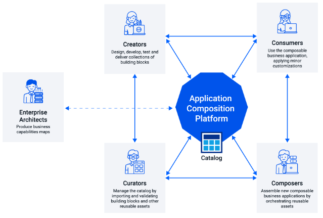

# Entando Platform

Entando is an open-source application composition platform (ACP) that streamlines the development of composable applications for the web. By implementing a modular architecture, the Platform enables parallel teams to accelerate development and innovation on a modern, cloud-native, and Kubernetes-native stack.
 
With Entando’s distributed working environment, you can build applications composed of modular reusable components and manage them all from one platform. This includes development and runtime tools, a component catalog, and an orchestrator to support the development lifecycle.

 

Development on Entando can be organized into four stages: Create, Curate, Compose, and Consume. In the simplest terms, you create functional building blocks or bundles, curate them in a catalog, compose them into an application, which is then consumed by a user. The Enterprise Architect oversees the process, defining business domains and mapping capabilities for the building blocks.

 

## Create 
Building a composable application begins with self-contained bundles, created from scratch or using existing code. With the freedom to choose the technologies and frameworks that meet their needs, developers can use the [Entando Component Generator](./create/component-gen-overview.md) and [Blueprint](./create/blueprint-features.md) to speed up the process. The composable methods of Entando mean innovations can be easily integrated without reworking existing systems. 

| Documentation | Tutorials        |
| :------------ | :--------- |
| [Entando Component Generator](./create/component-gen-overview.md) | [Micro Frontends](../tutorials/create/mfe/) |
| [Entando Blueprint Feature](./create/blueprint-features.md) | [Microservices](../tutorials/create/ms/generate-microservices-and-micro-frontends.md) |
| [Component Generation Technologies](./create/component-gen-tech.md) | [Build and Publish Project Bundles](../tutorials/create/pb/publish-project-bundle.md) |

## Curate  
In this stage, curators discover and organize components to share across teams and projects. The components can be sourced internally or from the [Entando Marketplace](https://entando.com/composable-platform/packaged-business-capabilities/) which offers a selection of pre-built solutions. Curators assess, publish, and share component features and metadata in a private or public hub, ensuring that it is discoverable. Centralizing these functions also makes is easier to govern the consistency of the reusable bundles.

| Documentation | Tutorials        |
| :------------ | :-------- |
| [Bundle Details](./curate/bundle-details.md) | [Install Bundles from a Private Image Registry](../tutorials/curate/bundle-private-images.md) |
| [Bundle Component Descriptors](./curate/bundle-component-details.md) | [Install Bundle Microservices from a Private Image Registry](../tutorials/curate/ms-private-images.md) |
| [Enterprise Entando Hub](./curate/hub-details.md) |   |

## Compose  
The Compose stage involves assembling the bundles, packaged business capabilities (PBCs), templates and other resources into an application. Centered around the visual interface, the [Entando App Builder](./compose/app-builder.md), the Platform provides tooling to define the structure, layouts, and interactions between micro frontends within an application. This unified environment, with direct access to the Entando catalogs, leads to the creation of a more cohesive and seamless user experience across a complex application.

| Documentation | Tutorials        |
| :------------ | :-------- |
| [App Builder Welcome Wizard](./compose/welcome-wizard.md) | [Create and Manage a Page](../tutorials/compose/page-management.md) |
| [Local Hub](./compose/local-hub-overview.md) | [Widgets and Fragments](../tutorials/compose/widgets-fragments.md) |
| [Entando Component Manager](./compose/ecm-overview.md) | [Content Templates](../tutorials/compose/content-templates-tutorial.md) |
|  | [Digital Assets](../tutorials/compose/digital-assets-tutorial.md) |

## Consume 
In the lifecycle of an application, Consume is the execution stage where users interact with the application, using browsers, mobile devices, and conversational interfaces. On Entando, the modular design of components and services means they can be scaled independently, governed consistently, and new features integrated uniformly, as user's needs change. Likewise, content can be updated, interactions improved, and upgrades carried out in a continuous process, with minimal disruptions and faster time to market.

| Documentation | Tutorials        |
| :------------ | :-------- |
| [Accessibility](./consume/accessibility.md) | [High Availability on Entando](../tutorials/consume/high-availability.md) |
| [Entando Operator](./consume/operator-intro.md) | [Add an API Claim](../tutorials/create/ms/add-api-claim.md) |
| [Entando APIs](./consume/entando-apis.md) | [Invoke Entando core APIs](../tutorials/consume/invoking-api.md) |
| [Entando Identity Management System](./consume/identity-management.md) | [External Identity Management System](../tutorials/consume/external-id-management.md) |

## Learn More
* [Entando Architecture](./getting-started/concepts-overview.md)
* [Solutions Templates](./getting-started/landing-page.md)
* [Getting Started](./getting-started/README.md)