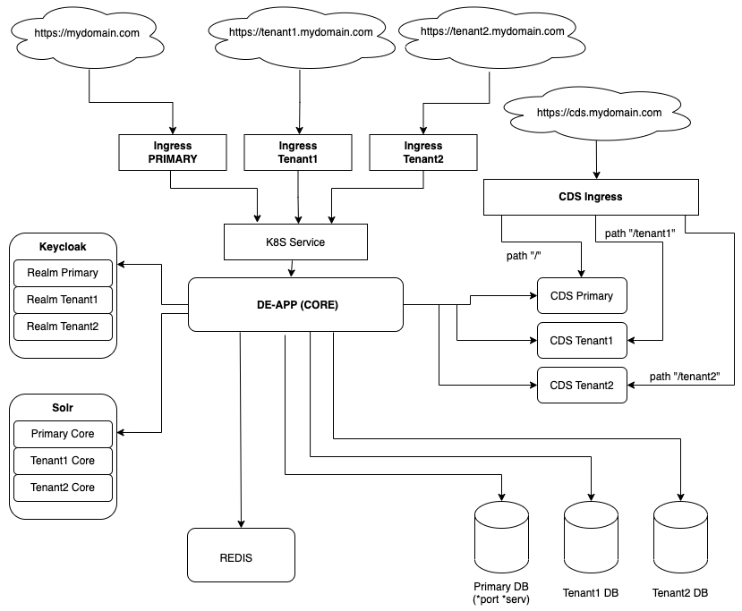

# Entando Multitenancy

An Entando Application can be configured with multitenant architecture where tenants share an infrastructure but are informationally separate. On Entando v7.3, the full capabilities of bundles can be utilized in a multitenant environment, where tenants share bundles and resources but each exists independently with its own functionality, design, and data.

This document provides an overview of multitenancy and Entando's implementation.

## Core Concepts

Multitenancy is an architecture framework in which a single software instance serves multiple tenants. A multitenant application is designed with a shared infrastructure while data between tenants is segregated. 

Entando Multitenancy shares Kubernetes, Keycloak, and the Entando Platform infrastructure while distributing resources (CPU, memory) across the primary and secondary tenants for optimal efficiency. 

Each tenant, identified by a unique domain name, comprises a user group with specific access privileges to the instance. Each can be designed and developed independently, with segregared data, configuration settings, and user management. Kubernetes Secrets are used to protect the confidential parameters of each tenant configurations.

Data for components and registries connected to a particular tenant is also isolated, with each tenant managing its own set of bundles and registries. When a bundle is installed to a tenant, whether from the Entando Cloud Hub or an enterprise Hub, it is identified as belonging to that tenant by the Component Manager.

## Architecture

All tenants rely on a single instance of an Entando Application for core functionality such as the App Builder, App Engine, and Keycloak. 

Redis is necessary for cache management and high availability, which Entando strongly recommends for a multitenant configuration. See the [Redis Integration](../../tutorials/consume/redis.md) tutorial to add it to your Entando Application.

Tenants are differentiated by unique domain names. To isolate its information and configuration, a tenant is allocated each of the following resource:

- A database or schema for independent data storage
- An Entando Content Delivery Server (CDS) instance to manage static resources external to the Entando App Engine
- A Solr core to implement an external search engine
- A Keycloak client realm to manage user access

Entando Multitenancy requires that [Solr](../../tutorials/consume/solr.md), [Entando CDS](../../tutorials/consume/cds.md), and [Keycloak](../../tutorials/consume/multitenancy.md#keycloak) are configured for each tenant. 

## Implementation

A single installation of Entando can manage more than one independent and isolated domain. Key features of Entando Multitenancy include the following:

- The domain name in the URL of the Entando instance identifies the current tenant
- Separate databases (or schemas) and filesystems physically isolate each tenant's data
- Different security domains (users, keys) hosted on different Keycloak realms ensure that each tenant's activity is independent
- All of the tenants rely on a single Kubernetes namespace, App Engine, App Builder, Operator, Kubernetes service, and Component Manager
- The App Builder UI for each tenant provides all the functionality of a standalone Entando installation 
- Each tenant can be connected to a registry individually, including the Entando Cloud Hub or enterprise Hub. This is where bundles can be shared and accessed by tenants.
- Bundles are deployed, installed and uninstalled to each tenant independently from the Local Hub in the App Builder. External DBMS are supported for microservices but need to be configured manually as shown in the [External DBSM for Microservices](../../tutorials/consume/external-db-ms.md) tutorial.
 

## Next Steps

Start here to configure [Multitenancy on Entando](../../tutorials/consume/multitenancy.md).

