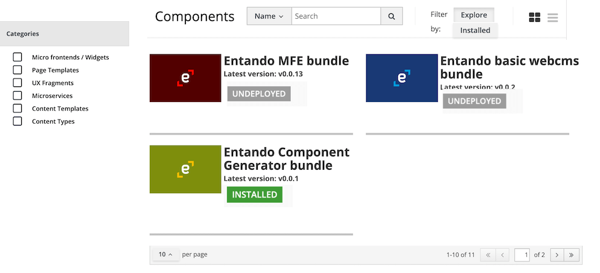

# Customize Bundle Info Shown in App Builder

An example of how bundles are displayed in the Local Hub of the App Builder is shown below:




The corresponding custom resource file on Kubernetes contains content similar to the following:

```
apiVersion: entando.org/v1
kind: EntandoDeBundle
metadata:
  name: simple-entando-bundle
spec:
  details:
    name: Entando Bundle
    description: An example of an Entando Bundle
    dist-tags:
      latest: v0.0.1
    time:
      created: '2020-05-20T15:59:21.946Z'
      modified: '2020-05-20T15:59:21.946Z'
      v0.0.1: '2020-05-20T15:59:21.946Z'
    versions:
      - v0.0.1
    keywords:
      - entando6
    author: Entando
  tags:
   - tarball: docker://registry.hub.docker.com/entando/simple-entando-bundle
     version: 0.0.1
```

Spec Definitions:

| Field                           | UI Element                                                                | 
|---------------------------------|---------------------------------------------------------------------------|
| `spec.details.name`             | Set the bundle title                                                      |
| `spec.details.description`      | Set the bundle description (only visible in list format)                  |
| `spec.details.dist-tags.latest` | Set the latest version of the bundle                                      |