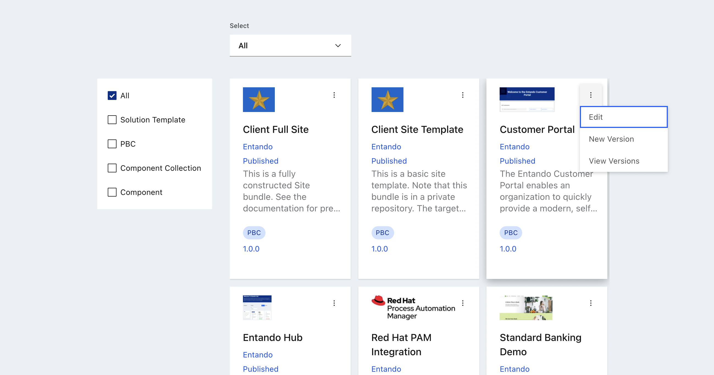

# Entando Hub Features and Definitions
## Overview
The Entando Hub is the central catalog where components are published, organized and shared. The reusable components called Bundle Groups come with versioning and publishing management capabilites in the Hub UI. The following describes the details of how this process is defined and accomplished.

Entando Hub Features:

- Centralize components and business capabilities for use across teams, groups, or clients
- Publish and manage components, and communicate component features, versions and metadata
- Perform business-level assessment of component readiness 

The Hub can be utilized in several ways in any Entando Application:
* The **Local Hub**, included in the Entando App Builder, displays a collection of ready-to-use components. They can be used to compose an application or as a starting point to create new components.	

* **Entando Cloud Hub** is the public catalog containing packaged business capabilities and components provided by Entando and its partners throughout the world.

* **Enterprise Entando Hub**, applied and curated by Entando clients and partners, it can be used to share components within their respective organizations or made available for public use. 

[Installation and User Guide](../../tutorials/solution/entando-hub.md)

## Bundle Group Definitions
The key entities in an enterprise Hub are:

- `Bundle Group`: A Bundle Group is a Hub entry, a single unit containing one or more Entando Bundles. 
- `Bundle`: An Entando Bundle is the deployment unit within an Entando Application. A bundle can contain one or more components such as micro frontends, microservices, or any of the [component types](../../docs/curate/bundle-component-details.md) allowed in Entando. 
- `Bundle Group Version`: A Bundle Group can have one or more versions, each with a particular status.
- `Category`: Each Bundle Group belongs to a specific category. The default categories are solution template, packaged business capability (PBC), and component collection. An admin of an enterprise Hub can create and refine the categories as desired.
- `Organization`: Bundle Groups belong to a single organization. Authors and managers can only update entries within their own organization. A single instance of the Hub can have multiple organizations.
- `User`: User identity is managed within Keycloak, where users are granted roles within a Hub instance. Users must be created in Keycloak, then added in the Hub and assigned to a specific organization.

> A private repository can be used for a bundle, but this requires [an additional Kubernetes Secret](../../tutorials/curate/private-git-repo.md) before deployment via the App Builder.

## Roles

Three roles are defined to provide access to the enterprise Hub features:

- `eh-author`: An author can create and edit Bundle Groups for their organization and submit them for publication. They can generate an API key.
- `eh-manager`: A manager has the capabilities of an author, but can also approve a publication request for their organization. 
- `eh-admin`: An admin has full access to create, update, and delete Bundle Groups and manage users for the entire Hub instance. An admin can also create categories, organizations and private catalogs, assign users to organizations, and generate API keys. 
- `guest`: Any user without one of the preceding roles is considered a guest in the enterprise Hub and is given a read-only view of the public catalog. This is also true for unauthenticated users.
To assign roles to a new Hub user, see the [Entando Hub Installation and User Guide](../../tutorials/solution/entando-hub.md#user-management)

## Bundle Group Versions
The list of Bundle Group versions can be seen by clicking `View Versions` for any entry in the catalog:

The following rules apply to Bundle Group versions:
- Once the first version of a group is published, the organization, name, and category can no longer be changed.
- A new version of a Bundle Group can be created (via the `New Version` option) after the first version has been published. 
- There can be at most two active versions: one draft or publication requested version, and one published version. 
- When a new version is published, the previous version is set to `Archived`. 
- Archived versions are only visible in the versions view and are not shown elsewhere in the user interface.

## Bundle Group Status

The possible statuses for each version of a Bundle Group are as follows:

- `Draft`: This is the default status for the first version of a Bundle Group. 
- `Publication Request`: An `eh-author` sets a version to this status to request the `eh-manager` or `eh-admin` to review the version and approve it for publication. The manager or admin may also edit versions with this status.
- `Published`: Versions with this status are visible in the home page catalog of available Bundle Groups, and are also available in the App Builder-facing API. An `eh-manager` or `eh-admin` may edit published versions.
- `Archived`: Previously published versions are assigned this status. No edits can be made to an archived version.
- `Deletion Request`: An `eh-manager` or `eh-admin` can delete versions once this status has been set.

Notes:
- An `eh-author` can change any field except organization while a version is in `Draft` status.
- There is no automated notification process when a publication request is made for a Bundle Group version.

## Application Details

An Entando Hub includes the following key components:

#### Micro Frontends / Widgets
- `Entando Hub App`: This is the main micro frontend which contains the management UI for the Hub entities noted above.
- `Entando Hub Login`: This is an optional login component which can be used in a page’s top navigation.

#### Microservices
A single Spring Boot microservice provides two REST endpoints:
- The first is a backend-for-a-frontend (BFF) service for the Hub UI and contains various entity APIs.
- The second provides methods that support the Entando App Builder integration (7.0+).

#### Content
The content bundle (`entando-hub`) includes a custom template and a page preconfigured with the main Hub micro frontends.

## Next Steps
Install an [enterprise Entando Hub](../../tutorials/solution/entando-hub.md).