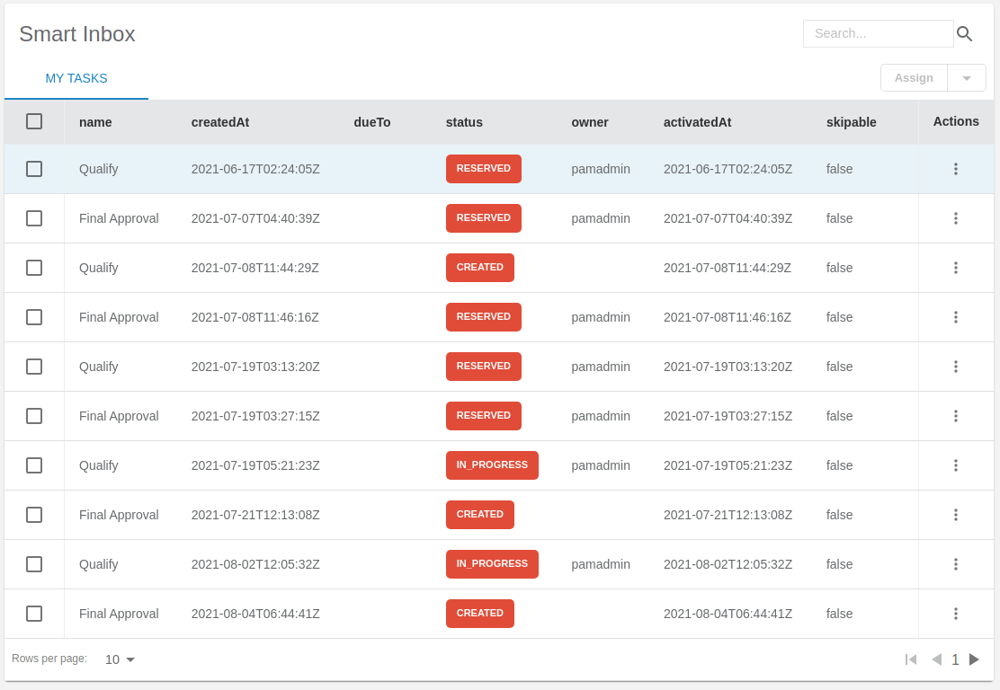

# Entando Solution Templates 

The Entando ACP offers several Solution Templates to demonstrate various business capabilities and integrations:

- [**Entando Customer Portal**](../../tutorials/solution/customer-portal.md)
- [**Entando Hub**](../../tutorials/solution/entando-hub.md)
- [**Entando Process Driven Applications Plugin**](../../tutorials/solution/pda-tutorial.md)
- [**Entando Standard Banking Demo**](../../tutorials/solution/install-standard-demo.md)

Each open source template was built with Entando and can be used as-is, reviewed as a reference, customized, or leveraged as a starting point for a similar application. 

These Solution Templates, and other packaged business capabilities (PBCs), are available in the [Entando Marketplace Hub](https://entando.com/composable-platform/packaged-business-capabilities/).

## Entando Customer Portal

The [Entando Customer Portal](../../tutorials/solution/customer-portal.md) is a customer-facing, self-service subscription management application. The Platform integrates Keycloak for role based access control and Jira Service Management as a ticket tracking system.

## Entando Hub

The [Entando Hub](../../tutorials/solution/entando-hub.md) empowers a team to share and collaborate on proprietary or Entando open source components. Capabilities, versions and metadata can be analyzed, managed and published. You can install a private catalog to share components within a team or the whole organization with user access controls. 

[Entando Hub Details](../../docs/curate/hub-details.md)  
[Entando Hub Installation and User Guide](../../tutorials/solution/entando-hub.md)

## Entando Process Driven Applications Plugin

The [Entando Process Driven Applications Plugin](../../tutorials/solution/pda-tutorial.md) provides a comprehensive and versatile automation scheme for Business Process Management. It comprises a custom UX layer, a Spring Boot Backend for Frontend microservice interface, and integration with the [Red Hat Process Automation Manager](https://access.redhat.com/products/red-hat-process-automation-manager).

## Entando Standard Banking Demo

The [Entando Standard Banking Demo](../../tutorials/solution/install-standard-demo.md) showcases the possibilities and benefits of a composable application built from modular components. The example banking environment integrates a transaction table, sign up form, alert icon, and summary cards to demonstrate micro frontend (MFE) capabilities. Prominent features include Keycloak role based access control, coexistence of React and Angular MFEs, and pluggable Spring Boot microservices.

