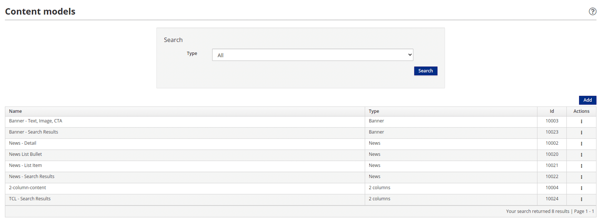
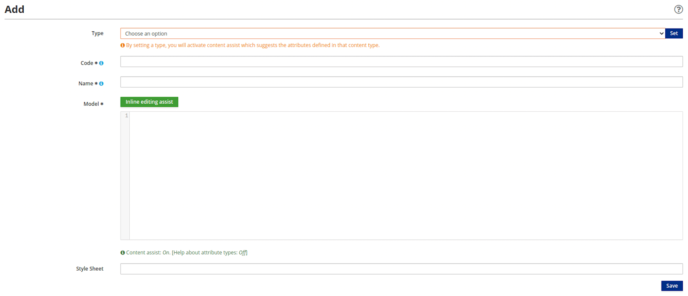

# Content Templates

Content templates define how information is displayed when content is published. They provide the styling and layout parameters for Content Types and enable different representations of the same content.

Note that the terms "templates" and "models" are used interchangeably.

## Create a Content Template

Content templates are managed by the Entando Web Content Management System (WCMS) in the [App Builder](../../docs/getting-started/concepts-overview.md#entando-app-builder). Follow the steps below to create and configure a content template.

**1.** From the left menu in the App Builder, go to `Content` → `Templates`

**2.** Click the `Add` button above the list of existing models  

**3.** Define the characteristics of the content model

- `Type`: Choose a content type from the drop-down list. Click `Set` to complete the selection.

- `Code`: Enter a sequence of up to 10 numbers to uniquely identify the content template. This field is required.

- `Name`: Enter a name or description for the content template. This field is mandatory and supports a string of 50 characters or less and should consist of one or more of the following: uppercase and lowercase letters, numbers, and/or special characters.

- `Model`: Enter HTML to model the content template with Velocity language. This field is required.

- `Style Sheet`: (Optional) Enter the CSS to be applied to the HTML `Model`.

**4.** Click `Save`

Now the content template/model is available to the content type.

