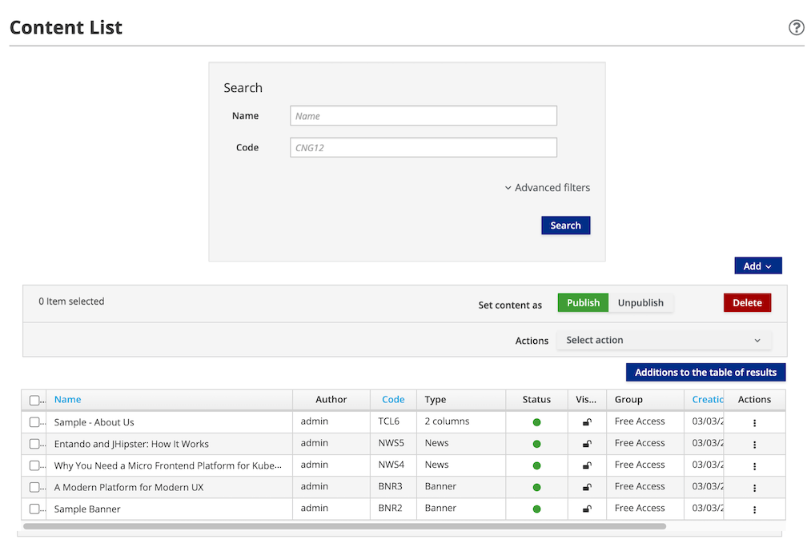
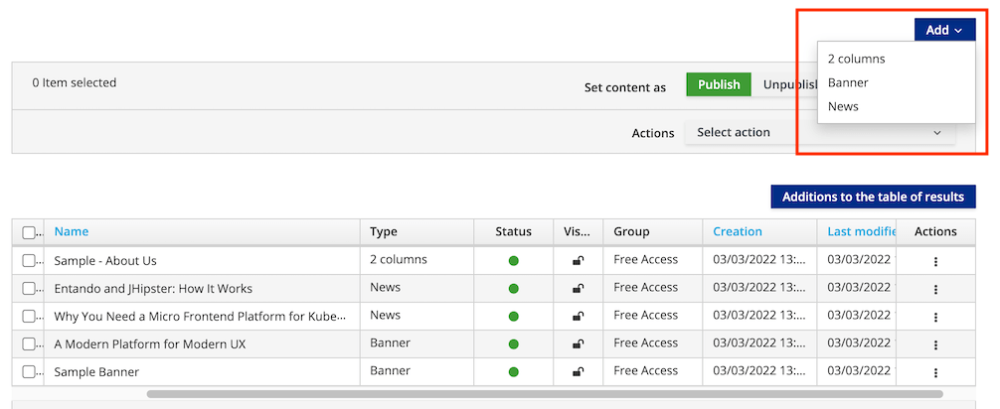
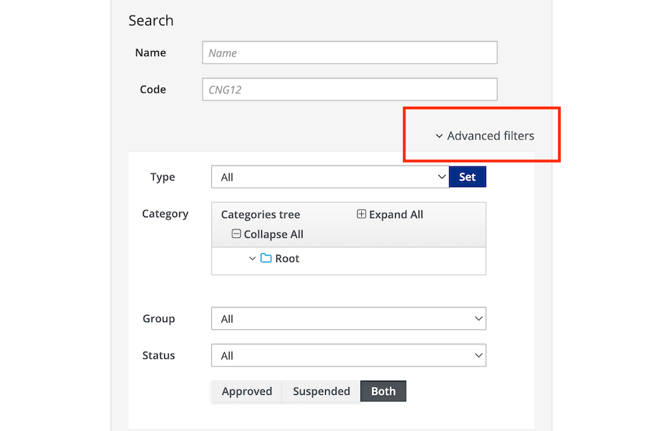
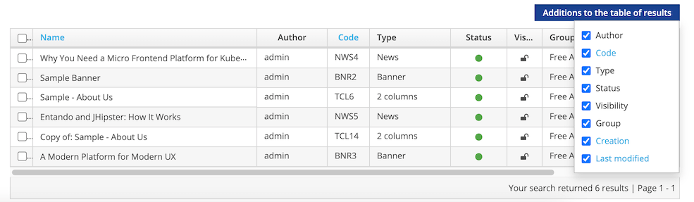
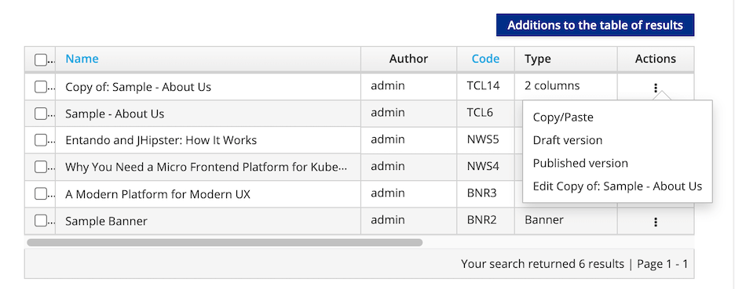
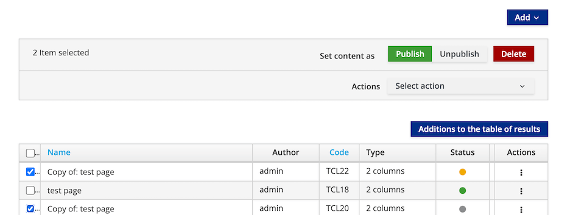
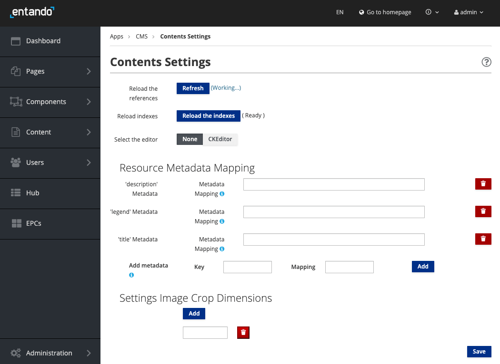

# Create and Manage Content

This tutorial describes how to create, edit and publish content in an application from the [App Builder](../../docs/compose/app-builder.md).

## Create Content

1. Log in to your App Builder
2. From the left sidebar, go to `Content` → `Management`. Existing content is displayed in the table.

3. To create new content, click the `Add` button on the right and select the desired type from the drop-down list. This loads a form to add details about the content. See [Content Type tutorial](./content-types-tutorial.md) to add new types.

4. Provide the following information:
    * `Info` 
         * `Content description`: Enter the content name or description. This field is required.
    *  `Groups`
         * `Owner Group`: From the drop-down list, choose an available user group to manage the content, then click `Set group`. This field is mandatory and can be amended in the App Builder's `Users` section under `Groups`.
         * `View Only Groups`: Add groups to provide viewing access by highlighting an available group and clicking `+` to add it. This field is required. 
    *  `Categories`: If categories have been added, you can select a category and click `+` under `Join` to include it in that category for searching and sorting. This field is not required.
    *  `Content attributes`: You are required to enter a title for the content type in the `Title` field. Populate the remaining optional fields as needed.
    > Note: `History` displays the iterations of the content previously saved. You can view the details or revert to a previous version. 

5. Determine the status of the content:  
 * `Draft`: The content is in the development stage and not ready for approval and publication. `Save` or `Save and Continue` keeps it in `Draft` mode.
 * `Ready`: The content is ready for review, but has not been approved or published. Content with this status can be approved later or published immediately.

6. Choose from these options to save the content:
 * `Save`: Save the content as a work in progress without approving it
 * `Save and Continue`: Save the content as a draft and continue editing it
 * `Save and Approve`: The content is saved, approved, and ready to use in an application

## Manage Content

### Find Content

From `Content` → `Management` of the left navigation menu, you can use the `Advanced Filters` to search for content by type, category, group, or status. 

In the resultant table, a set of parameters identifies the matching content. The parameters can be deleted from view by unchecking it from the `Additions to the table of results` drop-down menu.

### Content Actions

For each content listed in the table, the `Actions` menu provides the following options:
 * `Copy/Paste`: Replicate the content
 * `Draft version`: Edit the unpublished draft version
 * `Published version`: Edit the published content or revert to a previous version
 * `Edit`: Modify the content definition

### Publish, Unpublish, or Delete Content

To publish, unpublish or delete content:

1. In the App Builder, go to `Content` → `Management`
2. Select the check boxes next to the content you want to manage
3. Use the buttons above the table to `Publish`, `Unpublish` or `Delete` content. This takes you to a confirmation page that displays the current status of the content. 

## Content Settings
### Resource Metadata Mapping
Content Settings provide a method for managing aspects of your assets, letting the administrator reload content references and indexes, and select the text editor.  You can fine tune content by auto-populating or excluding metadata for images, or adding and removing metadata fields.

### Solr Configuration 
* In a multitenant application, when Solr is enabled and the `advancedSearch` environment variable is set to `true`, the Solr configuration page is accessible as the last item under `Content` in the App Builder left sidebar.

* The Solr Configuration page allows you to monitor and update the schema of the fields required by the content types, which the search is dependent on.

See [Solr configuration tutorial](../consume/solr.md) for more information.
