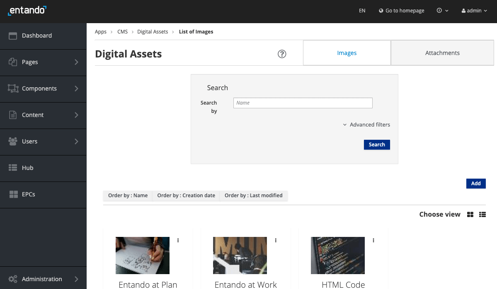

# Digital Assets

The Entando Web Content Management System (WCMS) includes capabilities to manage content and digital assets. These can include images, documents and other media files in the following formats.

**Default Supported Document Formats:** `pdf`, `xls`, `doc`, `ppt`, `txt`, `rtf`, `sxw`, `sxc`, `odt`, `ods`, `odp`, `tar`, `gz`, `zip`, `rar`, `flv`, `swf`, `avi`, `wmv`, `ogg`, `mp3`, `wav`, `ogm`, `mov`, `iso`, `nrg`, `docx`, `docm`, `xlsx`, `xlsm`, `xlsb`, `pptx`, `pptm`, `ppsx`, `ppsm`, `sldx`, `sldm`  
The WCMS in the App Builder can be configured to allow or exclude any type of file extension. The MIME type of each asset should be specified.

**Default Supported Image Formats**: `jpg`, `jpeg`, `png`, `svg`, `svg+xml`

## Manage Assets

1. Log in to the App Builder
2. From the left sidebar, go to `Content` → `Assets`
 
   * Select `Images` or `Attachments` in the tabs at the top of the page
   * Search for assests by name and/or by using the `Advanced filters`
   * Assets are displayed in alphabetical order by name. Organize the results with the `Order by` buttons just above the list. Toggle between list and grid formats with the `Choose View` button. 
   * Click on the action menu (indicated by three vertical dots) of the item to edit or delete it. 


### Add a New Asset

1. From the left sidebar, go to `Content` → `Assets`
2. Click the `Add` button 

3. Define the asset's parameters:
   - `Group`: Choose from the drop-down menu. This is a required field and defaults to `Free Access` which does not limit access. Additional groups can be defined in the Users section of the App Builder.  
   - `Categories`: You have the option to add the asset to a category using the `+` button under `Join`. Categorizing an asset expands the criteria by which it can be searched and sorted. New categories can be created via `Content` → `Categories`.
   - Add your asset by dragging it into the frame or click `browse` to select it from the file system. The file you choose should appear in the Name field. Use the `Add Another Resource` and `Choose file` buttons to select multiple items simultaneously. 
4. (Image only) You have the option to flip, rotate or crop your image by selecting [Edit](#edit-assets) from the kebab drop-down menu of each item.
5. Click `Save` to upload your asset(s).
6. Confirm the list of images or attachments displayed in the table.

## Edit Assets 
1. From the left sidebar, go to `Content` → `Assets`
2. Click on the action menu (indicated by three vertical dots) next to the item
3. Select `Edit` to modify the asset:
   - Edit the asset name via the text field
   - Edit the asset's category using the `+` button under `Join`
   - To edit an image:
     1. Click on the actions menu to the right of the image and select `Edit`
     
     2. Use the arrows to flip, rotate, zoom or recenter your image. Use the select window to resize. Click `Free` to remove the resizing ratio restrictions.
     3. Click the check button after all changes are made. 
     4. Click `Close` when all changes are done

4. Click the `Save` button to save your edits
::: tip
To organize or download assets, go to `Administration` → `File browser` and navigate to `/public/cms`
:::

## Embed an Image on a Page
An image can be embedded on a page using FreeMarker code like this: 
```html
<@wp.resourceUrl>cms/images/YOUR-ASSET.jpg
``` 
Go to `Administration` → `File Browser` and navigate to `/public/cms` to see the list of uploaded images.


## Include an Asset in Content
The asset can be added to a content type that has an `Attach` or `Image` attribute. Refer to the [Content Type tutorial](./content-types-tutorial.md) for detailed instructions.

## Configure File Extensions for Upload

The file types that can be uploaded to an Entando Application are defined on the server side of the App Builder, in the `entando-de-app` of a quickstart application.

Two properties in `src/main/conf/systemParams.properties` specify the supported file types via comma delimitted lists:

* `jacms.imageResource.allowedExtensions=`
* `jacms.attachResource.allowedExtensions=`

For example, `jacms.imageResource.allowedExtensions=jpg,jpeg,png,svg,svg+xml`, where `svg+xml` is the MIME type for an SVG image. The MIME type of an asset is checked by APIs that support them and should be defined in addition to the asset's file extension.

The `systemParams.properties` file is bundled into the WAR, so an image must be created and deployed to reflect changes to these properties.
