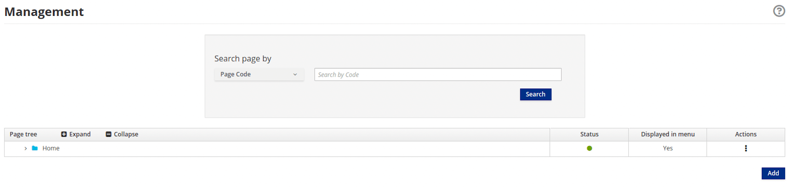
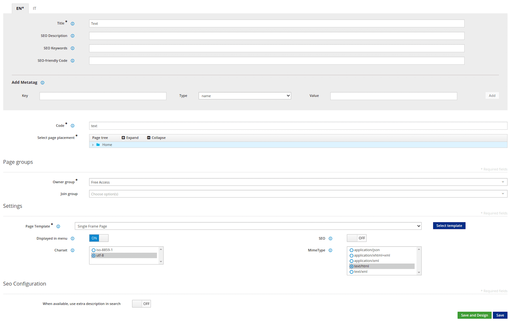
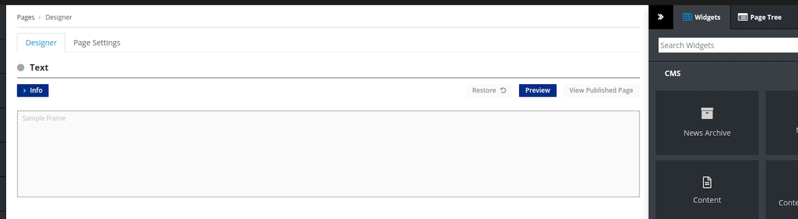
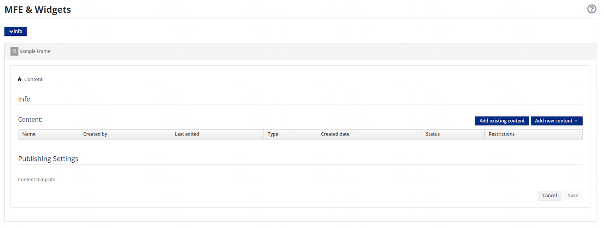
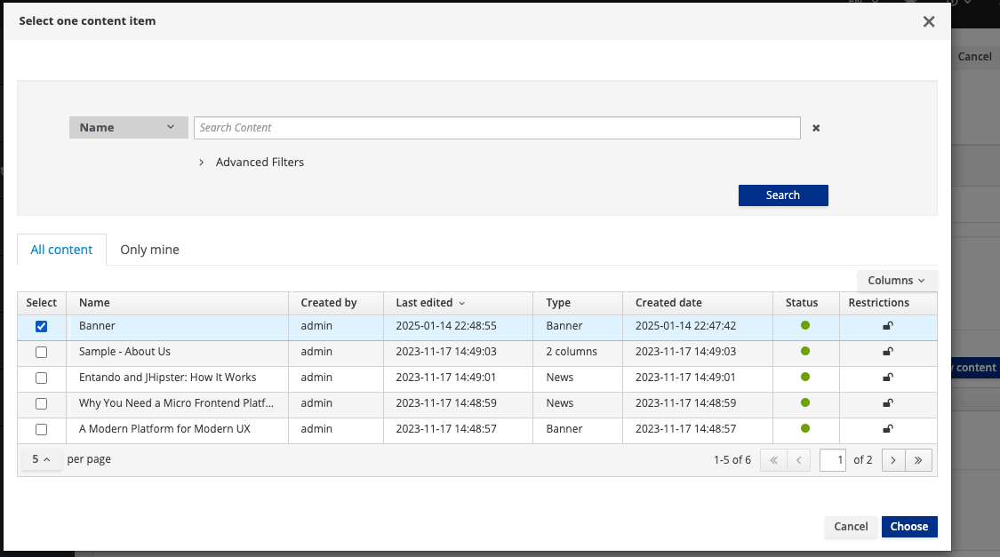
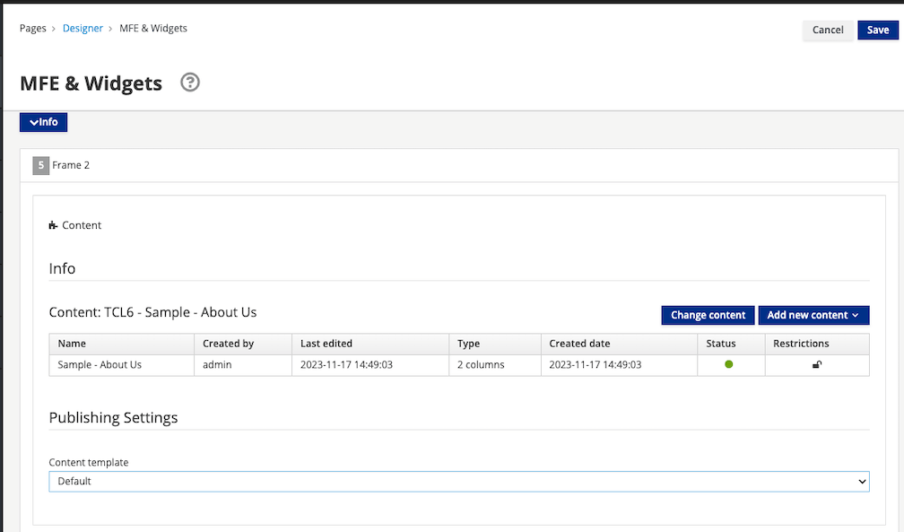
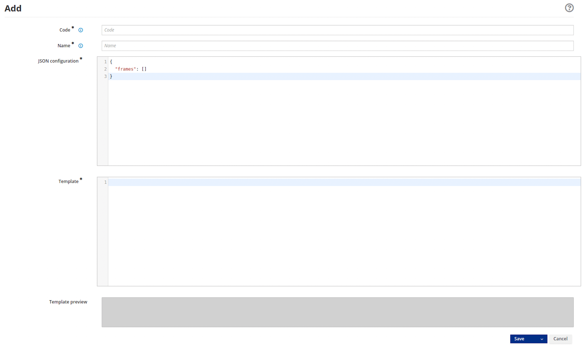

# Page Management

The [Entando App Builder](../../docs/compose/app-builder.md) provides the Content Management System (CMS) to design and publish application pages. Page Templates are used to define the layout using frames on a page where content and other frontend components are placed. Details of this process are examined below. 

Additionally, the App Builder offers a distributed editorial management system through roles and groups. When a user is created, they are assigned a role and added to groups to grant access to the content and pages of an application. For details on this topic, see the [Manage Roles, Users, and Groups tutorial](./role-users-groups.md). 

## Create a Page

Follow the steps below to create a page with a content widget.

**1. Go to `Pages` → `Management` in the App Builder.**



**2. Click the `Add` button.**

This generates a form with the following required fields:
- `Title`: used for SEO
- `Code`: must be unique (maximum of 100 alphanumeric characters, upper- and lowercase, and the '_' and '-' characters)  
- `Select page placement`: the location of the page in the page tree
- `Owner group`: the group that should have access to edit and design the page
- `Page Template`: the structure and layout of the page



**3. Click `Save and Design`.**

This launches the Page Designer where you place frontend components into the Page Template frames. Note the widgets are categorized by type, including CMS, Navigation, and User which are created by you.  



**4. Add a widget.**

Drag a widget from the right panel into the desired frame. Adding the Content widget loads the configuration page shown here. 



**5. Click `Add existing content`.**

This opens the content selection pop-up window.



Search for content by name, use the Advanced filters, or browse the table to find what you need. Remember that content must be saved and approved before it can be published to a page.

**6. Select the desired content item(s) from the list.** 

**7. Click `Choose`.**

The selected `Content` item is displayed here.



**8. Click `Save` at the top of the page.**

The following actions are now available:

-   `Preview` to show the page with the updates
-   `Publish` 
-   `View published page` to view the page in your application.

## Page Templates

Page Templates provide the scaffolding of a page and are constructed using two main elements:

- A `JSON configuration` field which lists the set of frames that can be used on a page 
- A `Template` field which uses FreeMarker code to setup the HTML page

### JSON Configuration

Each item in the `frames` array of the JSON configuration represents a frame or slot in the page, characterized by the following values:
- `pos`: A zero-based position index (starting from zero). This value is used by APIs to address a specific widget on the page.
- `descr`: The frame description displayed in the Page Designer view.
- `mainFrame`: This designates the primary frame in the Page Template.
- `defaultWidget`: The code for a default widget to use in this frame. Page Template developers can use this field to provide suggestions for common widgets, e.g. header and footer widgets.
- `sketch`: An object with 4 coordinates (x1,x2,y1,y2) to allow the developer to place the widgets in the Page preview. The x and y values go from 0 to 11 (similar to columns in Bootstrap), so if you want to place a 2x2 frame at the top left corner of the page, the values would be `x1: 0`, `x2: 1`, `y1: 0` and `y2: 1`.

### Template

To add a frame in a specific position on the page, input `<@wp.show frame=0 />`, where `frame` is the `pos` variable from the `JSON configuration`. To setup the `wp` variable, `<#assign wp=JspTaglibs["/aps-core"]>` is required at the top of the template.

Common code can be shared across multiple pages by using [UX Fragments](./widgets-fragments.md#create-and-update-a-ux-fragment) and ```<@wp.fragment code="\<FRAGMENT\_CODE\>" escapeXml=false /\>```.


### Create a Page Template

Follow the steps below to prepare a Page Template with two frames.

**1. Go to `Pages` → `Templates` → `Add`**



**2. Enter the field values as shown below:**

- `Code`: double_frame (allows max of 40 uppercase or lowercase letters, numbers and special characters)
- `Name`: Double Frame (allows max of 50 uppercase or lowercase letters, numbers and special characters)
- `JSON Configuration`:

``` json
{
  "frames": [
    {
      "pos": 0,
      "descr": "Frame 1",
      "mainFrame": false,
      "defaultWidget": null,
      "sketch": {"x1": 0, "y1": 0, "x2": 11, "y2": 1}
    },
    {
      "pos": 1,
      "descr": "Frame 2",
      "mainFrame": false,
      "defaultWidget": null,
      "sketch": {"x1": 0, "y1": 2, "x2": 11, "y2": 3}
    }
  ]
}
```

- `Template`:

``` ftl
<#assign wp=JspTaglibs["/aps-core"]>
<!DOCTYPE HTML PUBLIC "-//W3C//DTD HTML 4.0 Transitional//EN">
<html>
  <head>
      <title><@wp.currentPage param="title" /></title>
      <@wp.fragment code="keycloak_auth" escapeXml=false />
  </head>
  <body>
    <h1><@wp.currentPage param="title" /></h1>
    <div><@wp.show frame=0 /></div>
    <div><@wp.show frame=1 /></div>
  </body>
</html>
```
The fragment in the `head` section `<@wp.fragment code="keycloak_auth" escapeXml=false />` makes use of the user's Keycloak identity information.


**3. Verify that the `Template preview` reflects the two frame layout.**

**4. Click the `Save` button.**  
This Template is now available to use in your application.