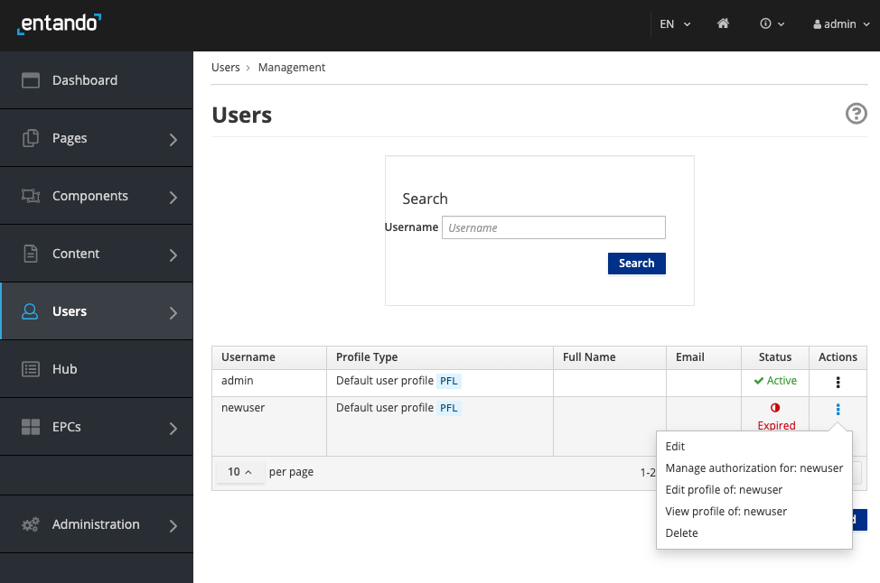

# Manage Roles, Users and Groups  

## Role-based Page Management
The Entando App Builder provides a page management system with distributed editorial controls. With editing privileges based on roles and groups, a user only sees the application pages they're given access to when they log in. Users and groups are assigned different levels of control and access to manage only those pages with the proper group ownership.

This tutorial demonstrates how to grant a user editorial access to a particular page in an application.

To add controls to micro frontends and/or microservices and additional details, see the [Role Based Access Controls for Micro Frontends & Microservices](../create/ms/add-access-controls.md) tutorial.

### 1. Create Role
This role will have access to edit, delete, and create pages. Users are assigned roles and added to groups who own the pages of an application. 
1. Log in to your Entando App Builder.
2. Go to `Users`→ `Roles` in the left navigation menu.
3. Click `Add` to create a new role.
4. Enter a name and code. 
5. Turn `ON` the following selections under `Permissions`: `Content Editing`, `Access to Administration Area` and `Operations on Pages`. Click `Save`. 

### 2. Create Group
1. Go to `Users`→ `Group` from the left navigation menu.
2. Click `Add` to create a new group that will manage a subsection of the application.
3. Enter a name and code. Click `Save`

### 3. Add New User
1. Go to `Users`→ `Management` in the left navigation menu.
2. Click `Add` to create a new user.
3. Enter a `Username` and `Password`. Select the default `Profile Type` and `Status`: `ON`. 
Click `Save`. The user account will appear with `Status`: `Expired Password` until the first time they login and reset their password. To change this status or add an email, go to `Edit` in the `Actions` column.

4. For the new user, select `Manage Authorization for: USERNAME` under the `Actions` column.
5. Select `Add new Authorization` and choose the `User Group` and `User Role` created above. Click `Add`.
6. Click `Save`. 

### 4. Create New Page and Assign Owner Group
1. Go to `Pages`→ `Management` in the left navigation menu.
2. Click `Add` to create a new page. 
3. Add `Title`, `Description`, `Keywords` and a `SEO-friendly Code` for the new page. Fill in the remaining fields as appropriate.
4. For `Owner group`, under the `Page groups` heading, choose the newly created group who should have editing privileges to this page. If `Free` is chosen, all users will have access to this page. 
5. Click `Save`.

When the new user logs in, they will have access only to the pages for which they are part of the authorized Owner Group.

#### Existing Page Assignment
If you need to assign editorial access to existing pages, add the user to the current Owner Group for the page in the `User Management` section. If a new group was added, go to `Pages` → `Management` from the left navigation menu, and select `Edit` under the `Actions` drop-down menu to reassign `Owner group` for each page.

