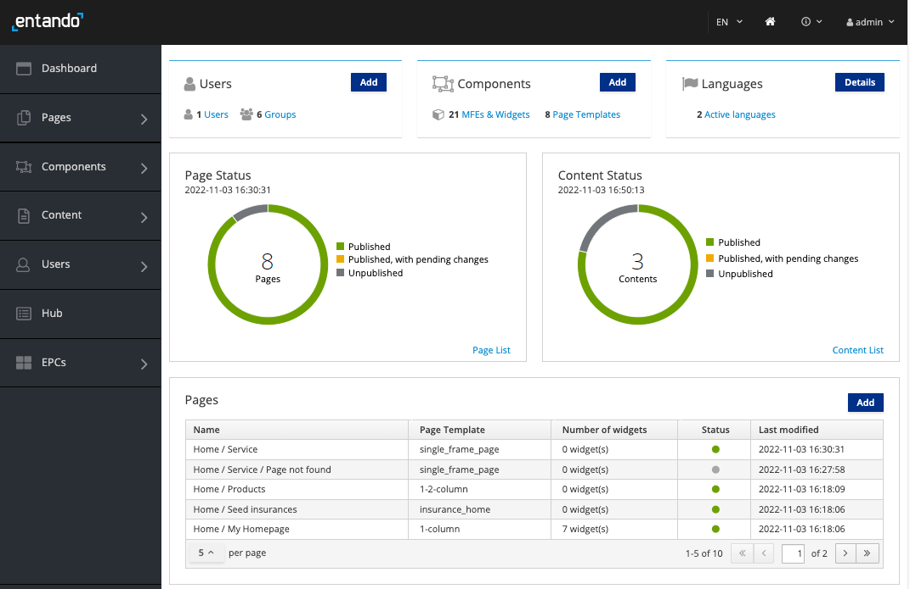

# Install Entando on Macs with M1/M2 Processors

This tutorial guides you through the steps required to install Entando on a Mac M1/M2 ARM64 system using the QEMU emulator as the backend driver.

## Step 1. Setup Minikube
1. Install the QEMU emulator to create the virtual model:
``` sh
brew install qemu
```
2. Setup the `socket_vmnet` service:
``` sh
brew install socket_vmnet
brew tap homebrew/services
HOMEBREW=$(which brew) && sudo ${HOMEBREW} services start socket_vmnet
```

3. Install Minikube:
``` sh
brew install minikube
```

## Step 2. Start Minikube

1. Start Minikube with the QEMU driver, socket_vmnet, and the K8s profile:

``` sh
minikube start --cpus=4 --memory=8G --profile=k8s-126 --driver=qemu --network=socket_vmnet --addons=ingress,default-storageclass,storage-provisioner --kubernetes-version=v1.26.9
```

> Using a profile is an easy way to switch between different versions of Kubernetes or different Entando projects. 

Once completed, `minikube profile list` should return a table similar to this:
``` sh
$ minikube profile list
|----------------|-----------|---------|--------------|------|---------|---------|-------|--------|
|    Profile     | VM Driver | Runtime |      IP      | Port | Version | Status  | Nodes | Active |
|----------------|-----------|---------|--------------|------|---------|---------|-------|--------|
| blockchain     | docker    | docker  | 192.168.67.2 | 8443 | v1.26.9 | Unknown |     1 | *      |
| k8s-126        | docker    | docker  | 192.168.49.2 | 8443 | v1.26.9 | Unknown |     1 |        |
| metacontroller | docker    | docker  | 192.168.58.2 | 8443 | v1.26.9 | Unknown |     1 |        |
|----------------|-----------|---------|--------------|------|---------|---------|-------|--------|
```
2. Set the current profile to `k8s-126`:
``` sh
$ minikube profile k8s-126                                                                                               
✅  minikube profile was successfully set to k8s-126
```
Confirm that `k8s-126` is activated by using the command `minikube profile list`.

> You must activate the profile, even if it is the only one listed. Otherwise, you will not be able to connect to the cluster. 

## Step 3. Install Entando
1. Install the custom resource definitions (CRDs) for Entando: 
``` sh
kubectl apply -f https://raw.githubusercontent.com/entando/entando-releases/v7.3.0/dist/ge-1-1-6/namespace-scoped-deployment/cluster-resources.yaml
```

2. Create the `entando` namespace or choose another for your target namespace:
``` sh
kubectl create ns YOUR-NAMESPACE
```
3. Download the Entando Operator `ConfigMap`:
``` sh
curl -LJO https://raw.githubusercontent.com/entando/entando-releases/v7.3.0/dist/ge-1-1-6/samples/entando-operator-config.yaml
```

4. Add two properties to the `entando-operator-config.yaml` file:
``` sh
echo -e '  entando.requires.filesystem.group.override: "true"' >> entando-operator-config.yaml 
echo -e '  entando.ingress.class: "nginx"' >> entando-operator-config.yaml
```
5. Apply the Entando Operator ConfigMap to your namespace:
``` sh
kubectl -n YOUR-NAMESPACE apply -f entando-operator-config.yaml
```
6. Install the namespace-scoped custom resources:
``` sh
kubectl -n YOUR-NAMESPACE apply -f https://raw.githubusercontent.com/entando/entando-releases/v7.3.0/dist/ge-1-1-6/namespace-scoped-deployment/namespace-resources.yaml
```

7. Generate the EntandoApp configuration file, using your namespace:
``` sh 
export ns=YOUR-NAMESPACE 
export minikube_ip=$(minikube ip)
export ingress_hostname="$ns.$minikube_ip.nip.io"
```

8. Generate the base EntandoApp manifest:
``` sh
cat >entando-"${ns}"-app.yaml <<endfile
apiVersion: entando.org/v1
kind: EntandoApp
metadata:
namespace: ${ns}
name: ${ns}
spec:
dbms: postgresql
ingressHostName: ${ingress_hostname}
standardServerImage: tomcat
environmentVariables:{}
replicas: 1
endfile
```
9. Deploy Entando by applying the manifest:
``` sh
kubectl apply -f entando-YOUR-NAMESPACE-app.yaml
```


Use the `get pods --watch` command to observe Entando starting up:

```sh
kubectl get pods -n YOUR-NAMESPACE --watch
```
Press `Ctrl-C` to exit the `watch` command once everything is up and running.

<details><summary>What does a successful startup look like?</summary>

- The `entando-operator` and `entando-k8s-service` start when you apply the namespace resources above, so they should already be in the `Running` status by the time you reach this point
- When you apply the `entando-app.yaml`, the `quickstart-deployer` starts and kicks off a series of deployments, beginning with the Keycloak deployment via the `default-sso-in-namespace-deployer`

**Jobs / Deployments**
- Some Pods, like `quickstart-deployer`, run to completion and then shutdown; they should eventually show `READY`: `0/1` and `STATUS`: `Completed`
- Other deployments, like `quickstart-ab-deployment` or `quickstart-deployment`, should eventually show `READY`: `1/1` and `STATUS`: `Running`

**Lifecycle Events**
- Each line represents an event: `Pending`, `ContainerCreating`, `Running` or `Completed`
- Restarts should ideally be `0`; otherwise, there may be a resource problem (slow network, not enough CPU or memory, etc.) with your cluster, and Kubernetes is trying to self-heal
- This is a partial history for a typical install.
``` shell-session
NAME                                                  READY   STATUS              RESTARTS  AGE    
entando-operator-5b5465788b-s6wjh                    1/1     Running             0          99m
entando-k8s-service-86f8954d56-lp5nl                 1/1     Running             0          99m
quickstart-deployer-7217                             0/1     ContainerCreating   0          7s
quickstart-deployer-7217                             1/1     Running             0          14s
default-sso-in-namespace-deployer-2045               0/1     Pending             0          0s
default-sso-in-namespace-deployer-2045               0/1     Pending             0          0s
default-sso-in-namespace-deployer-2045               0/1     ContainerCreating   0          0s
default-sso-in-namespace-deployer-2045               1/1     Running             0          4s
default-sso-in-namespace-deployment-7ddc5d44f-bsq7w  0/1     Pending             0          0s
default-sso-in-namespace-deployment-7ddc5d44f-bsq7w  0/1     Pending             0          5s
default-sso-in-namespace-deployment-7ddc5d44f-bsq7w  0/1     ContainerCreating   0          5s
default-sso-in-namespace-deployment-7ddc5d44f-bsq7w  0/1     Running             0          88s
default-sso-in-namespace-deployment-7ddc5d44f-bsq7w  0/1     Running             0          114s
default-sso-in-namespace-deployment-7ddc5d44f-bsq7w  1/1     Running             0          115s
default-sso-in-namespace-deployer-2045               0/1     Completed           0          2m6s
default-sso-in-namespace-deployer-2045               0/1     Terminating         0          2m6s
default-sso-in-namespace-deployer-2045               0/1     Terminating         0          2m6s
quickstart-ab-deployment-5b5c7c4f5c-w774v            0/1     Pending             0          0s
quickstart-ab-deployment-5b5c7c4f5c-w774v            0/1     Pending             0          0s
quickstart-ab-deployment-5b5c7c4f5c-w774v            0/1     ContainerCreating   0          0s
quickstart-deployment-667859b44d-nnk79               0/1     Pending             0          0s
quickstart-cm-deployment-69bb5f9fd8-ll8dk            0/1     Pending             0          0s
quickstart-deployment-667859b44d-nnk79               0/1     Pending             0          2s
quickstart-deployment-667859b44d-nnk79               0/1     ContainerCreating   0          2s
quickstart-cm-deployment-69bb5f9fd8-ll8dk            0/1     Pending             0          2s
quickstart-cm-deployment-69bb5f9fd8-ll8dk            0/1     ContainerCreating   0          3s
quickstart-cm-deployment-69bb5f9fd8-ll8dk            0/1     Running             0          88s
quickstart-ab-deployment-5b5c7c4f5c-w774v            0/1     Running             0          102s
quickstart-ab-deployment-5b5c7c4f5c-w774v            0/1     Running             0          2m
quickstart-cm-deployment-69bb5f9fd8-ll8dk            0/1     Running             0          2m3s
quickstart-ab-deployment-5b5c7c4f5c-w774v            1/1     Running             0          2m10s
quickstart-cm-deployment-69bb5f9fd8-ll8dk            1/1     Running             0          2m12s
quickstart-deployment-667859b44d-nnk79               0/1     Running             0          3m29s
quickstart-deployment-667859b44d-nnk79               0/1     Running             0          4m50s
quickstart-deployment-667859b44d-nnk79               1/1     Running             0          4m52s
quickstart-deployer-7217                             0/1     Completed           0          7m17s
quickstart-deployer-7217                             0/1     Terminating         0          7m17s
quickstart-deployer-7217                             0/1     Terminating         0          7m17s
pn-3c07adf0-fac54a9f-entando-app-builder-menu-bff-deployer-6999   0/1     Pending             0          0s
pn-3c07adf0-fac54a9f-entando-app-builder-menu-bff-deployer-6999   0/1     Pending             0          0s
pn-3c07adf0-fac54a9f-entando-app-builder-menu-bff-deployer-6999   0/1     ContainerCreating   0          0s
quickstart-pn-3c07adf0-fac54a9f-entando-app-builder-menu-b-link-deployer-2017   0/1     Pending             0          0s
quickstart-pn-3c07adf0-fac54a9f-entando-app-builder-menu-b-link-deployer-2017   0/1     Pending             0          0s
quickstart-pn-3c07adf0-fac54a9f-entando-app-builder-menu-b-link-deployer-2017   0/1     ContainerCreating   0          0s
pn-3c07adf0-fac54a9f-entando-app-builder-menu-bff-deployer-6999                 1/1     Running             0          12s
pn-3c07adf0-fac54a9f-entando-app-builder-menu-bff-deploymep6j87                 0/1     Pending             0          0s
quickstart-pn-3c07adf0-fac54a9f-entando-app-builder-menu-b-link-deployer-2017   1/1     Running             0          16s
pn-3c07adf0-fac54a9f-entando-app-builder-menu-bff-deploymep6j87                 0/1     Pending             0          5s
pn-3c07adf0-fac54a9f-entando-app-builder-menu-bff-deploymep6j87                 0/1     ContainerCreating   0          5s
pn-3c07adf0-fac54a9f-entando-app-builder-menu-bff-deploymep6j87                 0/1     Running             0          40s
pn-3c07adf0-fac54a9f-entando-app-builder-menu-bff-deploymep6j87                 0/1     Running             0          53s
pn-3c07adf0-fac54a9f-entando-app-builder-menu-bff-deploymep6j87                 1/1     Running             0          54s
pn-3c07adf0-fac54a9f-entando-app-builder-menu-bff-deployer-6999                 0/1     Completed           0          69s
quickstart-pn-3c07adf0-fac54a9f-entando-app-builder-menu-b-link-deployer-2017   0/1     Completed           0          70s
pn-3c07adf0-fac54a9f-entando-app-builder-menu-bff-deployer-6999                 0/1     Completed           0          71s
pn-3c07adf0-fac54a9f-entando-app-builder-menu-bff-deployer-6999                 0/1     Terminating         0          71s
pn-3c07adf0-fac54a9f-entando-app-builder-menu-bff-deployer-6999                 0/1     Terminating         0          71s
quickstart-pn-3c07adf0-fac54a9f-entando-app-builder-menu-b-link-deployer-2017   0/1     Completed           0          72s
quickstart-pn-3c07adf0-fac54a9f-entando-app-builder-menu-b-link-deployer-2017   0/1     Terminating         0          72s
quickstart-pn-3c07adf0-fac54a9f-entando-app-builder-menu-b-link-deployer-2017   0/1     Terminating         0          72s

```

</details>

---

<details><summary>What Pods come out of the box?</summary>

``` bash
kubectl get pods -n YOUR-NAMESPACE
```

``` shell-session
NAME                                                  READY   STATUS    RESTARTS   AGE
entando-operator-cf499c46c-r2bhn                                  1/1     Running   0          13m
entando-k8s-service-6c94495c87-j9p7b                              1/1     Running   0          13m
default-postgresql-dbms-in-namespace-deployment-ddf96f9c6-k46w4   1/1     Running   0          13m
default-sso-in-namespace-deployment-59d6cd795b-pgvth              1/1     Running   0          13m
quickstart-ab-deployment-7cd5c9987b-v96sv                         1/1     Running   0          13m
quickstart-cm-deployment-5896d4f8c5-sl8pg                         1/1     Running   0          13m
quickstart-deployment-57864cdfdf-n699w                            1/1     Running   0          13m
pn-3c07adf0-fac54a9f-entando-app-builder-menu-bff-deploymep6j87   1/1     Running   0          13m
```

</details>

---

## Step 4. Log in to Entando

Now that you've installed Entando, log in to the Entando App Builder.

The URL of your running Entando instance is http://ingressHostName/app-builder/.


- Example URL

``` bash
quickstart.192.168.64.33.nip.io/app-builder/
```


- Username: `admin`
- Password: `adminadmin`

After logging in, change your password to activate your account.

>Note: If the login process hangs for more than 5 seconds, refresh the browser.



In the App Builder, applications are composed from various components, including micro frontends and CMS content.

::: tip Congratulations!
You now have Entando up and running in your local environment.
:::

## End the Minikube Session
To start, shutdown or delete the Minikube environment: 

* Shutdown the local K8s cluster for later use: `minikube stop`
* Delete the local cluster (can be restarted to a blank state): `minikube delete`
* To restart the cluster with the latest used profile: `minikube start`

## Next Steps

* **Try a Tutorial:** Take advantage of the [Learning Paths](../../tutorials/), which organize a few of the most popular tutorials by user type.

* **Dig Deeper into Entando Concepts:** Review the [Docs](../) sections to understand the Entando building blocks.

* **Learn about the Quickstart Environment:** See the [Quickstart Tips](../../docs/reference/local-tips-and-tricks.md) for more information on how to manage your Getting Started or quickstart environment.