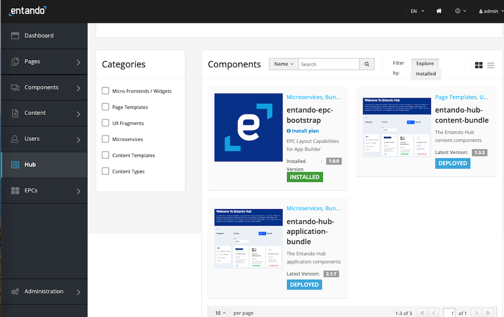
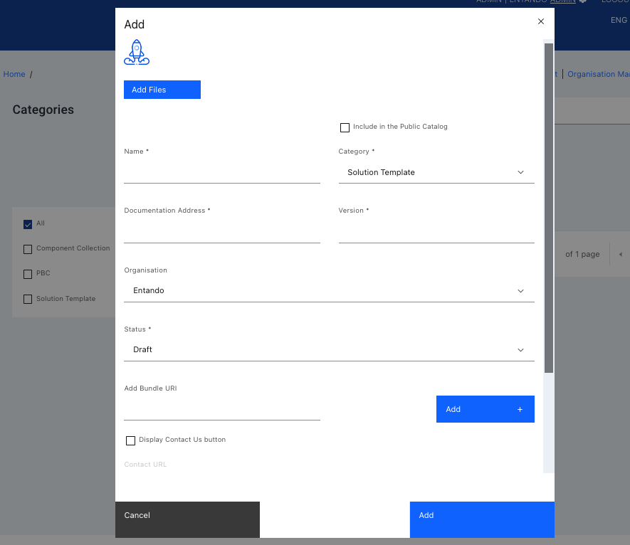

# Entando Hub Installation and User Guide

An Entando Hub enables teams to share components across their organization and between Entando Applications. It can be installed in any Entando 7+ instance and includes API-level integration with the App Builder.

This tutorial describes the steps to install and utilize an enterprise Entando Hub:

1. [Installation](#installation)
2. [Configuration](#configuration)
3. [Using an Enterprise Hub](#using-an-enterprise-hub)
4. [Resources](#resources)

For details on Hub features, definitions, user roles, component status and versioning process, see the [Entando Hub information page](../../docs/curate/hub-details.md). 

## Installation

An enterprise Entando Hub is installed with two Entando Bundles. One bundle contains the micro frontends and microservices, which needs to be installed first, while the second sets up the initial content and pages for the Hub UI.

### Prerequisites

- An Entando Application on any Kubernetes provider. Follow the [tutorials](../#operations) appropriate to your environment to install the Entando Platform.
- The [ent command line tool](../../docs/getting-started/entando-cli.md), installed and connected to your Kubernetes instance.

### Install the Hub from the Entando Cloud Hub 
Add the Entando Cloud Hub as a registry, directly accessible at any time from your App Builder:
1. Log in to your App Builder
2. Go to `Hub` → `Select Registry`  
3. Choose `New Registry`
4. In the pop-up window, enter `Entando Cloud Hub` and `https://auth.entando.com/entando-hub-api/appbuilder/api` for the URL. Click `Save` 
5. Select the Cloud Hub in the Registry and find the Entando Hub bundles 
6. Deploy and install `entando-hub-application` bundle by clicking `UNDEPLOYED` and then following the instructions in the pop-up window. Note that you can choose the version by clicking the down arrow in the install button. The `application` bundle must be installed first because it provides the `entando-hub-content` with the necessary frontend components.
7. Repeat the steps for `entando-hub-content` bundle. These bundles will now appear in your Local Hub. Continue with the [Configuration steps](#configuration) below.

### Manual Installation Steps

1. Apply the custom resource definitions for the Hub component bundles:

```
ent bundle generate-cr -t prod --image=docker://registry.hub.docker.com/entando/entando-hub-application | kubectl apply -f -
```
```
ent bundle generate-cr -t prod --image=docker://registry.hub.docker.com/entando/entando-hub-content | kubectl apply -f -
```

2. Log into your App Builder instance.

3. Select `Hub` from the menu on the left. The Hub bundles will be visible in the Local Hub as shown:



4. Click each bundle icon and `Install` the bundle, where order of installation is important. The `entando-hub-application` bundle must be installed first because it provides the `entando-hub-content` bundle with MFEs. It may take several minutes to download the Docker images for the microservices and install the related assets. 
>For multi-bundle components or PBCs, you need to follow the same order of installation for upgrades. For uninstalling the group, follow the reverse order of installation.

## Configuration
1. Set up permissions to configure the service for the Hub administrator:
   - [Log in to your Keycloak instance](../../docs/consume/identity-management.md#logging-into-your-keycloak-instance) as an admin.
   - Give at least one user the ability to manage the Hub by adding the `eh-admin` role. Assign the `eh-admin` role for the `pn-152edaba-0a2ba8fb-entando-entando-hub-catalog-ms-server` client. See [Role Assignment in ID Management](../../docs/consume/identity-management.md#authorization) for more details.
   - Give the generated plugin client permission to manage users. 
       1. From the left sidebar, go to `Clients` and select client ID `pn-152edaba-0a2ba8fb-entando-entando-hub-catalog-ms-server`. 
       2. Click the `Service Account Roles` tab at the top of the page and select `realm-management` from the `Client Roles` field. 
       3. Choose `realm-admin` from `Available Roles` and click `Add selected`. It should now appear as an `Assigned Role`.
    
2. Access your enterprise Hub from the App Builder by navigating to `Pages → Management`. Find `Entando Hub` in the page tree, and click `View Published Page` from its Actions.

## Using an Enterprise Hub
### The Hub UI
The enterprise Entando Hub UI is where users, entries, and catalogs are managed. Private and public catalogs can also be configured here. 
* Administrators can create and manage users, categories, and organizations. 
* Authors and managers have varying [levels of access](../../docs/curate/hub-details.md#roles) to create and manage entries, called Bundle Groups.
* Each catalog can be [connected directly to an App Builder](#add-a-catalog-registry) instance for easy access.


### User Management
Only a Hub administrator has the authorization to create and manage users. 
1. Log into your Keycloak admin console 
2. Go to the `Users` section from the left navigation bar and add a new user. Enter the relevant identity information. 
3. Once saved, go to the `Role Mapping` tab and assign the correct role under `Client Roles` `pn-152edaba-0a2ba8fb-entando-entando-hub-catalog-ms-server`  
   * for an author, assign `eh-author`
   * for a manager, assign `eh-manager`  
   [See role definitions](../../docs/curate/hub-details.md#roles)
4. Log in to the Hub UI as an admin 
5. Go to `User Management` and click `Add User`
6. Choose the desired user and select an organization from the drop-down list. If the organization is not available, go to Organization Management to add it. **Note:** the admin user needs to belong to an organization as well, especially for private catalogs that require an API key. 


### Create New Entries/Bundle Groups
Click the `Add +` button at the top of the Hub UI home page to create a new [Bundle Group](../../docs/curate/hub-details.md#bundle-group-definitions). In the pop-up window, enter the details for the entry.



1. Upload a file for the thumbnail of the Bundle Group. 
2. Fill in the documentation address, version and organization as needed. 
3. Add one or more bundle URIs using the `Add +` button next to the field. For multi-bundle entries, it is recommended that the URIs be entered in the order they should be installed so they will be listed in that order in the Hub. 
>Should a multi-bundle entry need to be uninstalled, bundles will need to be removed in the reverse order so dependencies can be cleared without issue.
4. Check the `Display Contact Us button` box and enter the `Contact URL` to gather more information from the viewer/visitor and manage access to the entry. Typically, the contact URL points to a web form on the owner's web site with a request for access.

Find more information on [Bundle Group publishing status](../../docs/curate/hub-details.md#bundle-group-status) and [versioning rules](../../docs/curate/hub-details.md#bundle-group-versions).

### Create a Private Catalog
A private catalog can be configured in the Hub UI when creating a new organization. There can be many organizations in a single Hub instance, but each organization is allowed one private catalog. Only the Hub admin can create an organization, and provision a private catalog for it. 
1. Go to `Organization Management` from the top menu.
2. Click `Add Organization +`, enter the relevant information in the pop-up window, and click `Save`.
3. The new organization will appear in the current list. Click on the kebab menu on the right and select `Create Private Catalog`. 
A key icon will appear next to the private catalog. To go directly to this catalog, use the link under the same kebab menu. 

### Generate an API Key
API access to private catalogs requires the use of an API key instead of user credentials. When connecting a registry from the App Builder, the API key is required to configure a private catalog.
1. API Keys are attached to a specific user account so log in as a user assigned to the organization of the private catalog.
2. From the Hub UI homepage, click on the gear icon right of the `Add +` button, and select `API Key Management`.
3. Click `Generate API Key`, enter a name, and confirm with the blue generate button. Save the key for future reference.

The API key is required to access the bundles and PBCs in a private Entando Hub catalog. Bundles can be initialized directly from there using the [ent bundle init command](../../docs/getting-started/ent-bundle.md#initialization) or by adding the registry in your App Builder and deploying it from that catalog as described below. 

### Add a Catalog Registry
Any enterprise Hub instance can be accessed from the Entando App Builder of any Entando Application. 

1. Go to the Hub from the left navigation bar in the App Builder and click `Select Registry` 
2. Choose `New Registry` from the drop-down menu
3. Enter the registry name and the API endpoint for the catalog:  
  * The API endpoint is `https://YOUR-BASEURL/entando-hub-application-152edaba/entando-hub-catalog-ms/appbuilder/api` where `YOUR-BASEURL` is the hostname of your Entando Application      
      
  * **Private Catalog**  
     For a private catalog, the URL has an added catalog ID number from the catalog's HTTP address. Go to the published catalog page from the App Builder and find the address in the browser. The number after `/catalog/` is YOUR-CATALOG-ID#.  
      * The endpoint to access the catalog is `https://YOUR-BASEURL/entando-hub-application-152edaba/entando-hub-catalog-ms/appbuilder/api/?catalogId=YOUR-CATALOG-ID#`  
       
     **E.g.**,  The catalog address: `https://quickstart.k8s-entando.org/entando-de-app/en/entando_hub.page#/catalog/1/` → `1` is YOUR-CATALOG-ID#    
       
     The URL to enter: `https://quickstart.k8s-entando.org/entando-hub-application-152edaba/entando-hub-catalog-ms/appbuilder/api?catalogId=1` 

4. If an API key is required, ask your Hub administrator or [generate a key](#generate-an-api-key) if you have a Hub user account.  

## Resources

* [Enterprise Entando Hub Features and Definitions](../../docs/curate/hub-details.md)
* Source Code  
Entando open source examples and tutorials are available on GitHub. Reference the Hub sample project for instructions to build the project from source code:   
<https://github.com/entando-samples/entando-hub>