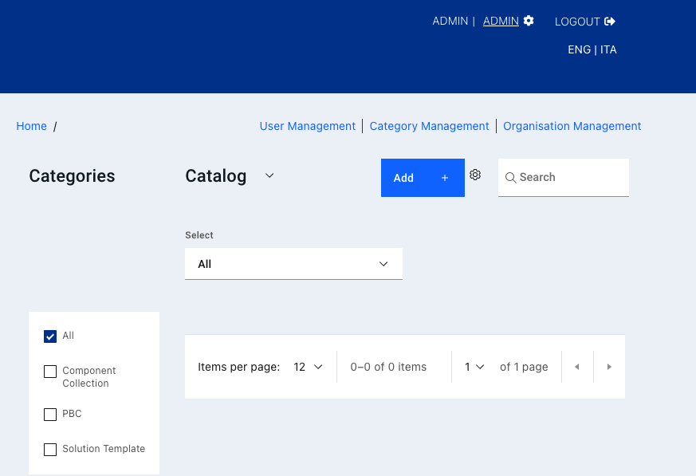

# Entando Hub Installation and User Guide

An Entando Hub enables teams to share components across their organization to build composable applications with ease and speed. This catalog management software bundle can be installed in any Entando 7+ instance and includes API-level integration with the App Builder.

The Entando Platform comes built in with a local Hub for independent development, but additional registries can be connected, including an enterprise Hub where you can share and collaborate on modular components, through a private or public catalog. This tutorial describes the steps to install and access the enterprise version of the Entando Hub.


1. [Installation](#installation)
2. [Configuration](#configuration)
3. [Using an Enterprise Hub](#using-the-enterprise-hub)
4. [Resources](#resources)

For details on Hub features, definitions, and other details, see the [Entando Hub information page](../../docs/curate/hub-details.md). 

## Installation

An enterprise Entando Hub is installed with two Entando Bundles. One bundle contains the micro frontends and microservices, and should be installed first, while the second sets up the UI content and pages.

### Prerequisites

- An Entando Application on any Kubernetes provider. Follow the [tutorial](../#operations) appropriate for your environment to install the Platform.
- The [ent command line tool](../../docs/getting-started/entando-cli.md), installed and connected to your Kubernetes instance.

### Install the Hub from the Entando Cloud Hub 
Connect the Entando Cloud Hub to your Local Hub so you can access the Hub bundles directly from your App Builder:
1. Log in to your App Builder
2. Go to `Hub` from the sidebar and click `Select Registry`  
3. Choose `New Registry`
4. In the pop-up window, enter the following:
  ``` bash
  Name: Entando Cloud Hub
  URL: https://auth.entando.com/entando-hub-api/appbuilder/api
  ``` 
The API Key is required only for private enterprise Hubs. Click `Save. 

5. Select the Cloud Hub in the Registry drop-down and find the Entando Hub bundles 
6. Deploy and install `entando-hub-application` bundle by clicking it and following the instructions in the pop-up window. Note that you can choose the version by clicking the down arrow in the install button. The `application` bundle must be installed first because it sets up the necessary frontend components for the `entando-hub-content` bundle.
7. Repeat the steps for `entando-hub-content`. They should now appear in your Local Hub. Continue with the [Configuration steps](#configuration) below.

### Manual Installation Steps

1. Apply the custom resource definitions in this order to deploy the Hub bundles:

```
ent bundle generate-cr -t prod --image=docker://registry.hub.docker.com/entando/entando-hub-application | kubectl apply -f -
```
```
ent bundle generate-cr -t prod --image=docker://registry.hub.docker.com/entando/entando-hub-content | kubectl apply -f -
```

2. Log into your App Builder instance.

3. Select `Hub` from the left menu. The Hub bundles are listed as Deployed in the local Hub catalog:


4. Click each bundle icon and `Install` the bundle, starting with the `entando-hub-application`. Again the order of installation is crucial. It may take several minutes to download the Docker images for the microservices and install the related assets. 
>For multi-bundle components or PBCs, you need to follow the same order of installation for upgrades. For uninstalling the group bundles, follow the reverse order of installation.

## Configuration
1. Set up permissions to configure the service for the Hub administrator:
   - [Log in to your Keycloak instance](../../docs/consume/identity-management.md#logging-into-your-keycloak-instance) as an admin.
   - Give at least one user the ability to manage the Hub by adding the `eh-admin` role. Assign the `eh-admin` role for the `pn-152edaba-0a2ba8fb-entando-entando-hub-catalog-ms-server` client. See [Role Assignment in ID Management](../../docs/consume/identity-management.md#authorization) for more details.
   - Give the generated plugin client permission to manage users. 
       1. From the left sidebar, go to `Clients` and select client ID `pn-152edaba-0a2ba8fb-entando-entando-hub-catalog-ms-server`. 
       2. Click the `Service Account Roles` tab at the top of the page and select `realm-management` from the `Client Roles` field. 
       3. Choose `realm-admin` from `Available Roles` and click `Add selected`. It should now appear as an `Assigned Role`.
    
2. To access your enterprise Hub: 
   - Navigate to `Pages` → `Management` in the App Builder
   - Find `Entando Hub` in the page tree, and click `View Published Page` from its `Actions` drop-down options

## Using the Enterprise Hub
### The Hub UI
The enterprise Entando Hub provides a UI where users, entries, and catalogs are managed. Private and public catalogs are also configured there. 
* Administrators create and manage users, categories, and organizations. 
* Authors and managers create and manage the components organized there called Bundle Groups. They are assigned varying [levels of access](../../docs/curate/hub-details.md#roles) to perform their tasks.
* Public or private catalogs can be configured, both [directly accessible from the App Builder](#add-a-catalog-registry).



### Create Users
Only a Hub administrator has the authorization to create and manage users. 
1. Log in to your Keycloak admin console. 
2. To create a new user, go to `Users` from the left sidebar and click `Add User`. Enter the relevant identity information. `Save`
3. Go to the `Role Mapping` tab and assign these roles for `Client Roles` `pn-152edaba-0a2ba8fb-entando-entando-hub-catalog-ms-server`:
   * for an author, assign `eh-author`
   * for a manager, assign `eh-manager`  
   [See role definitions](../../docs/curate/hub-details.md#roles)
4. Log in to the Hub UI as an admin 
5. Go to `User Management` and click `Add User`
6. Choose the desired user and select an organization from the drop-down list. If the organization is not available, go to Organization Management to add it. **Note:** the administrator needs to belong to the same organization(s) as well, especially for private catalogs that require an API key. 

### Create New Entries/Bundle Groups
At the top of the Hub UI, click the `Add +` button to create a new [Bundle Group](../../docs/curate/hub-details.md#bundle-group-definitions). This is what a component entry is called on Entando. In the pop-up window, enter the details for the entry.


1. Upload a thumbnail to represent the Bundle Group. 
2. Enter the documentation address, version and organization name (e.g., a team or business unit) as required. 
3. Add one or more bundle URI(s) using the `Add +` button beside the field. For multi-bundle entries, it is recommended that the URIs be entered in the order they should be installed so they will be listed in that order in the Hub. 
>Should a multi-bundle entry need to be uninstalled, bundles will need to be removed in the reverse order so dependencies can be cleared without issue.
4. Check the `Display Contact Us button` and enter the `Contact URL` to gather more information from the visitor and manage access to the Bundle Group. Typically the contact URL points to a request form on the owner's web site.

Find more information on [Bundle Group publishing status](../../docs/curate/hub-details.md#bundle-group-status) and [versioning rules](../../docs/curate/hub-details.md#bundle-group-versions).

### Create a Private Catalog
A private catalog can be configured when creating a new organization. There can be many organizations in a single Hub instance, but each organization is allowed one private catalog. Only the Hub admin can create an organization and provision a private catalog for it. 
1. Go to `Organization Management` from the top menu.
2. Click `Add Organization +`, enter the required information in the pop-up window, and click `Save`.
3. The new organization will appear in the current list. Click the kebab menu to the right and select `Create Private Catalog`. 
A key icon appears next to the private catalog to confirm it. To go directly to this catalog, use the link in the same menu. 

### Generate an API Key
API access to private catalogs requires the use of an API key instead of user credentials. When configuring access to the private registry from the App Builder, the API key is required.

1. API Keys are attached to a specific user account so log in as a user assigned to the organization connected to the private catalog.
2. From the Hub UI homepage, click on the gear icon at the top and select `API Key Management`.
3. Click `Generate API Key`, enter a name and confirm with the blue generate button. Save the key for future reference.

The API key is required to share the bundles and PBCs in a private Entando Hub catalog. Bundles can be initialized directly from the catalog by using the [ent bundle init command](../../docs/getting-started/ent-bundle.md#initialization) or by adding the registry in your App Builder and deploying it from that catalog as described below. 

### Add a Catalog Registry
Any enterprise Hub instance can be accessed from the Entando App Builder, with the right credentials. 

1. In the App Builder, go to the Hub from the left navigation bar and click `Select Registry`
2. Choose `New Registry` from the drop-down menu
3. Enter the Hub name and the API endpoint for the catalog:  
  * The API endpoint is `https://YOUR-BASEURL/entando-hub-application-152edaba/entando-hub-catalog-ms/appbuilder/api` where `YOUR-BASEURL` is the hostname of your Entando instance.      
      
  * **Private Catalog**  
     For a private Hub, the URL has an added catalog ID number from its HTTP address. Go to the published Hub page from the App Builder and find the address in the browser. The number after `/catalog/` is `YOUR-CATALOG-ID#`.  
      * The URL to access the catalog is `https://YOUR-BASEURL/entando-hub-application-152edaba/entando-hub-catalog-ms/appbuilder/api/?catalogId=YOUR-CATALOG-ID#`  
       
     **E.g.**,  If your catalog web address is `https://quickstart.k8s-entando.org/entando-de-app/en/entando_hub.page#/catalog/1/` → `1` is YOUR-CATALOG-ID#    
       
     The URL to enter: `https://quickstart.k8s-entando.org/entando-hub-application-152edaba/entando-hub-catalog-ms/appbuilder/api/?catalogId=1` 

4. If an API key is required, ask your Hub administrator or [generate a key](#generate-an-api-key) if you have a Hub user account. 

## Resources

* [Enterprise Entando Hub Features and Definitions](../../docs/curate/hub-details.md)
* Source Code  
Entando open source examples and tutorials are available on GitHub. Reference the Hub sample project for instructions to build the project from source code:   
<https://github.com/entando-samples/entando-hub>