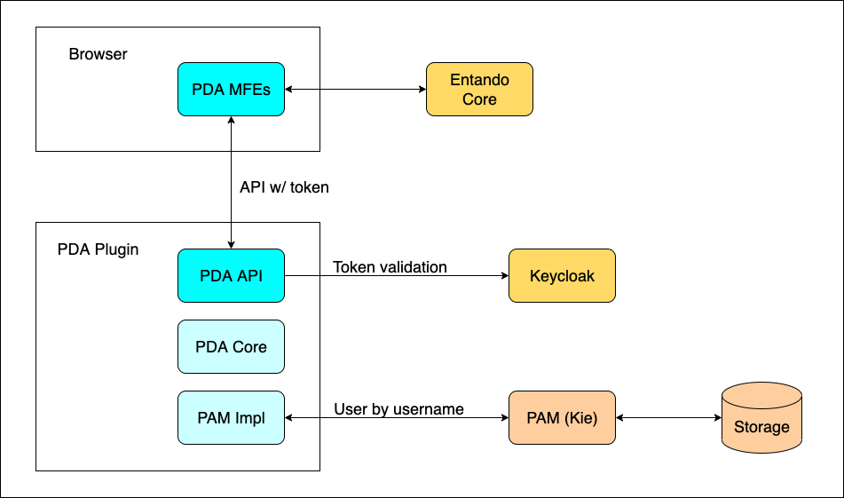

# PDA Architecture

This document describes the components that comprise the Process Driven Applications (PDA) plugin architecture in deployment and how they interact with each other.

The image below shows the high level components.

## PDA MFEs

The PDA micro frontends run on the browser, rendering the custom UI
components the user interacts with. These components are written in React and fetch data from the PDA API, passing the Keycloak token for authentication.

The MFEs also make calls to the Entando Core API to retrieve the
settings required for the UI configuration. These components are available to assist with page creation after the PDA plugin bundle is installed.

Source code:  
<https://github.com/entando/entando-process-driven-plugin/tree/master/widgets>

## PDA API

The PDA API is a Spring Boot application that communicates with the Business Process Management (BPM) engine, with the engine data made available through a REST API. Subject to the deployment configuration, the PDA API interacts with Keycloak to validate the token, retrieving the connection and sensitive data. Instead of calling specific engine classes directly, the application calls the abstraction defined in the PDA Core library. 

The engine implementation is determined at runtime based on the connection details provided. It is important to note that the PDA API does not have a database and is therefore stateless. All data available to it are retrieved from the BPM engine. After bundle installation, it is deployed as a microservice in the Kubernetes infrastructure. An ingress is also created to
make it available to the MFEs, as described by the Entando Plugin custom resource.

Source code:           
<https://github.com/entando/entando-process-driven-plugin>

## PDA Core

The PDA Core is the library that defines the interface and abstraction implementations for interacting with specific BPM engines. It allows multiple engine implementations to exist simultaneously.

Source code:  
<https://github.com/entando/pda-core-engine>

## PAM Impl

The PAM Impl is the Red Hat PAM implementation for the PDA Core library. If the connection maps
to a PAM engine, these are the classes that are executed when the
PDA API requests engine operations. This component communicates with
the Kie Server, which executes the defined process operations.

Source code:  
<https://github.com/entando/pda-redhatpam-engine>

