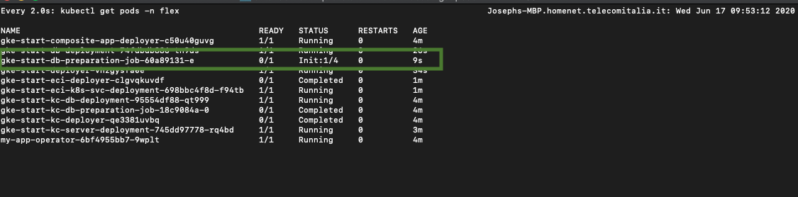

# Entando Deployment Structure

This page provides an overview of the key Entando GitHub repositories with brief descriptions 
of how these repositories are realized in a running Entando deployment. It also explores the architecture behind the Entando Platform and how its functions are structured.

## Entando Operator
The **Entando Operator** coordinates the installation and configuration of all of the components of an Entando Application. 

* GitHub: <https://github.com/entando-k8s/entando-k8s-controller-coordinator/>
* DockerHub: <https://hub.docker.com/repository/docker/entando/entando-k8s-controller-coordinator>

#### Customization
Use the [Entando custom resources](../reference/custom-resources.md) to extend the platform.

## Database Init Containers
During installation, an Entando Application needs to create and initialize several databases when deploying from a backup of your images. 

* GitHub: <https://github.com/entando-k8s/entando-k8s-dbjob>
* DockerHub: <https://hub.docker.com/repository/docker/entando/entando-k8s-dbjob>

The screenshot below highlights the init containers for the Entando Application schema creation, DB initialization, and component repository database.

Many managed Kubernetes instances like OpenShift don’t display init containers on their dashboards. If you’re troubleshooting, the logs may provide some useful information. To fetch logs for an init container using kubectl, you must 
pass the container name as an argument. 

For example:

        kubectl logs YOUR-POD -c YOUR-CONTAINER-NAME -n YOUR-NAMESPACE        
        kubectl logs default-sso-in-namespace-deployment-db-preparation-job-ddbdbddb-a  -c default-sso-in-namespace-deployment-db-schema-creation-job -n sprint1-rc

#### Customization
The init containers automatically restore a backup included in your application so that you can create custom images with your application setup.

## entando-de-app
The **entando-de-app** is a J2EE application and an instance of `entando-core`. It provides pathways for Entando Components and the server image required by the Entando Operator to manage the deployment. The pom.xml for the application reveals its dependencies.

* GitHub: <https://github.com/entando/app-engine>
* DockerHub: <https://registry.hub.docker.com/r/entando/entando-de-app-tomcat>

#### Customization
The **entando-de-app** is sometimes customized as part of an Entando implementation. 
A customized image can include:
* New APIs 
* Legacy Entando plugins
* New database tables  
* Other extensions to the `entando-core`

In most cases, microservices should be used to extend the platform. However, legacy 
integrations, extensions to the CMS, and migrations from earlier Entando versions may require changes to the **entando-de-app**. 

## App Builder
The **App Builder** is the user-friendly frontend UI for the `entando-de-app`. A ReactJS application, it is served via Node in the default deployment. It communicates with the `entando-de-app` and the Entando Component Manager via [REST 
APIs](../consume/entando-apis.md). The Component Manager provides information about bundles deployed to the Local Hub.

* GitHub: <https://github.com/entando/app-builder/>
* DockerHub: <https://hub.docker.com/repository/docker/entando/app-builder/>

#### Customization
The **App Builder** is customized as part of many Entando implementations. 
It can be customized via [configuration micro frontends](../../tutorials/create/mfe/widget-configuration.md) and [Entando Platform Capabilities (EPCs)](../../tutorials/create/mfe/epc.md).

## Entando Component Manager 
The **Entando Component Manager** provides the link between the `entando-de-app`, or your custom core instance, and the Local Hub. It queries the Entando Kubernetes service to fetch available 
bundles that have been deployed as custom resources inside the cluster. 

The **Component Manager** also administers the relationships between an Entando Application and the 
installed plugins. This is seen in the plugin link custom resource in Kubernetes. 

* GitHub: <https://github.com/entando-k8s/entando-component-manager/>
* DockerHub: <https://hub.docker.com/repository/docker/entando/entando-component-manager/>

## entando-k8s-service
The **entando-k8s-service** acts as an abstraction layer to fetch data from Kubernetes APIs. It interacts with the Local Hub to show the available bundles, installs and manages microservice plugins, and 
monitors the status of the installed EntandoApp.
* GitHub: <https://github.com/entando-k8s/entando-k8s-service/>
* DockerHub: <https://hub.docker.com/repository/docker/entando/entando-k8s-service/>

## Keycloak
The **entando-keycloak** project is an extension of the base Keycloak images. It provides default themes for Entando, a customized realm and clients, and Oracle JDBC JARs for connecting to Oracle databases.
* GitHub: <https://github.com/entando/entando-keycloak/>
* DockerHub: <https://hub.docker.com/repository/docker/entando/entando-keycloak/>

#### Customization
The Keycloak image can be customized as part of an Entando implementation. Some common extensions are: 
* Change the theme 
* Add default connections 
* Add default social logins 
* Add default clients 

## Other Key Repositories 
### Entando Kubernetes Controllers
A number of controllers are available to the Entando Operator to manage installations and 
components in an Entando Cluster. These are small and lightweight images that execute as 
run-to-completion pods, managing the installation flow for different parts of the infrastructure. For more information on controllers, Entando custom 
resources, and configuring your deployment, see 
[Custom Resources](../reference/custom-resources.md).

GitHub: 
* <https://github.com/entando-k8s/entando-k8s-composite-app-controller/>
* <https://github.com/entando-k8s/entando-k8s-plugin-controller/>
* <https://github.com/entando-k8s/entando-k8s-cluster-infrastructure-controller/>
* <https://github.com/entando-k8s/entando-k8s-app-controller/>
* <https://github.com/entando-k8s/entando-k8s-app-plugin-link-controller/>

DockerHub: 
* <https://hub.docker.com/repository/docker/entando/entando-k8s-composite-app-controller/>
* <https://hub.docker.com/repository/docker/entando/entando-k8s-plugin-controller/>
* <https://hub.docker.com/repository/docker/entando/entando-k8s-cluster-infrastructure-controller/>
* <https://hub.docker.com/repository/docker/entando/entando-k8s-app-controller/>
* <https://hub.docker.com/repository/docker/entando/entando-k8s-app-plugin-link-controller/>

#### Customization
It is unlikely that the controllers will be customized as part of an Entando implementation.
